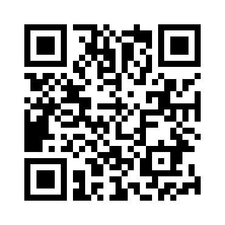
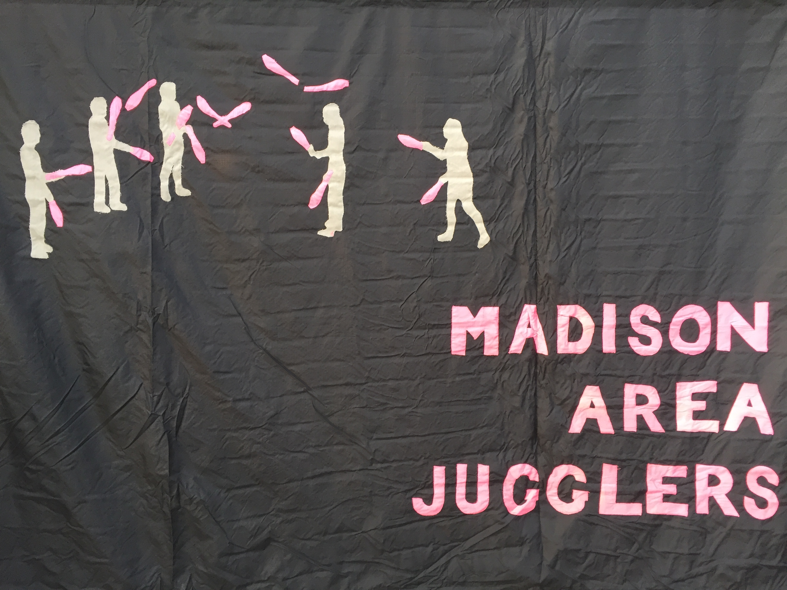

# About this document 

All jugglers are welcome to play with, use, distribute, extend, and otherwise enjoy all 
the club-passing patterns described in *Madison Area Jugglers' Pattern Book, Version 3.0*, which is licensed by its creators, the Madison Area Jugglers, under the [Creative Commons Attribution 3.0 Unported License](http://creativecommons.org/licenses/by/3.0/deed.en_US) {width=7%}. 

To see the book online (I mean, if you're not already reading this on a computer!), use this QR code:

{width=30%} 

or visit
the [*Madison Area Jugglers website*](http://madjugglers.com) for other links to this document and cool stuff about the MAJ.  All the code to make (and update!) this collection is at a [*Github repository*](https://github.com/wiscstatman/pattern-book). See the *build* subdirectory for the current pdf file.  Thinking it would facilitate
expansion and easy inclusion of new patterns, we formed the source code for this document as a collection of simple markdown files, including image media as appropriate.  New contributions are welcome for the next version, so 
please visit the Github site and provide some pattern descriptions.

If you have any questions, comments or suggestions relating to this book, 
please contact the Madison Area Jugglers.
Where possible we have given  credit to the creators of the patterns described here, though for many
these origins were unknown to us.  If we have erred in our attributions, please let us know.

{width=100%} 

