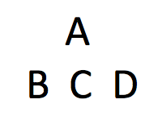
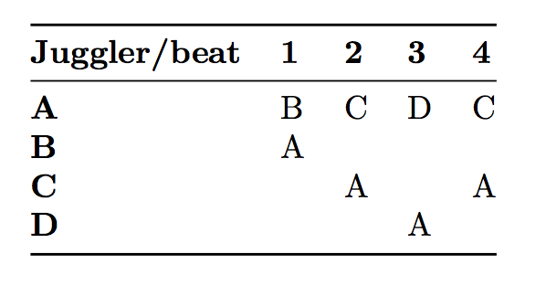

# Hello Madison Club Passers and Friends!

Welcome to the *Madison Area Jugglers' Pattern Book*, a collection of patterns
for intermediate to advanced passers. These patterns are part of our juggling repertoire.
Many we learned or adapted from other jugglers; we include them  because 
it's fun trying to juggle them.  But very many of the patterns in this book
were born in Madison, conjured up at Thursday/Sunday juggling sessions or at 47th Annual Madfests, annual
events since 1992.  The book offers some record of the evolution of club passing in Madison.

Originally we wrote down the patterns just to save time arguing over exactly
how we did the pattern last time. (Don't worry...there's still plenty of
arguing, even with the book.) We were pleasantly surprised to find other people
found our book helpful too! The pattern book can be used as a club passing
guide or just a library of the patterns that we originated or find interesting.
If you're from Madison, then it's a handbook to what we do twice a week on
Thursdays and Sundays, and if you don't know the patterns already then you
probably will. This book is not intended to be an encyclopedia of all possible
passing patterns (that would be a big book)! In fact, we don't include patterns just because
they are *theoretically* possible; we include them if we have done them!

The Madison Area Jugglers (MAJ) have been attempting, inventing, and 
recording juggling patterns for longer than most of us can remember. In 1997, when our memories were already getting strained by the variations, Mike
Newton compiled our first *Pattern Catalogue* to record the patterns for four
or more jugglers.
This morphed into the first *Pattern Book* by January 1999, but the hand-written collection (*Version 0.1*) 
was in a pretty limiting format.  By October of that year, Steve Otteson created the first computerized collection by 
reformating and expanding Mike's hand-written notes.
 Melonhead still caries around a tattered printout of *Version 1.0.*
Steve made a few version updates, for example adding a bunch of extra-club patterns by Peter Kaseman and Luke Emery; the unusual computer format of Steve's version and his departure from Madison  slowed down subsequent updates, even though the MAJ continued to create new patterns at a steady rate.  The next big contribution was Luke Emery's version (*Version 2.0*, 2012). Though it was not widely distributed, Luke's version
contained all kinds of new additions: more patterns for all numbers of jugglers, more on site-swap, more
on specialized extra-club patterns, and tips for creating and doing patterns.  
In 2015 Matt Hemke and Evan Driscol  created a Github repository for the project, converted Luke's version into a repo, and updated the collection further. 

 Recently  Chan Wilson, Jeff Adamus, and
Melonhead have been recording the patterns we do at  Thursday and Sunday MAJ practices.  It's
an amazing collection, and for those who remember the code words, like  *1-5-1 Foie Graham* or *4-5 Twister*, it's enough
to figure out what we really did.  But most of us forget the code words after a while,
except for the frequently juggled ones, and this has been an impetus for this Version 3.0
update by Mike Newton.  All along the editors have had 
substantial input from the Madison Area Jugglers and friends, and we are indebted 
to them for helping enhance this collection.  Club passing
is a social pastime that needs a group of similarly inclined jugglers. Many of
these patterns are inspired by other jugglers and patterns or created in
collaboration with other jugglers. We hope that these patterns will help
inspire new club passing ideas and help more jugglers all over the world enjoy
club passing!

## How To Read Patterns

There seems to be an indefinite number of ways a single juggler can juggle, so it's not
surprising that a juggling *pattern*, which combines the efforts of multiple jugglers, can 
also take many many forms.  There are many exceptions -- and we cover a lot of them --
but to develop our intuition  it's convenient to start with standard formulations. Say
each juggler is throwing three clubs,   alternating hands *right-left-right-left* etc,  and
juggling in sync with the others (all doing *right-left-right-left*...).
In this standard formulation, passes are single-spin exchanges between jugglers, either right-to-left
or left-to-right throws. Even without adding extra clubs or unusual throws (heff's, zips, simuls), 
there is an incredible  variety of fun patterns found by varying where jugglers are and 
 who passes to whom when.

### Counts/Cycles

A basic passing descriptor is the *count*, which tells the juggler how frequently to make a pass. 
In simple patterns each juggler's count is constant, but even simple patterns can be 
very difficult on a fast count.  We say you are passing on an $m/n$-count if you make $n$ passes in
a cycle of $m$ beats, counting on both hands.  
 For example, $2/1$-count means,  *pass-self*, then repeat.  When the
denominator $n$ is 1 we just say $m$-count, as in the familiar 1-count, 2-count, 3-count, and so on. 
Double-three count is a popular count, which in this notation is $3/2$-count.
 Stating the count does not necessarily imply what hands are doing what, how many clubs
are being juggled,  or the starting 
configuration. E.g., left-hand 2-count is different from right-hand 2-count.  Odd counts (i.e.,
odd $m$) are 
nicely balanced for the hands; then the only issue is the start, which we usually do out of the right.

Mortal jugglers, like us, can only do patterns that repeat.  That repeatable unit is called a *cycle*,
and it takes some total number of beats to complete on whatever is the base count of the pattern.  Patterns with
longer cycles are usually harder to remember and therefore harder to do, but not always.  In many
patterns each juggler does something relatively simple (i.e., a shorter *local* cycle) even if the
whole pattern takes a long time to complete. Those are cool! 

Throw timing, throw destination, and juggler position over time have to be recorded to describe
a juggling pattern.  We use tables and figures to express this information. For example,
the table below (right) describes a standard feed, with jugglers (letters) on the rows and passing beat (numbers) on the columns. We sometimes reverse row and column for complicated (longer-cycle) patterns.  We often
accompany the table with a simple figure showing how the jugglers are positioned (left).   In moving
patterns (later) we also indicate positions and  transitions with a  nodes-edges graph.

###  Example: standard feed

|                                        |                          |
|------------|------------|
| {width=15%} | {width=32%} |
| positions                                       |    Right-hand counting |

The label "Right-hand counting" means that only the right-hand throws are
tabulated. The column under each number lists the jugglers that
pass at that time. Since left-hand passes are not made in this particular
pattern, they are not tabulated; self-throws are indicated with a blank entry.

For example, if I was juggler C in the above pattern, I would read along the
3rd row to see where I pass. On the first pass (column 1), I have a self throw
(the empty box represents a self throw). For the next right-hand throw (column
  2), I pass to A. For the next two right-hand throws, I do a self throw
  followed by a pass to A. The table rolls over, so that the fifth pass is the
  same as the first; i.e. the pattern has a 4-beat cycle.

Unless otherwise specified, all passes are single spins and do not cross.
Doubles and triples to juggler A would be indicated by D-A and T-A respectively
and are also straight unless noted.

Special instructions like different counts, double selves, crossing passes or
starting instructions may be noted in or below the table.

### Typewriter Extra Club Feed (13 clubs)

| **Juggler/beat** | **1** | **2** | **3** | **4** | **5** | **6** |
|:-----------:|:-----:|:-----:|:-----:|:-----:|:-----:|:-----:|
| **A**       | D-D   |       | D-C   |       | D-B   |       |
| **B**       |       | D-A   |       |       |       |       |
| **C**       |       |       |       | D-A   |       |       |
| **D**       |       |       |       |       |       | D-A   |

> * Both hands counting, right hand passes.
> * A starts with 4 and right hand
> * B, C and D start with left hand

Here's an example with double straight passes and special instructions. In this
case all the passes are right-handed passes, but we count both left and right-hand throws. 
A throws right Double pass to D, then left self, then right Double
pass to C, then left self, then right Double pass to B.

*How to tip: Jugglers C and D should throw a little higher and deeper so A has
room to pass underneath to C and B.*

### Some Funny Left/Right Box

| **Juggler/beat** | **1** | **2** | **3** | **4** | **5** | **6** |
|-------------|-------|-------|-------|-------|-------|-------|
| **A**       | B     | C     | B     |       | D     |       |
| **B**       | A     | D     | A     |       | C     |       |
| **C**       |       | A     |       | D     | B     | D     |
| **D**       |       | B     |       | C     | A     | C     |

> * Both hands counting

The above pattern has both hands counting, so the column under 1 is a right hand
pass, the column under 2 is a left hand pass, etc.

If I was juggler D, I will read the fourth row to see that I start with a right
hand self (column under 1), followed by a left hand pass to B (column under 2).
The next 4 throws are: right hand self, left hand pass to C, right hand pass to
A, and a left hand pass to C. then the pattern repeats.

Any variation to anything said above will be noted as needed when a pattern
requires special circumstances.

### Site Swaps

Occasionally we tap the wonderful world of site-swap [notation](https://en.wikipedia.org/wiki/Siteswap) to describe patterns. For example, 7
club 2-count is 4p 3 | 3 4p (2nd juggler starts with left
hand).   There are a number of different site swap notations out there for passing.  We use whatever seems to make sense to us at the moment and make no guarantee of consistency!

## Secret Juggling Code Words and Phrases (Glossary)

* **baby position**.  The least challenging task in a juggling pattern, if there is one.
* **Bernardos**. Unecessary solo juggling tricks performed while other jugglers are trying
 to start a pattern. Named after Paul Bernardo, an expert of the craft.
* **Canadian catch**.   An impressive catch that would have been difficult
 for most mortal jugglers.
* **carriage return**. A style of feeding where the feeder returns to the first
 feedee in the line after passing in sequence to all feedees. (also called typewriter)
* **chalant**.  To drop a perfectly fine pass due to lack of focus. The opposite of nonchalant.
* **chocolate bar**. 
  pass--pass--self--self; a $4/2$-count.   By convention, this starts with the right-hand pass.
* **cross**.  A left-to-left or right-to-right pass.
* **cycle**. The  amount of juggling after which the pattern repeats.
* **Doc Blanchard/Glenn Davis**. Mr. Inside/Mr. Outside.
* **double 3-count**.  pass-pass-self: Academics insist that this is a  3/2-count not 2/3-count.
* **encroachment**.  Premature lane-crossing between two passing jugglers in a moving pattern.  Usually 
 entails a 5-yard penalty. 
* **everies**. 2-count
* **every-others**. 4-count
* **exclusion principle**. No two jugglers can occupy the same place at the same time.
* **extra clubs**.  When the number of clubs for the pattern exceeds three
 times the number of jugglers.
* **feast**. A pattern having only feeders, usually arranged in a circle.
* **feed**. A passing configuration where one juggler passes to multiple others.
* **feedee**. One who passes with a feeder. 
* **feeder**. One who feeds.  Usually this juggler is stationary. 
* **hup**.  The vocalization that signals the end of the pattern.
* **immaculate assumption**.
  When you think that a juggler is about to move or pass...maybe they even give
  you the look...you know, the **look**...but then they don't!
* **inverted.** A moving convention in the weave: forward-on-the-end/back-through-the-middle
* **I blame society**. An excuse for some juggling failure (usually by Mel).
* **last jugglers' try**. The last attept at a pattern, but only if it goes well enough.
* **leader**. One who calls out, *jugglers ready: up, down, ...* at the beginning of a pattern. 
* **Mel catch**.  The act of catching the fat end after a 2.5 triple up.
* **Mr. Inside/Mr. Outside**.  The two feeding positions of a doubly-fed weave.
* **mustard**.  Energy, power, spice, velocity or chi added to throws. As in, "Your corner
  passes need more mustard." Also, crispy. The opposite of mustard is mayonnaise. 
* **NFP**.  Nice Pass.
* **No, this is a club**. Said while pointing to a juggling club and talking to a curious 
 passer-by who asks about the group, "Is this a club?".
* **olive**. In a stacked, sandwich-style pattern, a single feeder on one side of the pattern.
* **orbiter**. A juggler who orbits a standard moving pattern and passes to others on 
some of their would-be self throws. 
* **phantom**.
  A feedee place holder who isn't really there. A feeder, for example, may feed
  2 real feeders and a phantom in a sweep feed: pass-pass-self-pass and repeat.
* **plus**.  A suffix added to indicate an extra club added to the base pattern.
* **post**. A stationary orbiter.
* **preverted.** A moving convention in the weave: back-on-the-end/forward-through-the-middle.
* **run it**.  Continue juggling for an indefinite number of cycles.
* **scheisse**.  An utterance of frustration, possibly by Dan Schuchnect. 
* **Someone passed me a bad self**. An excuse for dropping.
* **southern Wisconsin convention**.  When changing sides from a feedee position in a standard count, do so on an outside-throw/inside-catch; e.g. 
 on a  right-hand throw/left-hand reception when on the right side of the feedee line.
* **straight**. A right-to-left or left-to-right pass.
* **sweenish**.  A fancy final move in a pattern, preferably clean.
* **The wind is our friend**. An encouraging commentary when juggling outside.
* **three-count**. In Madison, the default passing count between two jugglers. Sometimes called the *waltz*.
* **tomify**.  Replace a pass-self or a pass-self-self  with pass-pass-pass to the same recipient.  (thanks Tom Pomraning)
* **triple up**.  The showy last action in a pattern, after the hup, in which each
 juggler lofts a triple self. 
* **ultimate**. 1-count
* **walk it through**.  To perform a slow-motion instance of a pattern, with juggling replaced by the holding of 
 clubs, with passes replaced by pointing to where you would pass, and following a slow, deliberate count by the
 leader. Done while setting up a pattern in order for jugglers to figure out what the hell they are supposed to do.
* **weave**. A most popular moving pattern with three feedees and a feeder, which is the basis of many multi-person patterns.  The 3 feedees move in a figure 8 while juggling. 
* **windshield wiper**. The more common style of feeding where the feeder 
first feeds the line in sequence, and then returns in reverse order.  Windshield wiper and carriage return are the same with two feedees, but
 differ for three or more feedees.
* **wuss**.  The amount of gentleness, tenderness and love added to a juggling throw.
  Compare to mayonnaise. Also, the quality of passes you would make to your favorite
  grandmother. As in, "Please add some wuss to your middle passes. You're hurting
  my catching hand!"
* **You herniated my ZOC.** Said if a pass forced extension and excessive effort in the catching.
* **ZOC**.
  Zone of Catchability. The volume near a juggler in which successful catches are probable.
 Peter Kaseman has the largest ZOC in Madison.
* **ZOOS**. (sounds like the Greek god Zeus)  Zone of occupied space.   Space occupied by a moving juggler.

## Random Tips on Passing Patterns
* **Better Never than Late**.
    If you miss a passing beat, don't pass on the next throw! Instead, wait for the pass
    to come around again in the pattern.
* **Always keep your eye on Mel**.
    Don't pick up the clubs until you're sure the pattern is over, unless you
    know you can pick up and keep juggling. Even when you're not juggling, it's
    wise to keep an eye on Mel.
* **Juggle slow, move fast**. You get it. There's a tendency to speed up
 your juggling when you move. Don't.
* **Juggling means never having to say you're sorry**
    No, really.  Don't say you're sorry unless you draw blood.  (However, if you draw blood then you do have to say you're sorry.)  Beginners often apologize profusely for their lack of skill. It's ok! We
    already know you're a beginner. But we like passing with other people and
    passing with beginners too. You'll get better soon and the best way is with
    lots of passing! If people want to do a hard pattern that is too advanced
    for beginners then they will, and you'll be left out of that one. Just do a
    pattern with somebody else. If we're juggling with you it's because we want
    to, not because we have to. Most patterns have positions of varying skill
    requirements, so if you're a beginner in a bigger or more advanced pattern,
    we'll try to put you in the best spot for your level. Just try to do the
    best you can, and if you drop, try to keep the timing anyway.
* **Mike's the leader**. Unless he's not.
* **Throw global, catch local**.  A prescription for happing passing.

## Mastering the craft

### Timing
It may already be obvious, but good timing is critical to group passing
patterns. One of the best tools to keep timing is your ears. For most patterns,
all the catches should happen at the same time. When the timing is perfectly
synchronized the sound of catching clubs is a metronome for the pattern.

Otherwise, find a juggler in your field of vision and make sure you throw at
exactly the same time as they do (either passes or selves).

Make sure all the passes of the same spin go to the same height.

For many patterns, selecting a juggler to count out loud as a metronome can be
very helpful.

And follow the leader!

**MAJ timing:** We estimate 0.9 seconds per right hand beat for no-extra-club passing.
This is a little slower than at most North American sites and a little faster than 
 at some European sites!

### Leads
The second most important skill is for the passer to lead the catcher in the
direction they are moving. The amount of lead varies based on the height of the
throw, the tempo of the juggling, and how fast the weaver is moving.

Outside leads are the easiest, because they are thrown away from the catcher's
pattern.

Inside leads are trickier, because they are thrown towards the catcher's
pattern, and if the passer is exchanging clubs with the catcher, the two passes
are prone to collision. (For some patterns, such as the Cyclone, the weavers are
moving so fast that the inside leads go all the way on the other side of the
incoming pass.)

One key to throwing good leads is to be able to see where your passes land.
That's a difficult skill at first, and especially hard for some patterns with
high throws, but your target will certainly appreciate the effort. Otherwise,
good communication (especially for dropbacks or other blind passes) helps fine
tune lead throws.

Remember that in a feed, the feedee on the same side as the feeder's pass must
throw an inside and/or deep pass to give the feeder room to throw underneath to
the next feedee.

### Turning
Twister weaves are all about turning. In general you can classify how hard a
moving pattern is by how many selves are allocated to turn 180 degrees. For
example, the Standard Twister Weave has 5 selves (weaving in 6-count). The Fast
Spiral has 3 selves (weaving in 4-count). The Chocolate Swirl has 1 self
(crossing sides in double 3 count).

In most of these patterns you can turn either to the outside or the inside. One
turn is usually easier than the other, but I recommend jugglers learn both turns
whenever possible. Learn turning in easy patterns like the Twister Weave and
then you can apply those to Clovers or Strange Attractors and other more
advanced weaves.

It is also helpful to practice turning while juggling solo. How many selves does
it take you to turn 180 degrees while spinning continuously?

### Learning

Take advantage of opportunities to pass with jugglers better than you. That's
how you'll learn timing.

Take advantage of opportunities to pass with jugglers less skilled than you.
That's how you'll learn catching.

Be sure to pass with jugglers at the same level as you. That's how you know how
good you really are. :)

Lots of passing patterns benefit from solo skills too. You'll need to be able to
juggle 4 clubs comfortably in triple singles, double singles and the fountain to
do a lot of the 7 and 8 club based passing patterns.

## Passing Pattern Philosophy

We're occasionally asked at juggling conventions, where do you come up with all
these patterns? Actually, they sort of make themselves once you invite the
opportunity. Here are some tips on how to make new passing patterns and have fun
doing it.  We discuss some other pattern generation techniques in Chapter 12.

### Mutate

* Start with a classic juggling pattern or any geometric figure (box, triangle,
  star, Y, W, line, etc.).
* Think about everybody juggling 3 or 4 clubs.
* Replace any selves with a pass to another juggler doing a self.
* Switch the positions of jugglers, but retain the passing sequence.
* Try the same movement in a different count, or left handed.
* Try the same passing sequence in a different movement.

### Complicate

Why not make things harder?
You get better at basic patterns if you try harder variations; plus they can be interesting if they're
not too hard. (We estimate that a success rate of 1/3 is optimal for making progress and retaining interest!)

* Replace any 3-count with a double 3-count.
* Replace any feed with an extra club feed.
* Replace any extra club feed with a 2 extra club feed.
* Make stationary jugglers move (circles, clovers, figure eights, or any
  juggling siteswap just to name a few).
* The clubs can be passed in any juggling pattern or siteswap (admittedly,
  patterns get challenging quickly once you get past the easier siteswaps).

### Combine patterns (*Mating*)

* Replace any position with a set of jugglers that spits out that same count.
  E.g. replace one person doing a  4-count with  one side of a Twister Weave;  or
 replace a 2-count person with a Weave (assuming there is room!).  This is the
 source of many fun big patterns, such as the Egg-Beater-Twister.

### Stacking

* Weaves-of-three and spinning-pairs are pattern components that  emit passes on either
 side of a line.  They are  naturally combined into
 multi-layer patterns by stacking them up against each other in parallel.  Then feeders (sometimes
 called *olives*) or same-facing movers anchor either end of the stack.  We get simple descriptors
 for quite elaborate patterns, such as 1-2-3-2-1, or 1-2-2-2-2-2-1. (See later chapters
for more details.)

### Starting

* There's nothing that saps mojo more than a long discussion about how to start
or progress through a pattern.   Keep instructions simple, informative, and clear. Warm up by doing parts
of a pattern in isolation.  Walk it through and minimize the Bernardos.  

* For very big patterns, we use
two decks of playing cards: one is used to mark starting positions by taping cards to
the floor; a matched set from the second deck is handed out to the participants. The
leader just instructs jugglers to find their positions, and they usually self-organize!
We also use tape on the floor to mark movements or passing lanes to keep it clear. 

###  Make it interesting

* Many of our favorite patterns are group collaborations where lots of people
  gave ideas for new ways to move or pass.
* Share your favorite club passing patterns with other jugglers and listen to
  their ideas too.
* Recognize the skill level of your participants and do patterns in which everyone
 can be challenged while also having fun.
* Antonio Vivaldi, in 1725,  titled his Opus 8, 12 Concerti for chamber orchestra and
 violin:   *Il cimento dell'armonia e dell'inventione*, or,
 *The contest between harmony and invention*.  There's no evidence he was juggling, but
 there is a connection to our endeavor. To be worked on, a juggling pattern has to be sufficiently
 novel that it is interesting for the participants to engage in, but also sufficiently regular that
 it can be mastered with reasonable effort. The fact that the Pattern Book has grown
 is testament to the fact that jugglers regularly pass clubs in Madison; for this
 activity to persist there must be invention of new things; and as well there must
 be consistent elements -- count signatures or motion elements -- that we master and
 then recombine in interesting and enjoyable ways.

## Internet Passing Resources

The world of juggling has many contributors and
contributions that we have failed to identify in this collection. 
Some important ones are:

* [Flying Karamozov Brothers](http://www.fkb.com/)
* [Gandini Juggling Project](http://www.gandinijuggling.com/)
* [Martin Frost's Youtube channel](https://www.youtube.com/user/elgra2)
* [JiBe's passingDB site](https://www.passingdb.com/)
* [International Juggling Association site](http://www.juggle.org)
* [Will Murray's site](http://www.csulb.edu/~wmurray/)
* [Mark Weston's passing collection](http://www.varietyartsdirectory.com/resources/PassingPatternsAug06.pdf)

## Version History
* Madison, Wisconsin, January 1999 Version 0.1
* Madison, Wisconsin, October 1999 Version 1.0
* Madison, Wisconsin, January 2001 Version 1.1
* Madison, Wisconsin, March 2001 Version 1.2
* Madison, Wisconsin, January 2012 Version 2.0
* Madison, Wisconsin, January 2018 Version 3.0

Like all earlier versions, the current Version 3.0 contains mistakes and
unfortunate omissions, which we have yet to discover and 
 for which the Editor's take responsibility.   We hope
that  future versions will correct these shortcomings.
