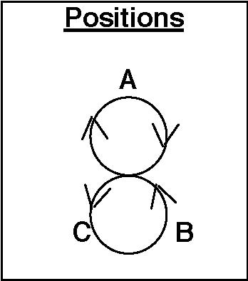
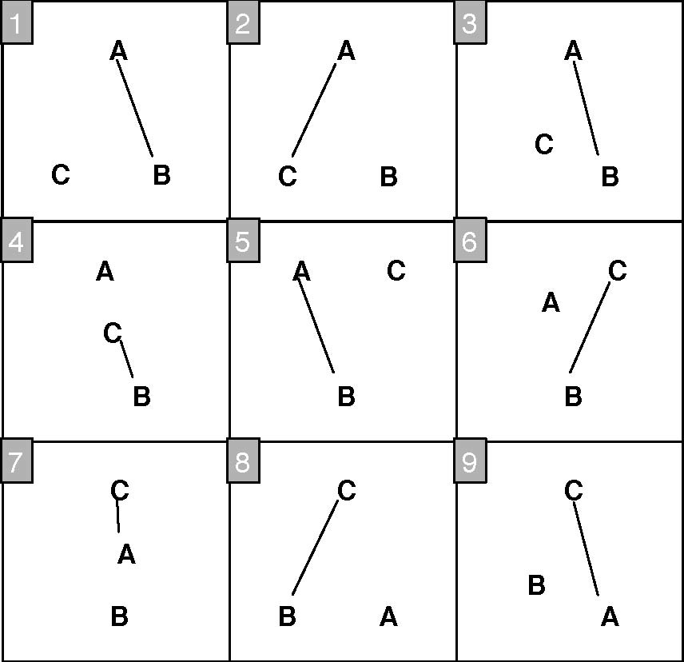
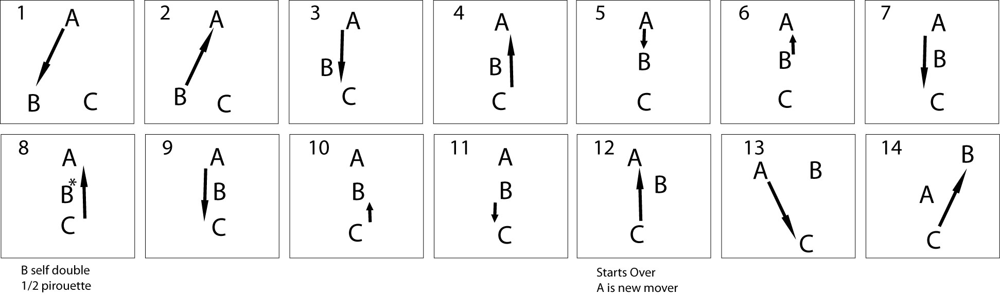
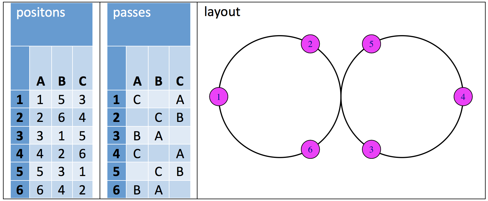

#  3-Person Patterns

## Feed (for 3 jugglers)

The feed for 3 jugglers is the simplest 3 person pattern and likely the first
one you tried. Because juggling with 3 is so much different than with 2, it's
often a good idea to be comfortable with other patterns in a 3 person feed
before trying them in larger patterns.

| **Juggler** | **1** | **2** |
|-------------|-------|-------|
| **A**       | B     | C     |
| **B**       | A     |       |
| **C**       |       | A     |

> * Right hand counting

How about left handed, chocolate bar, feeder in double 3-count (and feedees in
3-count), or Tom's (which is 3 passes in a row to each feedee with no selves for
the feeder)?

### Extra Club Feeds

Then extra club 2-count feeds with 10, 11 and 12 clubs (in singles and doubles
and triples). There are 4-count feeds in triples and popcorn feeds in 5-count,
6-count and 7-count. And 7 club double 3-count feeds in pass, pass, pause. And
extra club chocolate bar feeds.

#### 4-Count Popcorn Feed

| **Juggler** | **1**  | **2**  |
|-------------|--------|--------|
| **A**       | C      | B      |
| **B**       | A      | T-self |
| **C**       | T-self | A      |

> * Right hand counting
> * B starts with 4

#### 6-Count Popcorn Feed

| **Juggler** | **1**  | **2**  | **3**  |
|-------------|--------|--------|--------|
| **A**       | C      | T-self | B      |
| **B**       | A      |        | T-self |
| **C**       | T-self | A      |        |

> * Right hand counting
> * B starts with 4

This variation makes a nice triangle too.

Note: you can replace any triple self, self, single pass with a triple pass,
single self to make things more interesting, or with double straight self,
double straight self, pass (533p, 5p33, 443p, 44px3 all work).

#### 5-Count Popcorn Feed (one variation)

| **Juggler** | **1** | **2**  | **3** | **4** | **5**  |
|-------------|-------|--------|-------|-------|--------|
| **A**       | D-B   |        | D-C   |       |        |
| **B**       |       | T-self |       | D-A   |        |
| **C**       |       | D-A    |       |       | T-self |

> * Both hands counting, start with right hands
> * A and C start with 4 clubs

The timing is a bit wonky, B and C should delay slightly at the start.

4.5p:B 3 4.5p:C 3 3 | 3 5 3 4.5p:A 3 | 3 4.5p:A 3 5 3

#### Extra Clubs Chocolate Bar Feed (one variation)

| **Juggler** | **1**  | **2**  | **3**  | **4**  |
|-------------|--------|--------|--------|--------|
| **A**       | Dx-B   | Dx-B   | Dx-C   | Dx-C   |
| **B**       | A      | A      | D-self | D-self |
| **C**       | D-self | D-self | A      | A      |

> * Both hands counting, start with right hands
> * A and C start with 4 clubs
> * A throws all crossing doubles
> * B and C throw chocolate bar, then double self, double self
> * The double selves are straight

Fast/Slow Feeds, Gorilla Feeds, Site-Swap Feeds...we do all of them in Madison,
but they're not really part of the Pattern Book yet. Look them up somewhere else
for now and maybe we'll get some of them in a future passing pattern book.

## Triangles

Math geeks recognize that the positions of any three non-colinear jugglers
form vertices of a triangle.  But that's not what jugglers mean by triangle -- they mean
equilateral triangle.  When 3 jugglers are so evenly positioned, three obvious passing formations are 
suggested: the inside triangle (pass to the juggler on the left with a right hand pass),
outside triangle (pass to the juggler on the right with a right hand pass), and
two jugglers pass with each other while the other does a self.

Those 3 simple building blocks can be repeated in an infinite variety of
permutations in many different counts to provide hours of instruction and
diversion. You may already be familiar with the Hovey's Nightmare variations.
Mastery of such triangle variations is very useful for larger and more complex
patterns.

See Extra Club Triangles for variations of the triangle with 3-count, double 3
count and 1-count, 2-count and 4-count.

### Rotating Feed

The Rotating Feed Triangle is the simplest rotating feed. For 3 jugglers, a
rotating feed is the same as a feast.

| **Juggler** | **1** | **2** | **3** |
|-------------|-------|-------|-------|
| **A**       | B     |       | C     |
| **B**       | A     | C     |       |
| **C**       |       | B     | A     |

> * Right hand counting

### Pulsar

| **Juggler** | **1** | **2** | **3** | **4** | **5** | **6** | **7** | **8** | **9** | **10** | **11** | **12** |
|-------------|-------|-------|-------|-------|-------|-------|-------|-------|-------|--------|--------|--------|
| **A**       | B     | C     |       | C     |       | B     | C     | B     | C     |        | B      |        |
| **B**       | A     |       | C     |       | C     | A     |       | A     |       | C      | A      | C      |
| **C**       |       | A     | B     | A     | B     |       | A     |       | A     | B      |        | B      |

> * Right hand counting
> * Rules:
>   * Jugglers take turns as feeders: A is first, then C, then B (repeat).
>   * Each feeder feeds the other 2 jugglers.
>   * The next feeder feeds in the opposite order of the previous feeder.

A starts as the feeder and feeds right-left. C is the next feeder and feeds
opposite of A, so C feeds left-right. B, the next feeder, feeds opposite of C,
namely, right-left. A then feeds left-right, followed by C with right-left, and
B finishes the pattern with left-right.

I recommend that feeders call out what they are doing (right-left or left-right)
so that the next feeder will know what to do. This will also help every juggler
know what is going on.

With the rules and the recommendation, you won't have to memorize all of the
passes in the stinking table.

Try this with 1-count, so that both hands pass when you are the feeder.

Pulsar dates to 1993 by Steve Otteson and MAJ.

## Puzzle and Variations

### Three-piece Puzzle (for 2 jugglers)

Right, self, right, self, self, left, self, self, self, left, self, self.

### Puzzle Feeder (for 3 jugglers)

| **Juggler** | **1** | **2** | **3** | **4** | **5** | **6** | **7** | **8** | **9** | **10** | **11** | **12** |
|-------------|-------|-------|-------|-------|-------|-------|-------|-------|-------|--------|--------|--------|
| **A**       | C     |       | C     | B     |       | C     | B     |       | B     | C      |        | B      |
| **B**       |       |       |       | A     |       |       | A     |       | A     |        |        | A      |
| **C**       | A     |       | A     |       |       | A     |       |       |       | A      |        |        |

> * Both hands counting, right hand starts

A is the feeder, and B and C are doing the Three-piece Puzzle pattern six throws out of phase.

### Puzzle Feast

| **Juggler** | **1** | **2** | **3** | **4** | **5** | **6** | **7** | **8** | **9** | **10** | **11** | **12** |
|-------------|-------|-------|-------|-------|-------|-------|-------|-------|-------|--------|--------|--------|
| **A**       | C     | B     |       | C     | B     |       | B     | C     |       | B      | C      |        |
| **B**       | A     | C     |       | A     | C     |       | C     | A     |       | C      | A      |        |
| **C**       | B     | A     |       | B     | A     |       | A     | B     |       | A      | B      |        |

> * Both hands counting, right hand starts

In the Puzzle Feast, all 3 jugglers are doing what A did in the Puzzle Feeder pattern.

Three-piece Puzzle and Puzzle Feeder patterns are by Jim Brennen. Puzzle Feast is by Steve Otteson.

## Siteswap Feeds

Here are two nice variations related to a Martin's Madness feed.

| **Juggler** | **1** | **2** | **3** |
|-------------|-------|-------|-------|
| **A**       | D-B   | D-C   | 1     |
| **B**       |       | A     |       |
| **C**       |       |       | A     |

> * Both hands counting, right hand starts

A does 441 (i.e. double pass, double pass, shuffle)

Alternatively, A can throw cross double passes and B and C can throw cross
passes too (starting on opposite hands).

| **Juggler** | **1** | **2** | **3** |
|-------------|-------|-------|-------|
| **A**       | T-C   | B     | 1     |
| **B**       |       | A     |       |
| **C**       |       |       | A     |

> * Both hands counting, right hand starts
> * A does 5px3px1 (i.e. triple pass, single pass, shuffle)

Alternatively, A can throw straight passes and B and C can throw cross passes (starting on opposite hands).

** TODO: Reviewers – is that right?**
===============================

## Extra Club Rotating Feed (for 3 jugglers)

There are several versions of the extra club rotating feed, but this is one of
my favorites based on an extra club 2 count feed (10 club 2-count). After each
feed sweep, the feeder must throw a right to left self double to adjust the
timing of the pattern. Also, the old feeder throws 2 passes in a row to the new
feeder to transfer the extra club.

| **Juggler** | **1**  | **2** | **3** | **4**  | **5** | **6** | **7**  | **8** | **9** |
|-------------|--------|-------|-------|--------|-------|-------|--------|-------|-------|
| **A**       | D-B    |       | D-C   |        | D-C   |       | D-self | Pause |       |
| **B**       |        | D-A   |       | D-self | Pause |       | D-C    |       | D-C   |
| **C**       | D-self | Pause |       | D-A    |       | D-B   |        | D-B   |       |

> * Both hands counting.
> * A and C start with right hand.
> * B starts with left hand

### Variations

 Once you're comfortable with this pattern, try pirouetting under the double
self, or instead of throwing the double self, do two single selves and an early
triple straight pass instead (followed by a pause), or both!
By Luke Emery 1999.

## Extra Club Triangles

There are a lot of nice extra club triangle variations. Here are a few examples
to play with.

This pattern is based on the standard 7 club 3-count in double spins and extends
it to a triangle. All passes cross (rights to right, lefts to left). This
version has 10 clubs, and A starts with 4 clubs.

### 10 Club 3 Count Triangle

| **Juggler** | **1** | **2** | **3** |
|-------------|-------|-------|-------|
| **A**       | D-C   |       |       |
| **B**       |       | D-B   |       |
| **C**       |       |       | D-A   |

> * Both hands counting
> * All jugglers start in sync with right hand
> * All passes cross

If that isn't challenging enough. Add more clubs and passes. A and C start with
4.

### 11 Club 2 of 3 Count Triangle

| **Juggler** | **1** | **2** | **3** |
|-------------|-------|-------|-------|
| **A**       | D-C   | D-C   |       |
| **B**       |       | D-B   | D-B   |
| **C**       | D-A   |       | D-A   |

### 12 Club 1-Count Triangle

| **Juggler** | **1** | **2** | **3** |
|-------------|-------|-------|-------|
| **A**       | D-C   | D-C   | D-C   |
| **B**       | D-B   | D-B   | D-B   |
| **C**       | D-A   | D-A   | D-A   |

The 10 club version has been around for some time. We learned it from some
fellow club passers at a convention, but I don't remember from whom. 11 Club and
12 Club variations by Luke Emery, 2005, although it seems likely that other
jugglers have also tried them.

There are corresponding extensions to a 5 person star in the 5 Person Patterns.

### 10 Club Triangle with Triple-Single-Single

Here's another variation on a 10 club triangle from 4-count 7 with triples.

| **Juggler** | **1** | **2** | **3** |
|-------------|-------|-------|-------|
| **A**       | T-C   | B     | C     |
| **B**       | C     | A     | T-A   |
| **C**       | B     | T-B   | A     |

> * Right hand counting

You can skip all the single passes until the triple passes are reliable.

### 6-Count Popcorn Triangle

|             |        |        |        |
|-------------|--------|--------|--------|
| **Juggler** | **1**  | **2**  | **3**  |
| **A**       | C      |        | T-self |
| **B**       |        | T-self | A      |
| **C**       | T-self | B      |        |

> * Right hand counting
> * A starts with 4

### 5-Count Popcorn Triangle

| **Juggler** | **1**  | **2** | **3**  | **4**  | **5** |
|-------------|--------|-------|--------|--------|-------|
| **A**       | C      |       |        | T-self |       |
| **B**       |        |       | T-self |        | A     |
| **C**       | T-self |       | B      |        |       |

> * Both hand counting
> * A starts with 4 and right hand
> * C starts with left
> * B starts with right
> * All passes are crossing and alternate hands

Timing is wonky (hands aren't all synced up, so the table is a little
misleading...C should wait a bit before the first triple, throw high lofty
single crossing passes): 3.3px 3 3 5 3.

The pattern should be possible in 5-count with triple crossing passes too...
Hmmm... But fast...

Another 5-Count triangle is to throw crossing triples to the left in 5-count.
This timing is also wonky 1 2/3 count or some such difference between each
juggler.

### 10 Club 4-Count Triangle

The juggler with 4 clubs starts with a right hand double to the left and then
repeats in 4-count. Each juggler passes a right handed double to the left as the
incoming double pass approaches. The timing on this pattern is not symmetric.
Each juggler is 1/3 beat out of time with the juggler before. This pattern can
be extended to a number of interesting variations, such as the Bubbler of David.

## Turbos

### Bruno's nightmare

We haven't juggled this much in Madison, but we include it for reference. It used
to be popular in Europe! See [PassingDB](https://www.passingdb.com/patterns.php?id=49)

### Turbo (standard)
| **Juggler** | **1** | **2** | **3** | **4** | **5** | **6** | **7** | **8** | **9** |
|-------------|-------|-------|-------|-------|-------|-------|-------|-------|-------|
| **A**       | B     | C     | B     |       | B     |       | C     |       | C     |
| **B**       | A     |       | A     | C     | A     | C     |       | C     |       |
| **C**       |       | A     |       | B     |       | B     | A     | B     | A     |

> * Right hand counting

[Here's a cool animation of the Turbo](http://juggloid.com/editor/?s=npRW7l)  (Thanks Nick!)

A Turbo is a group of 3 weaving jugglers who feed themselves. It is also a
Two-leaf Clover or a continuous change sides feed through the middle. Pass every
right hand throw when you are feeding, and pass every other when you are not
feeding.

| layout     | moves/passes |
|-------------|-------|
| {width=25%} |{width=40%} |

When a juggler moves to the other side, he or she cuts across in front of the
old feeder, and turns around to pass to the new feeder.

History: We're not sure. Turbo may have developed inadvertently when in the early 90's we tried, unsuccessfully, 
to recreate  Bruno's Nightmare from faulty memory.  The main difference between Bruno's Nightmare and Turbo is when you turn.  In Turbo you turn before entering the middle.  In Bruno's Nightmare you turn after exiting the middle, which lengthens the cycle and makes the pattern easier by some measures.  There is also variations of
Bruno's Nightmare that we've heard about but we don't juggle.

To learn the Turbo, start by practicing a regular feed change sides. Then learn
the feed change sides through the middle. Finally, speed up the change side
moves until the feedees all move at the earliest possible opportunity.

*Jazzing it up:* When changing sides the mover has the option of clockwise or
counter-clockwise turns. Try both.  One is harder and cooler.  The standard (inside) turn is usually easier for right-handers off the right side of the feed
and harder for right-handers off the left side.  Try double or triple earlies
before entering the middle. Try a behind-the-back pass when moving
  off the right side.

### Count and Hand Variations

There are a lot of Turbo variations. Turbos can be done in almost any count and
combined in many different ways.

* **Left Handed** – Same as above, but mirror image.
* **3-count** – Feeder does 3
    count, feedees do 6 count.
* **Chocolate Bar** – Fun!
* **Double 3 count** –
    Tricky. There are 2 different ways to do the transitions. Usually we have
    the movers stay in 3-count and move on the inside hand throw. You can also
    do this pattern where the movers transition in 4 count and move on the
    outside hand throw. Feels a little like the El Nino.
* **Tom's Turbo** – Feeder is in 1-count and does 3 passes in a row to each
    feeder. Have each juggler start with a different set of clubs. (Created by
    Tom Pomraning.)
* **10-Club Turbo** – See below.
* Also see Interlocking Turbos in 6 person patterns and Strange Attractor in 5
person patterns.

### 10-Club Turbo

The 10 Club Turbo has the same positions and movement as the Turbo but with an
extra club. Usually we throw the passes as doubles (same as in 7 club 2-count).
In order to keep the timing the mover must add an extra beat into the pattern.
That can be done by throwing a double self (either right or left) to the
opposite hand or by throwing an early triple pass and pausing for one beat. The
diagram below shows the early triple, but experiment with whatever works best
for you (some people think a right to left double is easier).

| **Juggler** | **1**   | **2**   | **3**   | **4**   | **5**   | **6**   | **7**   | **8**   | **9**   | **10**   | **11**   | **12**   | **13**   | **14**   |
|-------------|---------|---------|---------|---------|---------|---------|---------|---------|---------|----------|----------|----------|----------|----------|
| **A**       | D-B     |         | D-C     |         | D-C     |         |         |         | D-C     | Move     |          |          | T-B      | Pause    |
| **B**       |         | D-A     | Move    |         |         | T-C     | Pause   |         |         |          | D-C      |          | D-A      |          |
| **C**       |         |         |         | D-A     |         | D-B     |         | D-A     |         | D-B      |          | D-B      |          |          |

> * Both hands counting
> * A starts with right hand.
> * B and C start with left hand.

The table shows 2 transitions. Note that the old feeder (A) passes twice in a
row to the new feeder (C). The mover (B) throws a triple to the new feeder at
the SAME time as the new feeder throws a double to the mover and then pauses for
one beat. The feeder and the 2 feedees are always on opposite timings (the
feeder's right is synchronized with the feedees' lefts).

The easiest way to learn is by practicing the change sides feed with transitions
on the outside and getting comfortable with the triple or the self double timing
transition. Then learn the inside transition and finally rev it up to true turbo
speed. Excelsior!

By Luke Emery, 1999.

### Even more variations

Try with single passes instead of double passes in 7 club 2 count singles speed.

We worked out an 11-Club Turbo variation with triple selves on the transitions,
but it's too hard for us to run more than a couple transitions at a time. Maybe
we'll get it in a future version of the book.

### Another 10-Club Turbo

The pattern above will always be **the** 10-Club Turbo, but here is another
version that makes a nice diversion. It's based on an extra club feed too, but
the transitions in the middle are made by a half pirouette underneath a right to
left double.

The feedee who is moving first steps into the middle of the pattern directly
between the feeder and the non-moving feedee. After one pass the moving feedee
does a half pirouette underneath a double right to left self throw, Then steps
back to complete a single turbo transition. The table below has one complete
transition.

| **Juggler** | **1** | **2** | **3** | **4** | **5** | **6** | **7** | **8**  | **9** | **10** | **11** |
|-------------|-------|-------|-------|-------|-------|-------|-------|--------|-------|--------|--------|
| **A**       | D-B   |       | D-C   |       | D-B   |       | D-C   |        | D-C   |        |        |
| **B**       |       | D-A   |       |       |       | D-A   |       | D-self |       |        | D-C    |
| **C**       |       |       |       | D-A   |       |       |       | D-A    |       | D-B    |        |

> * Both hands counting
> * A starts with R
> * B and C start with L
> * D-self is a half pirouette

 

When you do the half pirouette, make sure to throw the double more inside than
usual and have the outside passers pass a little on the wide side to reduce
collisions.

By Luke Emery, 2002.

## 2$\pi$/3

Read this *two pi on three*.   This one is a late bloomer, considering how simple it is and how long people have been juggling
and moving in groups of three.  There are three moving jugglers, A, B, and C, and six passing beats for a full cycle: (on count of choice; rows of tables).  Everyone moves through the figure eight; in contrast to a Turbo or Bruno’s nightmare, 
there is not a feeder being swapped here; all folks are moving all the time.  Four count is fun; three count is more fun.   In any count, it’s pass-one, pass-the other, self.   Whatever is the base count the pattern has a gap (in this layout, positions 2 and 5) where you can plug in any other juggler or 
pattern that matches that count (including three other jugglers doing a 2$\pi$/3!).   Looks like two pies when viewed from above, and it’s 3 jugglers.  Plus, each circle in the layout is divided into 3, hence the name.  We invented  2$\pi$/3 in summer 2017 and juggled it a lot then.

{width=50%}

## Lines

The Line is another classic family of patterns with countless variations. Here are a few we often juggle in Madison.

### Mel in the Middle

A double 3 count pass with a moving juggler in the middle spinning around. If
Mel is B (Mel is always B), and starts facing A, then it looks like this.

|             |       |       |       |       |       |       |       |       |       |        |        |        |
|-------------|-------|-------|-------|-------|-------|-------|-------|-------|-------|--------|--------|--------|
| **Juggler** | **1** | **2** | **3** | **4** | **5** | **6** | **7** | **8** | **9** | **10** | **11** | **12** |
| **A**       | C     | B     |       | C     |       |       | C     | B     |       | C      |        |        |
| **B**       |       | A     |       |       | C     |       |       | A     |       |        | C      |        |
| **C**       | A     |       |       | A     | B     |       | A     |       |       | A      | B      |        |

> * Both hands counting

**Peter's Backcrosses**

If you replace Mel with Peter, change to 3-count, remove spinning and add backcrosses, you get this pattern.

All jugglers are in 3-count. Use the exact same pass sequence, but B (that's Peter – ok, Mel isn't *always* B) faces perpendicular to the line from A to B and makes all the passes as backcrosses, alternately to A and C.

**Swiftly Tilting Popcorn**

Extra club version of Mel in the Middle, except in 4-count instead of 3-count. Inside person whirls with half pirouettes under doubles while outsides do popcorn. All passes are right handed.

| **Juggler** | **1** | **2**  | **3** | **4** | **5**  | **6** | **7**  | **8** | **9** | **10** | **11** | **12** | **13** | **14** |
|-------------|-------|--------|-------|-------|--------|-------|--------|-------|-------|--------|--------|--------|--------|--------|
| **A**       | D-C   |        | B     |       | D-C    |       | T-self |       | D-C   |        | D-C    |        | B      |        |
| **B**       |       |        | A     |       | D-self | ½ P   |        | C     |       | D-self | ½ P    |        | A      |        |
| **C**       |       | T-self |       | D-A   |        | D-A   |        | B     |       | D-A    |        | D-A    |        | T-self |

> * Both hands counting
> * A starts with 4 clubs, right hand
> * B starts facing A, right hand
> * C starts with left hand
> * ½ P marks half pirouette underneath the double
> * 1 is the same as 11. This is just one possible variation of spinning underneath popcorn.

### Dropback Line

A passes to B. B drops back to C. C passes to A. You can do a dropback line in
any count: 2-count, 4-count, 3-count, chocolate bar. It's a nice pattern to add
clubs to as well. Try one two, or 3 extra clubs with doubles or one extra club
in 3-count (A and B cross, C throws straight).

### Line Feed

You can do any of the feed variations in a line layout instead of a V. Some will
be useful for more complex patterns. Also see 4 person Lines.

### Extra Club Line

What do you do if there are 3 club passers and one is more advanced, one is
intermediate and the third is a beginner. Here's a nice pattern to accommodate
everyone!

A and B face each other. C faces A and B.

| **Juggler** | **1**   | **2**   | **3**   | **4**   |
|-------------|---------|---------|---------|---------|
| **A**       | D-C     |         | B       |         |
| **B**       |         |         | A       |         |
| **C**       |         | T       |         | D-A     |

> * Both hands counting
> * A starts with 4 clubs.

A alternates right hand doubles to C and singles to B. B does right hand 4-count
to A. A alternates right triple selves and doubles to A (fast popcorn).

## GDP

| **Juggler** | **1**   | **2**   | **3**   | **4**   | **5**   | **6**   | **7**   | **8**   | **9**   |
|-------------|---------|---------|---------|---------|---------|---------|---------|---------|---------|
| **A**       | T-C     | B       | T-C     | Move    | C       | Move    |         | T-B     |         |
| **B**       |         | A       | Move    |         | T-C     |         | T-A     | C       | T-A     |
| **C**       |         | T-A     |         | T-B     | A       | T-B     | Move    | B       | Move    |

> * Right hand counting

A starts with 4 clubs and passes triple to C, single to A. B faces A, starts
with a self, and passes every others to A. C starts with a self, then triple
every others to A.

The description above is the base pattern without movement. We will follow the
pattern of movement by concentrating on B. All jugglers do the following
sequence at different times.

Right hand counting:

B: self, single to A, self, self (while replacing A), triple to C, self (A
replaces C), triple to A, single to C, triple to A, self, (as B moves to the
middle). Start over.

By Luke Emery, 1999.

### Variations

Doubles – Throw doubles instead of singles.

A variety of tricks can be done while moving into the center (such as an early
triple followed by a pirouette, etc.)

There's a 5 person variation we call Cathedral in the 5 Person Patterns.

## Up, Up and Over

Ok, Mike, how do you do this one, exactly?
