1.  4 Person Patterns
    =================

    1.  ### Box

The box is a classic passing pattern with dozens of variations, many of which have been around for a long time. It's a great foundation for innovating new patterns, though.

**Basic 4 Count Box**

|             |       |       |
|-------------|-------|-------|
| **Juggler** | **1** | **2** |
| **A**       | B     |       |
| **B**       | A     |       |
| **C**       |       | D     |
| **D**       |       | C     |

Right hand counting

**2 Count Box**

|             |       |       |       |       |
|-------------|-------|-------|-------|-------|
| **Juggler** | **1** | **2** | **3** | **4** |
| **A**       | B     |       | B     |       |
| **B**       | A     |       | A     |       |
| **C**       |       | D     |       | D     |
| **D**       |       | C     |       | C     |

Both hands counting

A, B start with right

C, D start with left

**1 Count Asynchronous Box**

|             |       |       |
|-------------|-------|-------|
| **Juggler** | **1** | **2** |
| **A**       | B     | B     |
| **B**       | A     | A     |
| **C**       | D     | D     |
| **D**       | C     | C     |

Both hands counting

This is a good exercise to practice timing. All jugglers throw at exactly the same time. Wide throws make it a little easier. You can do the same pattern with synchronous ultimates, but that's pretty hard.

Almost any staggered passing pattern will work with a box, and many that are synchronous. A moving variation in 4 count is for C and D to swap places when A and B pass and vice versa. Other variations are Pistons and the Minuet.

### Extra Club Boxes

13 Club Box – Throw a double right pass to the juggler on your left in 4-count. Each passer passes on their own beat.

14 Club Box – This can be done with pairs of jugglers synchronized in a 7 club 2-count, but it is easiest if each juggler is ½ beat after each other.

14 Club 4-Count Box – This is a box where each pair of juggler does 7 club 4-count with triples. The two pairs are 1 beat away from each other (A and B's rights are synchronized with C and D's lefts).

16 Club Box – There are several nice 16 club box variations. To reduce collisions, have A and C throw triples while B and D throw singles (½ beat after each other). The overall timing is about the same as 8 doubles (or 7 singles). This is a pretty pattern. You can also do a 16 club box pattern with all the jugglers synchronized in 8 club 2-count singles, doubles or triples. Nice! Pass either straight across, or to the juggler on the left.

18 Club Box – With 9 club triples 2 count and each juggler offset ½ beat. However, if you are doing this pattern, you probably don't need our suggestions on club passing in a box... Very cool, but tricky!

Also see Fireworks.

### 14 Club Ultimate Box

If the timing is perfect, it is possible to do a 14 club box in 1-count, with right hand doubles across the box and left hand singles along the edges of the box.

|             |       |       |
|-------------|-------|-------|
| **Juggler** | **1** | **2** |
| **A**       | D-B   | C     |
| **B**       | D     | D-A   |
| **C**       | D-D   | A     |
| **D**       | B     | D-C   |

Both hands counting

A and C start with 4 clubs and right hands

B and D start with 3 clubs and left hands

Throw a little wide on the double passes and make sure that everyone has metronome perfect timing and it actually works!

Pattern by Luke Emery, 2007.

### Bermuda Quadrangle

|             |         |         |         |         |
|-------------|---------|---------|---------|---------|
| **Juggler** | **1**   | **2**   | **3**   | **4**   |
| **A**       | B       | C       | D       |         |
| **B**       | C       |         | A       | D       |
| **C**       | A       | D       |         | B       |
| **D**       |         | A       | B       | C       |

Both hands counting

Start with R

Bermuda Quadrangle by Laura and Becky Provance, Barry Friedman, and Steve Otteson.

### Maya

|             |         |         |         |         |         |         |
|-------------|---------|---------|---------|---------|---------|---------|
| **Juggler** | **1**   | **2**   | **3**   | **4**   | **5**   | **6**   |
| **A**       | D       |         | B       | C       |         | B       |
| **B**       | C       |         | A       | D       |         | A       |
| **C**       | B       | D       |         | A       | D       |         |
| **D**       | A       | C       |         | B       | C       |         |

Both hands counting

Start with R

Maya, by Tom Pomraning, was published in Jugglers World. Tom makes incredible chocolates as well as juggling patterns.

### Interlocking Triangles

|             |         |         |
|-------------|---------|---------|
| **Juggler** | **1**   | **2**   |
| **A**       | B       | B       |
| **B**       | D       | C       |
| **C**       |         | A       |
| **D**       | A       |         |

Right hand counting

### Spider Web

This is a variation of the box with 3 extra clubs and all right hand passes.

|             |         |         |         |         |
|-------------|---------|---------|---------|---------|
| **Juggler** | **1**   | **2**   | **3**   | **4**   |
| **A**       | T-C     |         | D-B     |         |
| **B**       |         | T-D     |         | D-C     |
| **C**       | D-D     |         | T-A     |         |
| **D**       |         | D-A     |         | T-B     |

Both hands counting, all passes with right hand

A and C start with right

B and D start with left

A, B and C start with 4 clubs

### Extra Club Rotating Feed (for 4 jugglers)

This is a box pattern with a rotating feed for 4 jugglers and one extra club.

The graph shows a counter clockwise feed but both directions work.

|             |        |        |       |        |        |       |        |        |       |        |        |        |
|-------------|--------|--------|-------|--------|--------|-------|--------|--------|-------|--------|--------|--------|
| **Juggler** | **1**  | **2**  | **3** | **4**  | **5**  | **6** | **7**  | **8**  | **9** | **10** | **11** | **12** |
| **A**       | D-C    |        | D-B   |        | D-self | Pause |        | D-C    |       | D-self | Pause  |        |
| **B**       | D-self | Pause  |       | D-D    |        | D-C   |        | D-self | Pause |        | D-D    |        |
| **C**       |        | D-A    |       | D-self | Pause  |       | D-A    |        | D-D   |        | D-self | Pause  |
| **D**       |        | D-self | Pause |        | D-B    |       | D-self | Pause  |       | D-B    |        | D-A    |

Both hands counting, all right hand throws are either double passes or double selves

A starts with 4 clubs

A and B start with right hand

C and D start with left hand

The steady state right hand sequence is pass across, pass left, self, pass across, self.

Pattern by Luke Emery, 1999.

### Gustav

This is a double 3-count extra club pattern for four jugglers in a box pattern.

|             |       |       |       |       |       |       |
|-------------|-------|-------|-------|-------|-------|-------|
| **Juggler** | **1** | **2** | **3** | **4** | **5** | **6** |
| **A**       | T-D   |       | C     | T-D   |       | C     |
| **B**       | D     |       |       | D     |       |       |
| **C**       |       |       | A     |       |       | A     |
| **D**       | B     | T-A   |       | B     | T-A   |       |

Both hands counting

A starts with 4 clubs

A throws triple crosses, B throws triple straights

C and D start slightly after A and B – timing is a bit wonky

Pattern by Luke Emery, 2008 and named after the hurricane.

### Switch Sides Feed

The standard Switch Sides Feed is an easy introduction to moving while passing. The extra club version is a fun and spectacular pattern.

The basic idea is that a feeder feeds three feedees, but the feedees on the end move straight across after every pass so that the middle feedee becomes the new feeder after each sweep.

**Windshield Wiper Switch Sides Feed**

|             |       |       |       |       |       |       |       |       |
|-------------|-------|-------|-------|-------|-------|-------|-------|-------|
| **Juggler** | **1** | **2** | **3** | **4** | **5** | **6** | **7** | **8** |
| **A**       | B     | C     | D     | C     |       | C     |       | C     |
| **B**       | A     |       |       |       | C     |       |       |       |
| **C**       |       | A     |       | A     | B     | A     | D     | A     |
| **D**       |       |       | A     |       |       |       | C     |       |

Right hands counting

Start with right hand

In this version, weavers move back and forth in an 8-count.

**Typewriter Switch Sides Feed**

|             |       |       |       |       |       |       |
|-------------|-------|-------|-------|-------|-------|-------|
| **Juggler** | **1** | **2** | **3** | **4** | **5** | **6** |
| **A**       | B     | C     | D     |       | C     |       |
| **B**       | A     |       |       | C     |       |       |
| **C**       |       | A     |       | B     | A     | D     |
| **D**       |       |       | A     |       |       | C     |

Right hands counting

Start with right hand

**Extra Club Switch Sides Feed**

In this version, weavers move back and forth in an 6-count. This is a fun one.

|             |        |       |       |        |       |       |       |        |       |        |        |        |        |        |
|-------------|--------|-------|-------|--------|-------|-------|-------|--------|-------|--------|--------|--------|--------|--------|
| **Juggler** | **1**  | **2** | **3** | **4**  | **5** | **6** | **7** | **8**  | **9** | **10** | **11** | **12** | **13** | **14** |
| **A**       | D-B    |       | D-C   |        | D-D   |       | D-C   |        |       |        | D-C    |        |        |        |
| **B**       |        | D-A   |       | D-self | ½ P   |       |       |        | D-C   |        | D-self | ½ P    |        |        |
| **C**       |        |       |       | D-A    |       |       |       | D-B    |       | D-A    |        | D-D    |        | D-A    |
| **D**       | D-self | ½ P   |       |        |       | D-A   |       | D-self | ½ P   |        |        |        | D-C    |        |

Both hands counting, all passes are right handed

A starts with right hand and 4 clubs

B, C and D start with left hand

½ P marks a half pirouette underneath the Right to Left double self throw

Pattern by Luke Emery.

### Standard Weave

Here's where the fun really begins! This is a great pattern to master because it leads to many other exciting patterns.

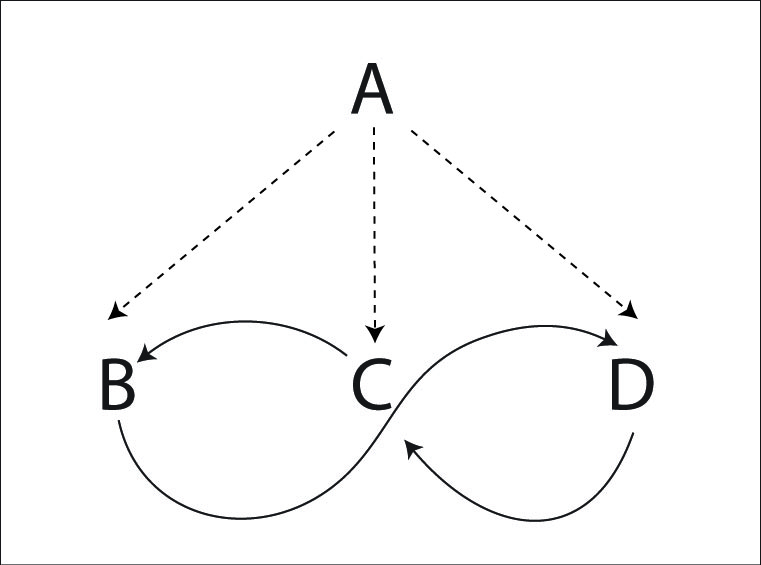

|             |       |       |       |
|-------------|-------|-------|-------|
| **Juggler** | **1** | **2** | **3** |
| **A**       | B     | C     | D     |
| **B**       | A     |       | A     |
| **C**       |       | A     |       |
| **D**       |       |       | C     |

Right hand counting

Weavers move BACK on the ends and FORWARD in the middle for the standard weave.

A is the feeder who throws to the end, middle, end, middle and then repeats. A will be in a 2-count. That's called a wind-shield wiper field (as opposed to a typewriter feed that only goes in one direction).

Each weaver passes from their current position and then moves to the next position. The weavers pass in a 6-count. Weavers move back on the ends and forward in the middle in a figure 8 pattern.

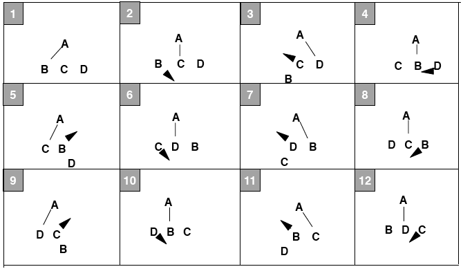

Note: The middle weaver moves towards the end that passes to the feeder first.

**Variations**

Oh, there are so many variations of the weave! The mind boggles. To start, try with left handed throws in 2-count feeding. Try moving forward on the ends and back in the middle (an inverted weave). Now try with chocolate bar (feeder throws ultimates, Right, and then Left to each feeder.)

You can do this pattern with an extra club, all passes as doubles, or all throws as singles, or feeder throwing singles and weavers throwing triples, or feeder throwing all triples and weavers throwing singles.

Do this pattern with 2 extra clubs and all the passes are triples.

Slow it down and pass twice in a row from the feeder to each weaver.

In general, the weavers can move in many different counts, and the feeder can choose a pattern that makes the weave work as long as two weavers aren't passing at the same time. You can slow the weave down if you want, or speed it up. Here are some examples (all of these in both hands counting):

**5-Count Weave (Feeder PSPSP, Feedees 5-Count)**

|             |         |         |         |         |         |         |         |         |         |          |
|-------------|---------|---------|---------|---------|---------|---------|---------|---------|---------|----------|
| **Juggler** | **1**   | **2**   | **3**   | **4**   | **5**   | **6**   | **7**   | **8**   | **9**   | **10**   |
| **A**       | B       |         | C       |         | D       | B       |         | C       |         | D        |
| **B**       | A       |         |         |         |         | A       |         |         |         |          |
| **C**       |         |         | A       |         |         |         |         | A       |         |          |
| **D**       |         |         |         |         | A       |         |         |         |         | A        |

There are other variations that also work out as a 5-count Weave (like the feeder throwing PPPSS instead of PSPSP).

**Double 3-Count Weave (Feeders Double 3-Count, Feedees 4 of 5-Count)**

|             |         |         |         |         |         |         |         |         |         |
|-------------|---------|---------|---------|---------|---------|---------|---------|---------|---------|
| **Juggler** | **1**   | **2**   | **3**   | **4**   | **5**   | **6**   | **7**   | **8**   | **9**   |
| **A**       | B       |         | C       | D       |         | B       | C       |         | D       |
| **B**       | A       |         |         |         |         | A       |         |         |         |
| **C**       |         |         | A       |         |         |         | A       |         |         |
| **D**       |         |         |         | A       |         |         |         |         | A       |

In this variation, the weavers move in a 5 count to the middle and a 4 count to the outsides. The inverse works too, but is a bit harder.

The variations with a 4-count or 3 of 4-count for the feeders don't work with the standard feed, but see the Iron Cross Weave, Spiral Weave or Twister Weave for more 4-count weave variations.

**Hyper -Weave (Feeders 1-Count, Feedees 3-Count)**

|             |         |         |         |         |         |         |
|-------------|---------|---------|---------|---------|---------|---------|
| **Juggler** | **1**   | **2**   | **3**   | **4**   | **5**   | **6**   |
| **A**       | B       | C       | D       | B       | C       | D       |
| **B**       | A       |         |         | A       |         |         |
| **C**       |         | A       |         |         | A       |         |
| **D**       |         |         | A       |         |         | A       |

Ok, this is about as fast as a weave can get. It's really fast and really hard. Throw really high lofty slow passes, move fast and hope for the best. If you can do this weave, make sure you stop by Madison some time and do some fun juggling with us!

Also see Mr. Inside Mr. Outside Weaves, Inside Out Weaves, Twister Weaves, etc.

There are a number of variations floating around where the weavers trade place with the feeder (typically on one end only). Work it out.

The Standard Weave has been around longer than any of us have been juggling.

###
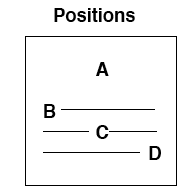

This weave variation has the same passes as the standard weave, but the weavers move back and forth instead of in a figure 8.

|             |       |       |       |
|-------------|-------|-------|-------|
| **Juggler** | **1** | **2** | **3** |
| **A**       | B     | C     | D     |
| **B**       | A     |       | A     |
| **C**       |       | A     |       |
| **D**       |       |       | C     |

Each juggler has its own slot to move on. Each slot has three positions: left, middle, and right. Weavers move back and forth on their slots. Moves are made to the next position after the pass is made from the current position.

When was this pattern created? We have been doing it since 1992.

###
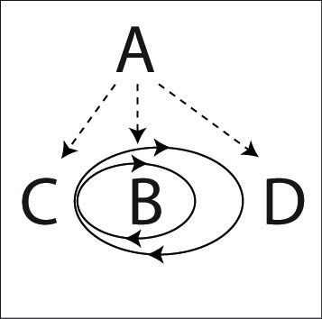

A standard weave is in a figure eight, which is two loops connected by a center. Now imagine warping space so that one of the loops is folded back inside the other. That's the Inside Out Weave.

The count and the passes are exactly the same as the standard weave, but the jugglers move in a small loop from the new center (which is in the middle, but has the count and movement for an end) to the “middle” (which is now on the outside), and then in a large loop back (the other end) . In the loops always move forwards for the “middle” (where C starts) and backwards from the “ends” (where B and D are).

The passing lanes can be somewhat narrow, so be careful, or you might bruise your Zoc.

Pattern by Mike Newton.

### Gandini Weave

The Gandini Juggling Project has explored a lot of interesting weaves (see Appendix C for more examples). We call any weave a Gandini Weave if the weavers always pass in the middle of the figure 8 loop, although the Gandini's have innovated many other interesting weaves besides just these variations. I don't know if that is what the Gandini's call them! This is a simple Gandini Weave that is a great foundation for other patterns.

In this weave all the weavers move in a figure 8, but they always pass from the middle instead of the end. To make the weave slow enough to be under control the feeder will pass twice in a row to each mover.

The feeder is in 2-count (every right hand pass), the feedees throw 2 right hand passes in a row, and then 4 right hand selves (PPSSSS).

|             |         |         |         |         |         |         |
|-------------|---------|---------|---------|---------|---------|---------|
| **Juggler** | **1**   | **2**   | **3**   | **4**   | **5**   | **6**   |
| **A**       | B       | B       | C       | C       | D       | D       |
| **B**       | A       | A       |         |         |         |         |
| **C**       |         |         | A       | A       |         |         |
| **D**       |         |         |         |         | A       | A       |

It's easiest to start with the weavers stacked in a line all facing the feeder.

-   The feeder (A) passes twice to the first weaver (B), then that weaver goes to the right.

-   The feeder passes twice to the second weaver (C), then that weaver goes to the left.

-   The feeder passes twice to the third weaver (D), then that weaver goes right.

-   Now repeat where each weaver passes to the feeder and then moves in the opposite direction of the previous weaver.

This weave can be done in many interesting variations.

Try adding an extra club and making all the passes as doubles, or passing chocolate bar.

You can also invert the weave (reverse cascade).

Try this weave in 6-count with only a single pass to each weaver if you want a challenge that will really make you break a sweat.

See the Gandini 5 variations in 6 Person Patterns, the Twister 5 in 7 Person Patterns and other variations in Appendix C.

We learned about this family of weave variations from juggling with Sean Gandini and the Gandini Juggling Project in 2000.

### Three Leaf Clover (Standard)

|             |         |         |         |         |         |         |         |         |
|-------------|---------|---------|---------|---------|---------|---------|---------|---------|
| **Juggler** | **1**   | **2**   | **3**   | **4**   | **5**   | **6**   | **7**   | **8**   |
| **A**       | D       | B       | C       |         |         | B       |         |         |
| **B**       |         | A       |         |         | C       | A       | D       |         |
| **C**       |         |         | A       | D       | B       |         |         | D       |
| **D**       | A       |         |         | C       |         |         | B       | C       |

Right hand counting

The idea of a clover leaf is to have a juggler on top of each leaf, and a juggler in the middle. The juggler in the middle trades places with a juggler on a leaf. The juggler who was on the leaf goes to the middle, and then replaces the juggler on the next leaf (follow the arrows in the diagram above). All of this movement occurs while passing.

In this variation, there is a feeder who passes 3 times in a row (once to each of the other jugglers). Then the former feeder has 2 right hand selves to move to the middle, one pass in the middle, and 2 right hand selves to move out of the middle. Then the pattern repeats.

To start, ignore the fact that there is a clover. Just concentrate on the feed, and then moving into the middle of a feed and then moving out and repeating the feed.

Just remember, feed, 2 in and 2 out. In the diagram above, A is the first feeder. In 8 passes, the clover has completed a cycle where every juggler has moved from their leaf to the next leaf.

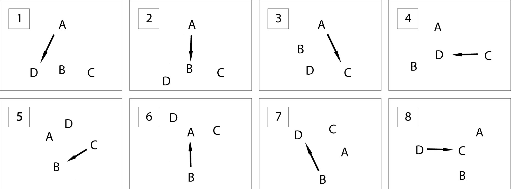

There's a beautiful symmetry to the pattern once it gets going. I hope you enjoy it as much as we do!

Mike Newton created this pattern in 2000.

**Variations**

Try it in 3-count or chocolate bar. There are straight forward extensions for any number of people and you can also add extra clubs (see Extra Club Clover and Hyper Clover).

Madison passing history has a lot of other clover variations, some of which are described later in the book.

The Run Over Clover is the same pattern with some of the selves replaced with passes.

### Run Over Clover

|             |         |         |         |         |         |         |         |         |
|-------------|---------|---------|---------|---------|---------|---------|---------|---------|
| **Juggler** | **1**   | **2**   | **3**   | **4**   | **5**   | **6**   | **7**   | **8**   |
| **A**       | D       | B       | C       | B       |         | B       |         | B       |
| **B**       |         | A       |         | A       | C       | A       | D       | A       |
| **C**       |         | D       | A       | D       | B       | D       |         | D       |
| **D**       | A       | C       |         | C       |         | C       | B       | C       |

Right hand counting

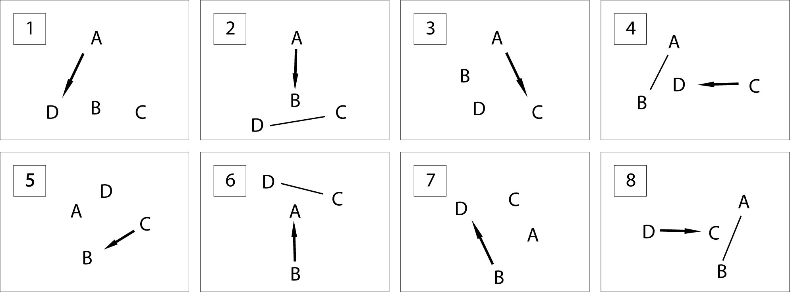

Created in 2001 by Mike Newton and the MAJ.

###

This is the standard three leaf clover with an extra club added and all passes as doubles. As usual, there are a number of ways to add a club. Here is a slower version that is a little easier. The feeder passes twice to the 2nd and 3rd feedees. The Hyper Clover is a faster and more elegant (but much harder) relation.

All passes are right hand straight doubles. A right to left double self is required to keep the timing.

|             |          |         |          |          |         |          |         |          |         |          |          |          |
|-------------|----------|---------|----------|----------|---------|----------|---------|----------|---------|----------|----------|----------|
| **Juggler** | **1**    | **2**   | **3**    | **4**    | **5**   | **6**    | **7**   | **8**    | **9**   | **10**   | **11**   | **12**   |
| **A**       | D-D      |         | D-B      |          | D-B     |          | D-C     |          | D-C     |          | D-self   | Pause    |
| **B**       |          |         |          | D-A      |         | D-A      |         | D-self   | Pause   |          |          |          |
| **C**       | D-self   | Pause   |          |          |         |          |         | D-A      |         | D-D      |          | D-D      |
| **D**       |          | D-A     |          | D-self   | Pause   |          |         |          |         |          | D-C      |          |
| Juggler     | 13       | 14      | 15       | 16       | 17      | 18       | 19      | 20       | 21      | 22       | 23       | 24       |
| **A**       |          |         |          |          |         | D-B      |         | D-B      |         | D-self   | Pause    |          |
| **B**       |          |         | D-C      |          | D-A     |          | D-A     |          | D-D     |          | D-D      |          |
| **C**       |          | D-B     |          | D-B      |         | D-self   | Pause   |          |         |          |          |          |
| **D**       | D-C      |         | D-self   | Pause    |         |          |         |          |         | D-B      |          | D-C      |
| Juggler     | 25       | 26      | 27       | 28       |         |          |         |          |         |          |          |          |
| **A**       |          |         |          |          |         |          |         |          |         |          |          |          |
| **B**       | D-self   | Pause   |          |          |         |          |         |          |         |          |          |          |
| **C**       | D-D      |         | D-D      |          |         |          |         |          |         |          |          |          |
| **D**       |          | D-C     |          | D-A      |         |          |         |          |         |          |          |          |

> Both hands counting, right hand passes only
>
> A and C start with R
>
> B and D start with L

Hmmm...this is the first time that pattern has been written down. It isn't really as complicated as it looks. Let's walk one juggler through it.

1.  Feed from right to left in doubles. Pass once to the end, twice to the middle, twice to the other end.

2.  Self double, pause.

3.  Two right selves to move into the middle, then pass twice

4.  Self double, pause

5.  Two right selves to move out of the middle

6.  Repeat!

It's good fun if you're comfortable weaving while throwing doubles. Make sure your double selves are high enough to maintain the timing of the pattern.

Pattern by Luke Emery, 2001.

### Hyper-Clover

|             |       |        |        |       |        |        |       |        |        |        |        |        |
|-------------|-------|--------|--------|-------|--------|--------|-------|--------|--------|--------|--------|--------|
| **Juggler** | **1** | **2**  | **3**  | **4** | **5**  | **6**  | **7** | **8**  | **9**  | **10** | **11** | **12** |
| **A**       |       | D-B    |        | D-C   |        | D-self | Pause |        | D-B    |        | D-self | Pause  |
| **B**       | Pause |        | D-A    |       | D-self | Pause  |       | D-A    |        | D-D    |        | D-self |
| **C**       |       | D-self | Pause  |       | D-D    |        | D-B   |        | D-self | Pause  |        | D-D    |
| **D**       | D-A   |        | D-self | Pause |        | D-C    |       | D-self | Pause  |        | D-C    |        |

Both hands counting, all right hands are double passes or double selves

> A starts with left hand
>
> B starts with pause, then left hand (for start, B can just start with right self)
>
> C starts with left hand
>
> D starts with right hand and 4 clubs

It's a great pattern but quite challenging.

This was one of the first extra club clover variations we tried. (The first attempt was me, Peter and Luke and Ilka from Luka Luka at a juggling convention.) Peter, Luke and Ilka are all fantastic club passers, but we discovered that this pattern was actually quite hard to do. That was the motivation to create the slower version described previously. However, after practicing and performing the Extra Club Clover for a few years, we were finally able to learn the original variation too, now renamed to the Hyper-Clover.

Pattern by Luke Emery, 2001.

###
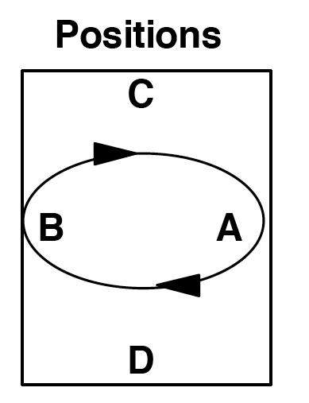

There is a whole family of benzene ring patterns, where movers juggle in a circle between two feeders. The Benzene Ring for Six and for Eight are much easier patterns to start, but Benzene Ring for Four is more fun.

This version is in 3-count.

|             |         |         |         |          |
|-------------|---------|---------|---------|----------|
| **Juggler** | **1**   | **4**   | **7**   | **10**   |
| **A**       | C       | D       | D       | C        |
| **B**       | D       | C       | C       | D        |
| **C**       | A       | B       | B       | A        |
| **D**       | B       | A       | A       | B        |

Both hands counting starting

with the right hand. Numbers

missing are self throws.

After the first pass (throw \#1 in the graph, made with the right hand), A and B have 2 self throws to turn around. If C and D make their right hand passes deep, A and B will have an easier time turning.

After the second pass (throw \#4 in the graph, made with the left hand), A and B have 2 self throws to switch places. They switch places by moving around each other in a counter clockwise direction.

After the 3rd pass (throw \#7 in the graph, made with the right hand), A and B have 2 self throws to turn around.

After the 4th pass (throw \#10 in the graph, made with the left hand), A and B have 2 self throws to switch places. The jugglers are at their original positions. At this point, the pattern repeats.

This pattern is fast for the movers A and B because they are passing 3-count while spinning around each other.

This pattern could be considered a 2-seated unicycle without the seats, going backwards. It is a precursor for the Razor juggling pattern.

Pattern created July, 1997 by MAJ.

###
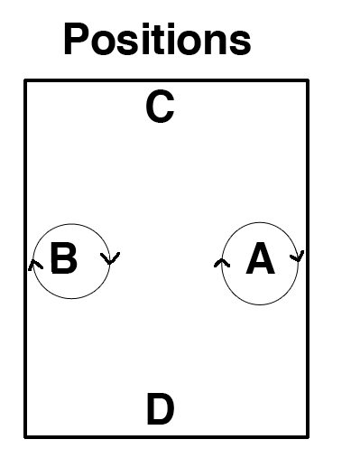

A chocolate bar variation of the 4 person Benzene Ring starts in the same positions as the Benzene Ring. Each juggler is in chocolate bar. The inner jugglers throw right pass, left pass, then right to left single and do a half pirouette underneath, followed by a left self and then repeat.

|             |       |       |       |       |       |       |       |       |
|-------------|-------|-------|-------|-------|-------|-------|-------|-------|
| **Juggler** | **1** | **2** | **3** | **4** | **5** | **6** | **7** | **8** |
| **A**       | D     | D     | ½ P   |       | C     | C     | ½ P   |       |
| **B**       | C     | C     | ½ P   |       | D     | D     | ½ P   |       |
| **C**       | B     | B     |       |       | A     | A     |       |       |
| **D**       | A     | A     |       |       | B     | B     |       |       |

Both hands counting starting

with the right hand.

The ½ P marks a half pirouette under a single spin right to left self. A and B spin in place. They don't move to both positions like in the Benzene Ring.

Pattern by Luke Emery

### Canoe

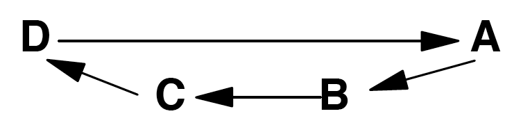

A is facing B, C, and D.

> B, C, and D are facing A.
>
> B and C pass dropbacks.
>
> Use your favorite passing sequence.
>
> Arrows indicate passes.

We don't know who invented this pattern, but we have been doing it since 1993. You can easily add extra clubs or people and use a variety of passing counts.

### Death from Above

This is a fun but challenging pattern with 2 extra clubs. It requires two jugglers that are comfortable with 7 clubs 4-count back to back passing and who aren't pansies like some Madison Area Jugglers I could mention.

|           |
|-----------|
| Positions |
| A         |

A faces B, and C faces D.

|             |         |         |
|-------------|---------|---------|
| **Juggler** | **1**   | **2**   |
| **A**       | T-D     | S-B     |
| **B**       | T-C     | S-A     |
| **C**       | S-D     | T-B     |
| **D**       | S-C     | T-A     |

Right hand counting

A and B start with 4 clubs each and start passing at the same time. C and D each start with 3 clubs.

A passes triple to D, then single to B.

> B passes triple back-to-back to C, single to A.
>
> C passes single to D, triple back-to-back to B.
>
> D passes single to C, triple to A.

Pattern by Luke Emery, 1999.

### Two on Two Double 3-Count

Everyone does double 3-count feed, feeding from right to left. This pattern is a prerequisite for El Nino \[see later\].

|             |         |         |         |
|-------------|---------|---------|---------|
| **Juggler** | **1**   | **2**   | **3**   |
| **A**       | C       |         | D       |
| **B**       | D       | C       |         |
| **C**       | A       | B       |         |
| **D**       | B       |         | A       |

Both hands counting

Start with R

This is the standard MAJ double 3-count box, but you might as well learn the opposite version (feeding from left to right) for doing the backwards El-Nino (La Niina).

\[dates to 7/97 MAJ\]

### Ultimate Feed

This is just a standard typewriter or windshield wiper feed in 1-count, but it's worth extra attention because it is a foundation for so many other patterns, including the very cool El Nino.

**Typewriter**

|             |         |         |         |
|-------------|---------|---------|---------|
| **Juggler** | **1**   | **2**   | **3**   |
| **A**       | B       | C       | D       |
| **B**       | A       |         |         |
| **C**       |         | A       |         |
| **D**       |         |         | A       |

Both hands counting

Start with R

**Windshield Wiper**

|             |         |         |         |         |
|-------------|---------|---------|---------|---------|
| **Juggler** | **1**   | **2**   | **3**   | **4**   |
| **A**       | B       | C       | D       | C       |
| **B**       | A       |         |         |         |
| **C**       |         | A       |         | A       |
| **D**       |         |         | A       |         |

Both hands counting

This is a 3-count feed where A feeds a 1-count carriage return, and B, C, and D are passing 3-count.

This pattern has been around for a long time and is a basis for other patterns. For example, each of the jugglers in the El Nino pattern will take their turn as feeder of the above pattern.

**Extra Club Ultimate Feed**

Add one extra club to the Ultimate feed by having all the feedees throw crosses. Alternatively (the feeder can throw crosses while the feedees throw straight). The extra club feed can be done with many different spins.

All passes in singles. (Timing is a bit wonky. Throw a little outside, especially on the middle throws.)

Feeder and feedees all in double passes. (Feeder rights synchronized with feedee lefts.) Feels like 7 club 3-count.

Feeder in triples ultimates, feedees in singles. (Feeder rights synchronized with feedee rights.)

Feeder in single ultimates, feedees in triples. (Feeder rights synchronized with feedee rights.)

**Two Extra Club Ultimate Feed**

To add another club (14 total), throw all passes as doubles and all passes are straight from both feeder and feedees.

Theoretically you could keep adding more clubs and higher throws, and just switching back and forth from straight to cross feedee passes with each extra club, but it gets challenging quickly.

### El Nino

El Nino is a rotating 1 count feed and is one of the crown jewels of the MAJ pattern book.

It is a challenging pattern, but quite doable once passers master the 1-count feed and the 2 on 2 double 3-count box. And once you can juggle it, you can join the Madison elite group of Jugglers Who Can Do The El Nino.

|             |         |         |         |         |         |         |         |         |         |          |          |          |          |          |          |          |
|-------------|---------|---------|---------|---------|---------|---------|---------|---------|---------|----------|----------|----------|----------|----------|----------|----------|
| **Juggler** | **1**   | **2**   | **3**   | **4**   | **5**   | **6**   | **7**   | **8**   | **9**   | **10**   | **11**   | **12**   | **13**   | **14**   | **15**   | **16**   |
| **A**       | C       | D       | B       | C       |         | B       |         |         | C       |          |          | C        |          |          | D        |          |
| **B**       |         |         | A       |         | D       | A       | C       | D       |         | C        |          |          | D        |          |          | D        |
| **C**       | A       |         |         | A       |         |         | B       |         | A       | B        | D        | A        |          | D        |          |          |
| **D**       |         | A       |         |         | B       |         |         | B       |         |          | C        |          | B        | C        | A        | B        |

Both hands counting

All jugglers start with left hands

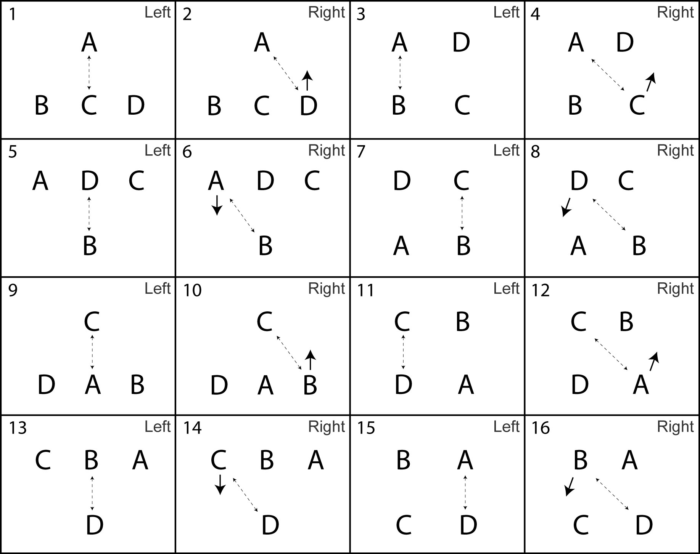

Positions: Lines indicate passes, arrows indicate movement of juggler after the pass.

El Nino is the combination of 2 patterns: Two on Two Double 3-Count, and Ultimate feed. Starting in the positions of the Ultimate Feed pattern, one of the feedees moves across and stands next to the feeder. Now the jugglers are doing Two on Two Double 3-Count.

Then another of the original feedees moves across, following the first mover, and the pattern becomes the Ultimate Feed again.

Now have 2 jugglers move back (one at a time) to join the feeder. See the diagrams above to see how the jugglers move.

The pattern in the graphs above is the fastest version. While learning, it's a good idea to wait a while, until the next juggler is ready, before the next move. Remember to move on a right hand pass.

The mirror image (1-count feeding left to right) is called La Nina. Move on left throws instead of rights and start with a right pass in the middle.

There are other fun ways to rotate a 1-count feed. Tarim demonstrated a pattern similar to 1-count El Nino where the mover transitions in 4-count instead of 3-count (leaving on a left hand throw in the above picture instead of a right, and joining the double three count box on the opposite count. He also goes the wrong direction like La Nina! :)

El Nino dates to August, 1997 by Peter Kaseman and MAJ.

### Oogle Boogie

The Oogle Boogie is a rotating Y.

**Positions and passing directions **

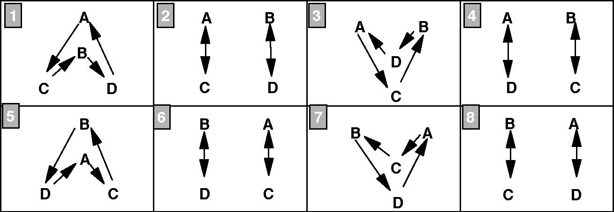

For each box, the jugglers will throw 3 right hand passes (two count) followed by a right hand self throw so they can move to the positions in the next box. The arrows are the directions of the passes. For example, in box 1, A passes to C, C passes to B, B passes to D, and D passes to A.

For the **Left Hand Version of Oogle Boogie**, use the same positions but reverse the direction of all of the arrows and rearrange the order of the boxes as 1,8,7,6,5,4,3, and 2.

For **Three Count Oogle Boogie**, use the positions in the diagram above. Instead of the arrows, use the table below to determine where to pass. Notice that the table below does not show beats 2,3,5,6,8,9, .... Assume that all beats not in the table are self throws.

The first 3 passes, i.e. on beats 1, 4, and 7, are done in the positions in box one above. The next 3 passes, i.e. on beats 13, 16, and 19, are done in the positions in box two. Continue assigning 3 passes to each box. After the 4th box, you will be at the end of the table below. For the boxes 5 through 8, start again at the beginning of the table below.

|             |         |         |         |          |          |          |          |          |          |          |          |          |          |          |          |          |
|-------------|---------|---------|---------|----------|----------|----------|----------|----------|----------|----------|----------|----------|----------|----------|----------|----------|
| **Juggler** | **1**   | **4**   | **7**   | **10**   | **13**   | **16**   | **19**   | **22**   | **25**   | **28**   | **31**   | **34**   | **37**   | **40**   | **43**   | **46**   |
| **A**       | C       | D       | C       |          | C        | C        | C        |          | C        | D        | C        |          | D        | D        | D        |          |
| **B**       | D       | C       | D       |          | D        | D        | D        |          | D        | C        | D        |          | C        | C        | C        |          |
| **C**       | B       | A       | B       |          | A        | A        | A        |          | B        | A        | B        |          | B        | B        | B        |          |
| **D**       | A       | B       | A       |          | B        | B        | B        |          | A        | B        | A        |          | A        | A        | A        |          |

Try the above in a 'pass, pass, self' pattern. Each box in the position table will have 6 passes before changing positions for the next box. This is a difficult pattern.

**Fast Oogle Boogie**: Use only the position boxes 1, 3, 5, and 7, and follow the passing directions indicated by the arrows. Remember to pass 3 times with the right hand, using the 4th right hand self to switch positions. This is the version we usually do.

Notice that the passes are always from A to C, B to D, C to B, and D to A.

When was this pattern created? We have been doing it since 1991.

### 14 Club Oogle Boogie

This has the same movement sequence as the standard Oogle Boogie, but with 2 extra clubs so all the passes are doubles (like 7 2-count).

Position 1: C, D start with 4 clubs each, do 3 passes, then triple self. A, B start (1/2 beat after C and D) with 3 clubs each, do 3 passes, then move to position 2.

Position 2: A, B do 3 passes , then triple self. C, D do 4 passes, then move to position 3.

Position 3: A, B do 3 passes, then triple self. C, D do 3 passes, then move to position 4.

Position 4: A, B do 4 passes, then move to position 5. C, D do 3 passes, then triple self.

All passes are double spin passes. Four passes are needed to transfer the extra clubs to the team that is not moving.

It's probably helpful to be comfortable with 7 club popcorn variations before learning this pattern.

It's possible to do a regular fast Oogle Boogie instead of the slow version if you have jugglers that are comfortable moving while throwing self triples.

Pattern by Luke Emery, 2000.

### Luke's Oogle

This is a Y in 3-count. Odd numbers are right hand passes and even numbers are left passes.

|             |         |         |         |         |
|-------------|---------|---------|---------|---------|
| **Juggler** | **1**   | **2**   | **3**   | **4**   |
| **A**       | C       | D       | C       | D       |
| **B**       | D       | C       | A       | A       |
| **C**       | B       | A       | D       | B       |
| **D**       | A       | B       | B       | C       |

3-Count

Start with R

B does drop backs to A

If you have 4 jugglers that can do every position, then you can try the following:

Four position graphs are depicted below. Starting with the first position, perform 4 passes (one cycle) and use your 2-self throws to move to the positions in the next graph. Four passes are made in every position.

The kind of rotation that the jugglers are doing in the variation above is the same as in the fast Oogle Boogie pattern, also known as the rotating-Y.

Pattern created in 1998 by Luke Emery.

### Slingshot

This is an 14 club variation on the Y pattern (Oogle) where all of the right hands are synchronized.

|             |         |         |
|-------------|---------|---------|
| **Juggler** | **1**   | **2**   |
| **A**       | C       | T-D     |
| **B**       | T-D     | C       |
| **C**       | A       | B       |
| **D**       | T-A     | T-B     |

Right hand counting

B and D start with 4 clubs each, and A and C start with 3 each.

D feeds A and B with 2-count triples (like 8 club 2-count).

C feeds A and B with 2-count singles (standard feed).

A and B alternate triple passes to D and single passes to C.

Every juggler is feeding two other jugglers: A and B are feeders to C and D, and C and D are feeders to A and B.

By Peter Kaseman, 1999.

**Slingshot Minus**

Here's an easier version with only one extra club. All passes are in a 4-count.

|             |         |         |         |         |
|-------------|---------|---------|---------|---------|
| **Juggler** | **1**   | **2**   | **3**   | **4**   |
| **A**       | C       |         | T-D     |         |
| **B**       | T-D     |         | C       |         |
| **C**       | A       |         | B       |         |
| **D**       |         | T-A     |         | T-B     |

Right hand counting and passing

B starts with 4

**Slingshot Plus**

You can make the pattern more interesting by adding clubs in the middle. With one more club C feeds an extra club line in doubles.

|             |         |         |         |         |
|-------------|---------|---------|---------|---------|
| **Juggler** | **1**   | **2**   | **3**   | **4**   |
| **A**       | D-C     |         | T-D     |         |
| **B**       | T-D     |         | D-C     |         |
| **C**       |         | D-B     |         | D-A     |
| **D**       | T-A     |         | T-B     |         |

Both hands counting

All passes with right hand

A, B and D start with 4 clubs and right hand

C starts with 3 clubs and left hand

**Slingshot Plus Plus**

Ok, while we're at it, you can add another club (so that all right hands are triple passes) to get the following:

|             |         |         |
|-------------|---------|---------|
| **Juggler** | **1**   | **2**   |
| **A**       | T-C     | T-D     |
| **B**       | T-D     | T-C     |
| **C**       | T-B     | T-A     |
| **D**       | T-A     | T-B     |

Right hand counting

All passes with right hand

All passers start with 4 clubs

This works best if all the jugglers are quite comfortable with 8 club 2-count in triples.

Created June, 1999 by MAJ.

### Martin's Madness/Mildness

After we learned Martin's Madness, we put 4 jugglers in the positions shown and tried to figure out if all 4 jugglers could be the feeder as in Martin's Madness at the same time. The pattern below is what we ended up with.

|                   |                 |                 |                 |                 |                 |                 |                 |                 |                 |                 |                 |                 |
|-------------------|-----------------|-----------------|-----------------|-----------------|-----------------|-----------------|-----------------|-----------------|-----------------|-----------------|-----------------|-----------------|
| **Juggler**       | **1**           | **2**           | **3**           | **4**           | **5**           | **6**           | **7**           | **8**           | **9**           | **10**          | **11**          | **12**          |
| **Al** | \*              | Cr   |                 | s               |                 | Dr   | s               |                 | Dr   |                 | Cr   |                 |
| **Ar** | s               |                 | Dl   |                 | Cl   |                 | \*              | Cl   |                 | s               |                 | Dl   |
| **Bl** |                 | Dr   | s               |                 | Dr   |                 | Cr   |                 | \*              | Cr   |                 | s               |
| **Br** | Cl   |                 | \*              | Cl   |                 | s               |                 | Dl   | s               |                 | Dl   |                 |
| **Cl** |                 | Al   |                 | Bl   |                 | \*              | Bl   |                 | s               |                 | Al   | s               |
| **Cr** | Br   |                 | s               |                 | Ar   | s               |                 | Ar   |                 | Br   |                 | \*              |
| **Dl** |                 | Bl   |                 | \*              | Bl   |                 | s               |                 | Al   | s               |                 | Al   |
| **Dr** | s               |                 | Ar   | s               |                 | Ar   |                 | Br   |                 | \*              | Br   |                 |

Legend: Al = left hand of A

Cr = right hand of C

\* = handoff

s = self pass

Notes: A and B are doing Martin's Mildness, out of sync. (straights)

C and D are doing Martin's Madness, out of sync. (crosses)

A and D are in sync, as are B and C.

Martin Frost created Martin's Madness and the variation on this page dates to 4/98 by MAJ. Martin has innovated many interesting feeds and other patterns, often with hurries and zips. Look them up, or best of all, find a Stanford juggler to help out.

Also see the 3 person Siteswap Feeds.

### Popcorn Feed

Recall that a popcorn pattern between 2 jugglers is a 7 club pattern where the jugglers are passing a beat out of sync. With the right hand, each juggler passes a double spin to partner, a single spin to self, and a triple spin to self. The left hand throws are all single spin self throws.

The Popcorn Feed is a 14 club pattern where A is out of sync with B, C, and D. A and B start with 4 clubs each, and B and C start with 3 each. A does a typewriter feed in doubles. B, C, and D all do a standard 6-count popcorn.

|             |         |          |         |          |         |          |
|-------------|---------|----------|---------|----------|---------|----------|
| **Juggler** | **1**   | **2**    | **3**   | **4**    | **5**   | **6**    |
| **A**       | D-D     |          | D-C     |          | D-B     |          |
| **B**       |         | D-A      |         | self     |         | T-self   |
| **C**       |         | self     |         | T-self   |         | D-A      |
| **D**       |         | T-self   |         | D-A      |         | self     |

Both hands counting

A starts with R and 4 clubs

C, D start with L

B starts with 4 clubs and a pause, then right throw on 2

This is a spectacular pattern, and could be a basis for an El Nino.

**Low Popcorn Feed**

This feed can be done with single passes and double selves instead of doubles and triples.

**Popcorn Weave**

Like most feeds, this can be turned into a weave. The feeder throws windshield wiper feed instead of typewriter feed. The feedees throw a triple self, then a double pass, then move to the next weave position on their self. This is a challenging weave. Also see the Popcorn Twister and Popcorn Twister Weave.

This pattern dates to September, 1999 by Luke Emery and the MAJ.

###
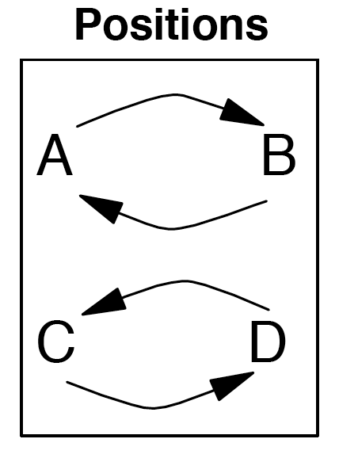

This is like a 4-person version of a synchronous double weave.

|             |         |         |         |         |
|-------------|---------|---------|---------|---------|
| **Juggler** | **1**   | **2**   | **3**   | **4**   |
| **A**       | C       |         | D       |         |
| **B**       | D       |         | C       |         |
| **C**       | A       |         | B       |         |
| **D**       | B       |         | A       |         |

After the 4th box, the jugglers are inverted, but the passing sequence repeats.

This pattern dates to 1997 by Mike Newton and MAJ.

###
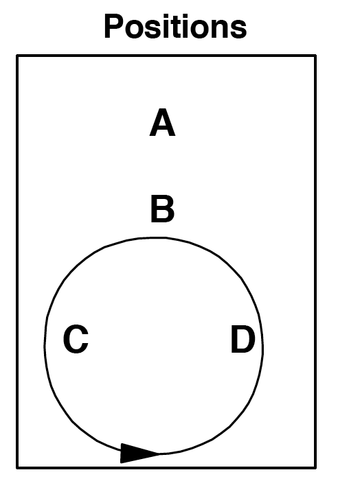

The unicycle is a nice moving pattern in 3-count.

|             |         |         |         |          |
|-------------|---------|---------|---------|----------|
| **Juggler** | **1**   | **4**   | **7**   | **10**   |
| **A**       | C       | D       | D       | C        |
| **B**       | A       | A       | A       | A        |
| **C**       | B       |         |         | B        |
| **D**       |         | B       | B       |          |

Both hands counting

Start with right hand

A is the seat, B is the stem, and C and D are the wheel.

A and B face C and D. C and D move around the circle in a counter clockwise direction.

Passes are done on 3-count.

All passes from B to A are drop-backs.

The following table combines the position table and passing table from above.

Also see Extra Club Unicycle and Two Seated Unicycle.

Unicycle dates to 1996 by MAJ.

###
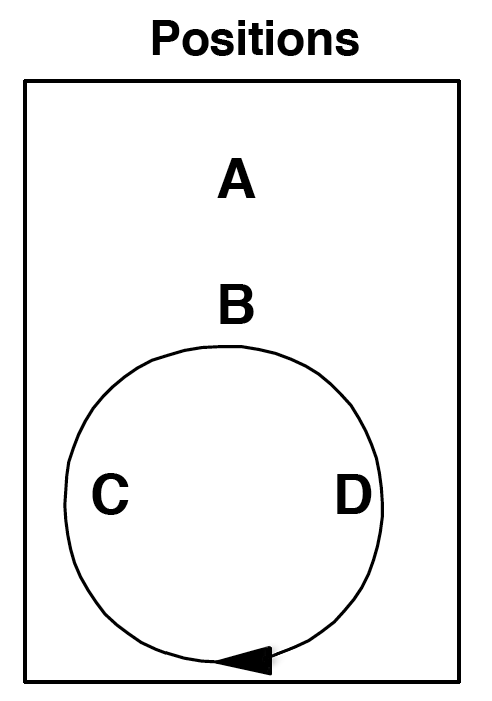

The Extra Club Unicycle is a fun moving pattern in 4-count with triple passes, double passes and dropbacks.

A feeds the left and right positions with 4-count triples.

B always throws dropbacks to A in 4-count.

C and D each throw 2 double passes to B in 4-count from the left position and then the right position, and then have 4 right hand counts to move around the back of the circle to the start.

|             |       |       |       |       |       |       |       |       |       |        |        |        |        |        |        |        |
|-------------|-------|-------|-------|-------|-------|-------|-------|-------|-------|--------|--------|--------|--------|--------|--------|--------|
| **Juggler** | **1** | **2** | **3** | **4** | **5** | **6** | **7** | **8** | **9** | **10** | **11** | **12** | **13** | **14** | **15** | **16** |
| **A**       |       |       | T-C   |       |       |       | T-D   |       |       |        | T-D    |        |        |        | T-C    |        |
| **B**       |       | D-A   |       |       |       | D-A   |       |       |       | D-A    |        |        |        | D-A    |        |        |
| **C**       | D-B   |       |       |       | D-B   |       |       |       |       |        |        |        |        |        |        |        |
| **D**       |       |       |       |       |       |       |       |       | D-B   |        |        |        | D-B    |        |        |        |

Both hands counting – all passes with right hand

C starts with 4 clubs and right hand

B starts with left hand

A and D start with right hand selves

### Y2K

This pattern has synchronous 1-count passes from A and synchronous dropbacks from B to A. A and B throw simultaneously with the left and right hand. It might take some practice to be comfortable catching those crazy passes!

B starts with 4 clubs and passes 2 at a time to A.

A starts with 2 clubs and passes 2 at a time:

Right hand passes to C's left hand.

> Left hand passes to D's right hand..

C passes every right hand to the "C" side of B (B's right hand) in right handed 2-count.

D passes every left hand to the "D" side of B (B's left hand) in left handed 2-count.

If B is facing C and D, then B passes simultaneous drop-backs to A, C passes to B's right hand, and D passes to B's left hand.

At B's discretion, B will rotate and face A.

B will now pass 2 at a time straight to A.

C passes drop-forwards to B's left hand.

D passes drop-forwards to B's right hand.

Have B rotate in the pattern until dizzy, then switch positions so that everyone has a chance to experience the problems associated with Y2K.

This pattern was created by Mike Newton on December 31, 1999.

### Gorilla for Four

This is one variation on gorilla passing with 4 passers.

There are 13 clubs. X starts with 4. A, B and C start with 3.

X throws synchronous ultimates. B throws right handed 2 count. A and C throw right handed 4 count. Here is the pattern.

X starts by throwing synchronous ultimates to B's left hand and C's left hand. Then X throws synchronous ultimates to A's left hand and B's left hand. And repeat.

B starts a little after X's first throws, with a right hand throw to X's right hand, then the next right hand throw is to X's left hand. In the steady state, B alternates feeding X's right hand and X's left hand with 2 count right hand throws.

C starts a little after X's first throw (in time with B) and throws to X's right hand. After that, C is always doing 4 count with X's right hand.

A starts a little after X's first throw with a right hand self. After that, A does 4 count with X's left hand.

Pattern by MAJ.

### Anklet (for 4 jugglers)

Argyle sock minus 2 jugglers.

|             |       |       |       |       |       |       |
|-------------|-------|-------|-------|-------|-------|-------|
| **Juggler** | **1** | **2** | **3** | **4** | **5** | **6** |
| **A**       | B     | D     |       | C     | D     |       |
| **B**       | C     | C     |       | A     | C     |       |
| **C**       | A     | B     |       | B     | B     |       |
| **D**       |       | A     |       |       | A     |       |

Both hands counting

Variation: Try making D spin.

Pattern by MAJ.

### Rush and Rest

This is a four-person pattern using right and left hand passing where each juggler passes four out of six throws.

**Classic Rush and Rest**

|             |         |         |         |         |         |         |
|-------------|---------|---------|---------|---------|---------|---------|
| **Juggler** | **1**   | **2**   | **3**   | **4**   | **5**   | **6**   |
| **A**       | B       | C       | B       |         | D       |         |
| **B**       | A       | D       | A       |         | C       |         |
| **C**       |         | A       |         | D       | B       | D       |
| **D**       |         | B       |         | C       | A       | C       |

Both hands counting

**First Variation**

This is a Feast pattern with an extra pass across and an extra pass to self.

|             |         |         |         |         |         |         |
|-------------|---------|---------|---------|---------|---------|---------|
| **Juggler** | **1**   | **2**   | **3**   | **4**   | **5**   | **6**   |
| **A**       | B       | B       | C       |         |         | D       |
| **B**       | A       | A       | D       |         |         | C       |
| **C**       |         |         | A       | D       | D       | B       |
| **D**       |         |         | B       | C       | C       | A       |

Both hands counting

**Second Variation**

A and B repeat the passing rhythm in the classic Rush and Rest. C and D pass for two beats, rest for one beat.

|             |         |         |         |         |         |         |
|-------------|---------|---------|---------|---------|---------|---------|
| **Juggler** | **1**   | **2**   | **3**   | **4**   | **5**   | **6**   |
| **A**       | D       | D       | B       |         | C       |         |
| **B**       | C       | C       | A       |         | D       |         |
| **C**       | B       | B       |         | D       | A       |         |
| **D**       | A       | A       |         | C       | B       |         |

Both hands counting

Rush and Rest is by Steve Otteson and MAJ from 1998.

### Shooting Star

In a Star pattern five jugglers stand in a circle and pass to the second juggler to the right. A Shooting Star is a star with one juggler missing. When each juggler runs out of clubs, they move to the empty space.

1.  A, C, and D start with 3 clubs and pass according to diagram one. When C runs out of clubs, C moves to the empty spot.

<!-- -->

1.  A will run out of clubs next and then move to the empty spot. The pattern continues so that each juggler will run out of clubs and move to the empty spot.

Tip: Move to the center as you throw your last club after a club whizzes by the front of your head. Turn around. Move out as the next pass whizzes by the back of your head.

There are many variations on the shooting star. Add multiple clubs and up the passes to doubles and/or triples. Pirouette through the middle

Shooting Star was created by Bryan Olson in 1993.

### 14 Club Lines (for 4 jugglers)

Here are some of the many 4 juggler line variations we do in Madison. A and B are both facing C and D.

**Locked Lines**

|             |         |         |         |         |
|-------------|---------|---------|---------|---------|
| **Juggler** | **1**   | **2**   | **3**   | **4**   |
| **A**       | D-C     |         | D-C     |         |
| **B**       | D-D     |         | D-D     |         |
| **C**       |         | D-A     |         | D-A     |
| **D**       |         | D-B     |         | D-B     |

Both hands counting, right hand passes only

A and B start with 4 and right hand

C and D start with 3 and left hand

To avoid dangerous collisions, A and B should throw at exactly the same time, and C and D should throw at exactly the same time. A and D can control the timing the best since they have the best visibility.

**Popcorn Lines**

|             |         |          |         |         |
|-------------|---------|----------|---------|---------|
| **Juggler** | **1**   | **2**    | **3**   | **4**   |
| **A**       |         | T-self   |         | D-C     |
| **B**       | D-D     |          | C       |         |
| **C**       | D-A     |          | B       |         |
| **D**       |         | T-self   |         | D-B     |

Both hands counting, right hand passes only

B and C start with 4 and right hand

A and D start with 3 and left hand

**Popcorn Lines 2**

|             |         |         |         |         |
|-------------|---------|---------|---------|---------|
| **Juggler** | **1**   | **2**   | **3**   | **4**   |
| **A**       |         | T-D     |         | D-C     |
| **B**       | D-D     |         | C       |         |
| **C**       | D-A     |         | B       |         |
| **D**       |         | T-D     |         | D-B     |

Both hands counting, right hand passes only

B and C start with 4 and right hand

A and D start with 3 and left hand

You can switch back and forth between the Popcorn Line variations.

**Popcorn Dropback Line**

The popcorn dropback variations work better if B and C move a little to the side in more of a diamond formation than a line.

|             |         |          |         |         |          |         |
|-------------|---------|----------|---------|---------|----------|---------|
| **Juggler** | **1**   | **2**    | **3**   | **4**   | **5**    | **6**   |
| **A**       | D-C     |          |         |         | T-self   |         |
| **B**       |         | T-self   |         | D-A     |          |         |
| **C**       |         | T-self   |         | D-D     |          |         |
| **D**       | D-B     |          |         |         | T-self   |         |

Both hands counting, right hand passes only

A and D start with 4 and right hand

B and C start with 3 and left hand and throw all dropbacks as doubles

**Popcorn Dropback Line 2**

Now add triple passes over the top!

|             |         |         |         |         |         |         |
|-------------|---------|---------|---------|---------|---------|---------|
| **Juggler** | **1**   | **2**   | **3**   | **4**   | **5**   | **6**   |
| **A**       | D-C     |         |         |         | T-D     |         |
| **B**       |         | T-C     |         | D-A     |         |         |
| **C**       |         | T-B     |         | D-D     |         |         |
| **D**       | D-B     |         |         |         | T-A     |         |

Both hands counting, right hand passes only

A and D start with 4 and right hand

B and C start with 3 and left hand and throw all dropbacks as doubles

To start, add one set of triple passes at a time.

**Popcorn Dropback Line 3**

Ok, add in some more extra passes. Why not?

|             |         |         |         |         |         |         |
|-------------|---------|---------|---------|---------|---------|---------|
| **Juggler** | **1**   | **2**   | **3**   | **4**   | **5**   | **6**   |
| **A**       | D-C     |         |         |         | T-D     |         |
| **B**       |         | T-C     |         | D-A     |         | C       |
| **C**       |         | T-B     |         | D-D     |         | B       |
| **D**       | D-B     |         |         |         | T-A     |         |

Both hands counting, right hand passes only

A and D start with 4 and right hand

B and C start with 3 and left hand and throw all dropbacks as doubles

###
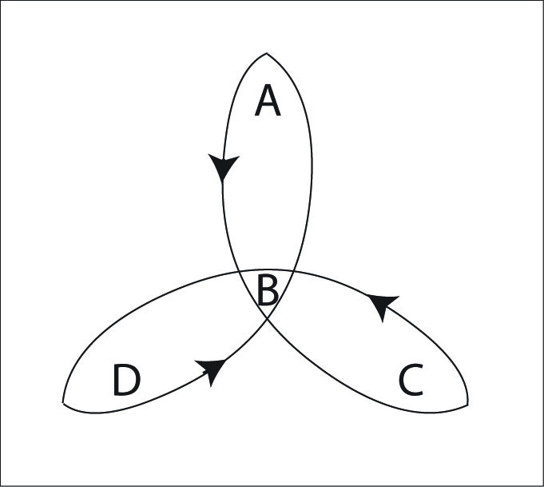

Here's another version of the 4 person clover. However, we juggle the Standard Clover more often (which used to be called the New Clover) because it is easier to remember and has a nicer flow to it.

|             |         |         |         |         |         |         |         |         |
|-------------|---------|---------|---------|---------|---------|---------|---------|---------|
| **Juggler** | **1**   | **2**   | **3**   | **4**   | **5**   | **6**   | **7**   | **8**   |
| **A**       | B       |         | D       |         | C       |         | D       |         |
| **B**       | A       |         | C       |         | D       |         | C       |         |
| **C**       | D       |         | B       |         | A       |         | B       |         |
| **D**       | C       |         | A       |         | B       |         | A       |         |

Right hand counting

Every juggler is a feeder passing a standard 4-count feed to the other 3 jugglers.

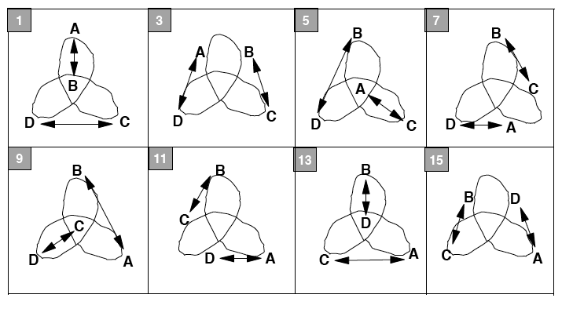

Mike Newton is the creator of this pattern.

### Three Leaf Clover (Peter's Version)

The MAJ juggles the Standard Clover more often than this version. This is a nice pattern, if you can remember the passing sequence.

|               |         |         |         |         |         |         |         |         |         |          |          |          |
|---------------|---------|---------|---------|---------|---------|---------|---------|---------|---------|----------|----------|----------|
| **Juggler**   | **1**   | **2**   | **3**   | **4**   | **5**   | **6**   | **7**   | **8**   | **9**   | **10**   | **11**   | **12**   |
| **A**         | B       | C       | D       | B       | D       | C       | B       | C       | D       | B        | D        | C        |
| **B**         | A       | D       | C       | A       | C       | D       | A       | D       | C       | A        | C        | D        |
| **C**         | D       | A       | B       | D       | B       | A       | D       | A       | B       | D        | B        | A        |
| **D**         | C       | B       | A       | C       | A       | B       | C       | B       | A       | C        | A        | B        |

Right handed 4-count

In the graph below, lines indicate passes, and arrows indicate the movement of jugglers after the pass.

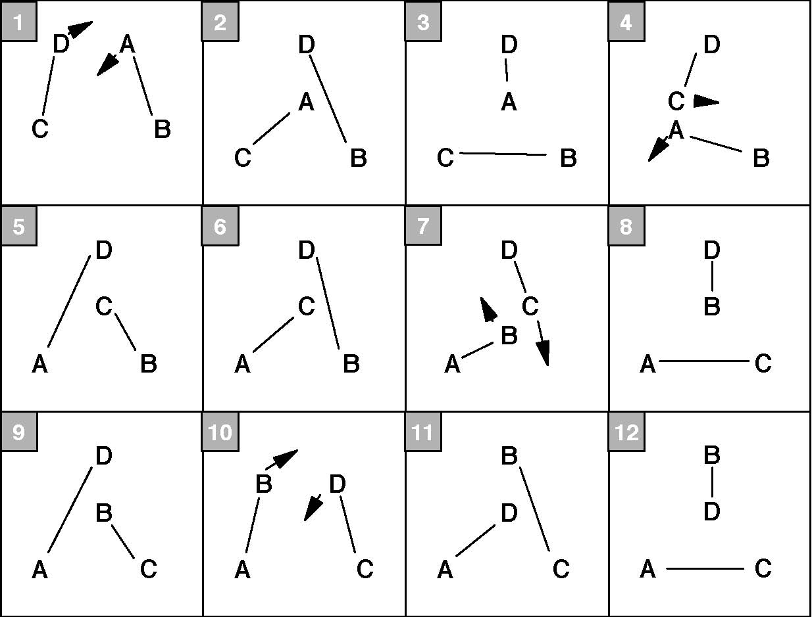

Notice that the movement around the leaves in Peter's version is reversed from Mike's and Steve's version. (The starting positions are also different.) It takes 12 passes for everyone to move to the next leaf.

Every juggler is a feeder in a modified typewriter feed.

### Three-Leaf Clover (Steve's Version)

As above, the MAJ now juggles the standard clover more often than this version, but it's worth exploring this variation too.

**Inside Passing Triangles**

|               |         |         |         |         |         |         |         |         |
|---------------|---------|---------|---------|---------|---------|---------|---------|---------|
| **Juggler**   | **1**   | **2**   | **3**   | **4**   | **5**   | **6**   | **7**   | **8**   |
| **A**         | B       |         | D       |         | C       |         | D       |         |
| **B**         | A       |         | C       |         | D       |         | C       |         |
| **C**         | D       |         | B       |         | A       |         | B       |         |
| **D**         | C       |         | A       |         | B       |         | A       |         |

Right hand passing 4-count

**Outside Passing Triangles**

|               |         |         |         |         |         |         |         |         |
|---------------|---------|---------|---------|---------|---------|---------|---------|---------|
| **Juggler**   | **1**   | **2**   | **3**   | **4**   | **5**   | **6**   | **7**   | **8**   |
| **A**         | B       |         | D       |         | C       |         | D       |         |
| **B**         | A       |         | C       |         | D       |         | C       |         |
| **C**         | D       |         | B       |         | A       |         | B       |         |
| **D**         | C       |         | A       |         | B       |         | A       |         |

Right hand passing 4-count

**Alternate Inside/Outside Passing Triangles**

|               |         |         |         |         |         |         |         |         |
|---------------|---------|---------|---------|---------|---------|---------|---------|---------|
| **Juggler**   | **1**   | **2**   | **3**   | **4**   | **5**   | **6**   | **7**   | **8**   |
| **A**         | B       |         | D       |         | C       |         | D       |         |
| **B**         | A       |         | C       |         | D       |         | C       |         |
| **C**         | D       |         | B       |         | A       |         | B       |         |
| **D**         | C       |         | A       |         | B       |         | A       |         |

Right hand passing 4-count

The movement graph below applies to the three versions above. Lines indicate passes. Arrows indicate movement of jugglers after the pass.

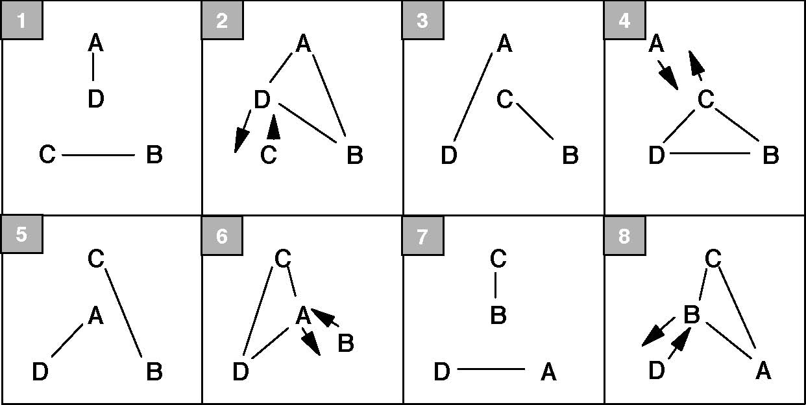

The passing rate and movement along the leaves is the same as in Mike's version (notice the different numberings in the graphs of Steve's and Mike's versions).

In Steve's version, for the odd numbered passes, A and D always pass to each other, and B and C always pass to each other. For the even numbered passes, three jugglers pass to each other in a triangle. The juggler not in the triangle will be bumped off its leaf.

The 1st version of Steve's version has inside passing triangles, the 2nd has outside passing triangles, and the 3rd toggles between outside and inside passing triangles.

Steve Otteson is the creator of this pattern.
