# 6 Person Patterns

## 1-2-3 Apollo 

This Apollo for 6 jugglers is another Madison classic. (There are Apollos for
all numbers.)

|                                        |                          |
|------------|------------|
| {width=40%} | 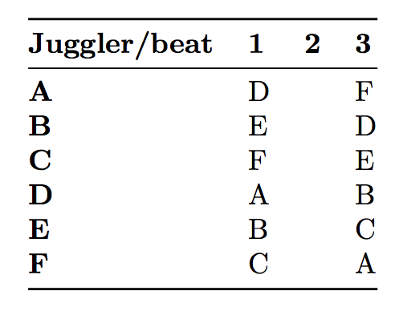{width=35%} |
| positions                                       |    Right-hand counting |

Nice easy 4-count pattern.

Pattern by MAJ.

## Argyles

### Argyled Triangles

Want to challenge your left-right passing? Try one of these.

|                                        |                          |
|------------|------------|
| {width=30%} | 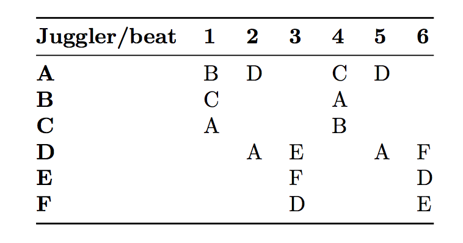{width=50%} |
| positions                                       |    both-hands counting |

A and D face each other, passing double 3-count with the rest. B,C, E, and F
pass 3-count.

It's trickier than you might think, even if you rock double-3 count. Helps if A and D make loopy
passes to each other.

Pattern by MAJ.

### Argyle Sock

Everyone does double 3-count.

|                                        |                          |
|------------|------------|
| {width=30%} | 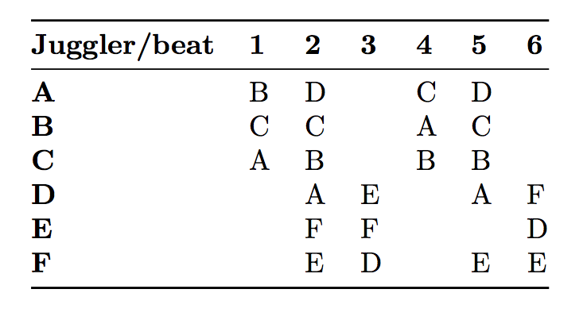{width=50%} |
| positions                                       |    both-hands counting |

See Anklet for a 4 juggler version.

Pattern by MAJ.

## Hex

This is a nice 3-count warm-up for a group of six jugglers. In the steady state all jugglers
do the same thing.

|                                        |                          |
|------------|------------|
| 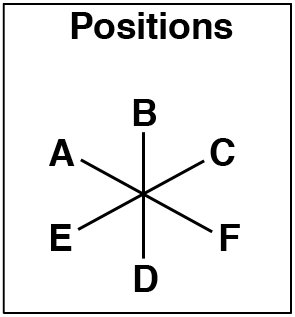{width=30%} | 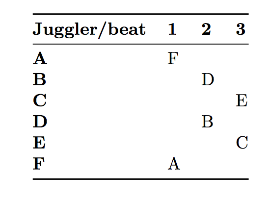{width=40%} |
| positions                                       |    both-hands counting |

**Variation** 7-Club 3-count Hex. For those seeking a challenge, try a Hex where each pair juggles a 3-count 7
club pattern in doubles. It works if the passes are precise.

Pattern by MAJ.

## Bubbler of David
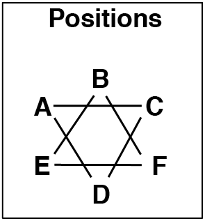{width=30%}

The Bubbler is a Star of David with interlocking triangles and extra clubs in
4-count doubles (that's the effervescent part).

A, C and D are in one triangle. They do a 4-count extra club triangle. The pass
is a double from right hand to left hand. Each juggler passes to the juggler on
their left The timing is a little fast and syncopated (A throws to C, C throws
to D 4/3 beats after A, D throws to A 4/3 beats after C).

B, F and E are another triangle. They do a 4-count extra club triangle too. F
throws at exactly the same time as A, E throws with C and D is synchronized with
B.

Get that pattern smooth first. Now, notice how the juggler across from you is
doing a self at the exact same time as you are? Now, just pass the right hand
single straight across.

As always, timing is the key.

This pattern doesn't lend itself to a table format because the counts aren't
even, but it's easy to figure out.

Pattern by MAJ.

## 6-Person Double Weaves
{width=30%}

As you've seen, there are a mind boggling variety of possible weaves. Well, any of these weaves can be paired up with any other weave to make a double weave. The permutations are infinite, but here are some that we like.

### Standard Double Weave

If A, B and C do a standard weave and pass across to D, E and F in a standard weave, you get the Standard Double Weave.

| **Juggler/beat** | **1** | **2** | **3** |
|-------------|-------|-------|-------|
| **A**       | D     |       |       |
| **B**       |       | E     |       |
| **C**       |       |       | F     |
| **D**       | A     |       |       |
| **E**       |       | B     |       |
| **F**       |       |       | C     |

> * Right hand counting

The standard weave has each juggler moving forward in the middle, and back on
the ends. Move to the next position after each pass. See the Standard Weave for
more details concerning movement.

In this version jugglers pass short throws in the middle and long throws on the
ends. As always, watch the lead throws!

### Invert Prevert Weave (Equidistant Weave)

One team is inverted (which must mean the other team is preverted). Team DEF
does an inverted weave by moving forward on the ends and backwards in the
middle. This is an easier weave than the standard weave if all passers are
comfortable with both standard and inverted weaves and looks nice because each
juggler in a pair stays the same distance from the other.

{width=30%}

### Cross-Corner Weave (Kitty-Korner Weave)

Same as the standard double weave, but pass to the opposite corner on the ends.

### Extra-club Double Weave

Set up a standard double weave, but have one juggler with an extra club.  Passing beat
stays at 6-count; moving stays the same (figure eight), but the passes have to be doubles.
Importantly, you receive from one juggler then pass to another, in order to retain the 7-club-style
passing.  Lead deeply on the ends and short and lofty in the middle.

### Dresser Drawers Double Weave

Either, both weaves do Dresser Drawer style (see 4-person patterns), or they do that plus
adding 3 clubs, as described here. **check this**

Both teams do the Dresser Drawers weave.

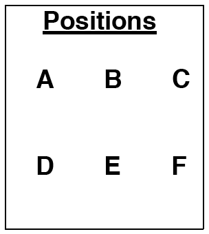{width=30%}

All passes are right hand doubles (like 7 2-count). Each weaver passes to only
one other weaver (like in standard double weave) in a 6-count. The leads are
very important.

| **Juggler/beat** | **1** | **2** | **3** | **4** | **5** | **6** |
|-------------|-------|-------|-------|-------|-------|-------|
| **A**       | D-D   |       |       |       |       |       |
| **B**       |       |       | D-E   |       |       |       |
| **C**       |       |       |       |       | D-F   |       |
| **D**       |       | D-B   |       |       |       |       |
| **E**       |       |       |       | D-C   |       |       |
| **F**       |       |       |       |       |       | D-A   |

> * Both hands counting
> * A, B and C start with right hand
> * D, E and F start with left hand

### Switch Sides Double Weave

Switch sides at each end. For example, after A and D pass at the end, they
switch positions so that A, E, and F are weaving, as are D, B, and C.

When was this pattern created? We have been doing it since 1993.

### Double Gandini Weave

The Standard Gandini Weave makes a very nice double weave too. Each weaver
passes twice in a row to two different jugglers, and then has 4 selves to move
out, around back and into the middle. Next time move out in the opposite
direction.

| **Juggler/beat** | **1** | **2** | **3** | **4** | **5** | **6** |
|-------------|-------|-------|-------|-------|-------|-------|
| **A**       |       |       |       | E     | F     |       |
| **B**       |       | D     | E     |       |       |       |
| **C**       | D     |       |       |       |       | F     |
| **D**       | C     | B     |       |       |       |       |
| **E**       |       |       | B     | A     |       |       |
| **F**       |       |       |       |       | A     | C     |

> * Right hands counting

For a good time, call Melonhead. Or try this pattern in chocolate bar.

Another nice variation is to add an extra club and make all the passes in the middle right hand doubles.

Based on Gandini Weaves by Gandini Juggling Project and MAJ.

### Double Gandini Weave Plus

There is so much time at the back end of the Double Gandini Weave! Nine self
throws! There must be something to do in all that time. Wait, I know! Let's add
another club!

This is the same as the previous pattern with a triple club passed back and
forth over the top of the pattern. It's a spectacular pattern and not as hard as
you might think (though certainly not easy).

| **Juggler/beat** | **1** | **2** | **3** | **4** | **5** | **6** |
|-------------|-------|-------|-------|-------|-------|-------|
| **A**       |       | T-F   |       | E     | F     |       |
| **B**       |       | D     | E     |       |       | T-E   |
| **C**       | D     |       |       | T-D   |       | F     |
| **D**       | C     | B     |       |       | T-B   |       |
| **E**       | T-A   |       | B     | A     |       |       |
| **F**       |       |       | T-C   |       | A     | C     |

> * Right hands counting

Pattern by Luke Emery.

### Stick on the End Double Weave 

Two teams of weavers pass to each other while weaving: moving back on the ends,
forward in the middle, starting positions as in the Standard Double Weave.  All  three opposing pairs 
pass simultaneously.  In order for this to work,
pass twice (on base count) while in the end positions, and pass once while in the middle.
Weavers pass in 6-count in the standard version, but since they're in sync you can
easily do other counts. 4-count is pretty tough, but 5-count is fun!

|                                        |                          |
|------------|------------|
| 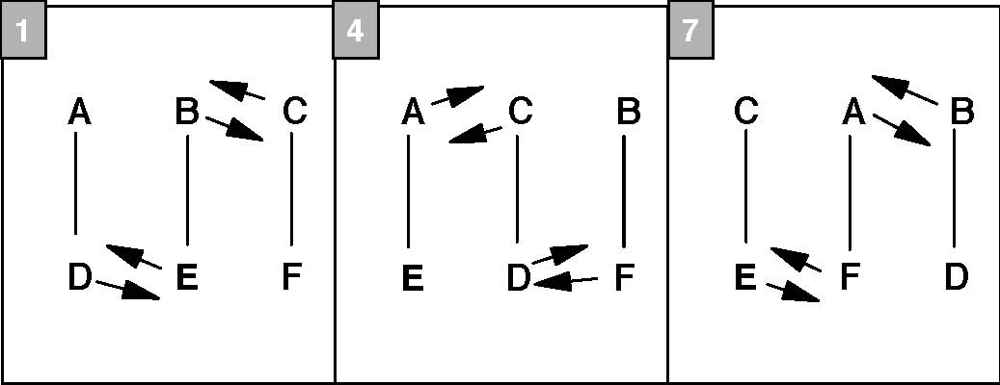{width=60%} | 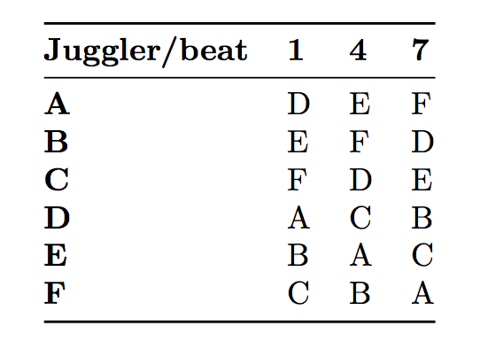{width=25%} |
|  movements   |    right-hand counting |

In the figure above, lines indicate passes, numbers indicate the passing beat,
and arrows indicate movement after the pass. So starting out Jugglers A and F are stickers.

Note: If each side moves on the edges and middle of a rectangle, instead of
weaving, we have the essence of Han's Delight. \[Euro '98'\].

When was this pattern created? We have been doing it since 1993 (when we did it in Tripp Commons with Matt Henry!).

### Five Person Weave (Peter Feeds Five)

This is a fun moving pattern that's pretty simple but mentally tough for beginners, since the count
changes as you move through the weave.  The local rule is pass to Peter (the feeder) then move to the
next spot.  If you're in an odd spot, then you move back away from Peter and *with the grain* (i.e. in the
same direction as Peter's sweep); if you're in an even spot then you move forward and *against the grain*. You end up passing more frequently in the middle and less frequently on the ends.

| **Juggler/beat** | **1**  | **2**  | **3**  | **4**  | **5**  | **6**  | **7**  | **8**  | **9**  | **10** |
|-------------|--------|--------|--------|--------|--------|--------|--------|--------|--------|--------|
| **A**       | F      |        |        |        |        |        |        | F      |        |        |
| **B**       |        | F      |        |        |        |        |        |        | F      |        |
| **C**       |        |        | F      |        |        | F      |        |        |        |        |
| **D**       |        |        |        | F      |        |        | F      |        |        | F      |
| **E**       |        |        |        |        | F      |        |        |        |        |        |
| **F**       | A      | B      | C      | D      | E      | C      | D      | A      | B      | D      |
|             | **11** | **12** | **13** | **14** | **15** | **16** | **17** | **18** | **19** | **20** |
| **A**       | F      |        |        | F      |        |        |        |        |        |        |
| **B**       |        |        |        |        |        | F      |        |        | F      |        |
| **C**       |        |        | F      |        |        |        |        |        |        | F      |
| **D**       |        |        |        |        |        |        | F      |        |        |        |
| **E**       |        | F      |        |        | F      |        |        | F      |        |        |
| **F**       | A      | E      | C      | A      | E      | B      | D      | E      | B      | C      |

> * Right hand counting

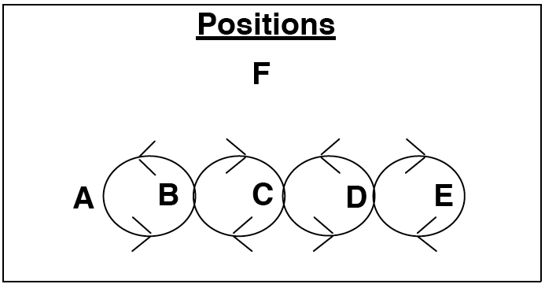{width=50%}

When was this pattern created? We have been doing it since 1998.

### Spiral

Peter and Luke have complained that this shouldn't be called a Spiral, but that's what we call it! It's sort
of a weave, but there are three loops instead of two. And you pass at the faces of the loops instead of on the edges. The standard version has weavers in 6 count (two doing every third rights and two every third lefts) and feeders in 3 count.

|                                        |                          |
|------------|------------|
| 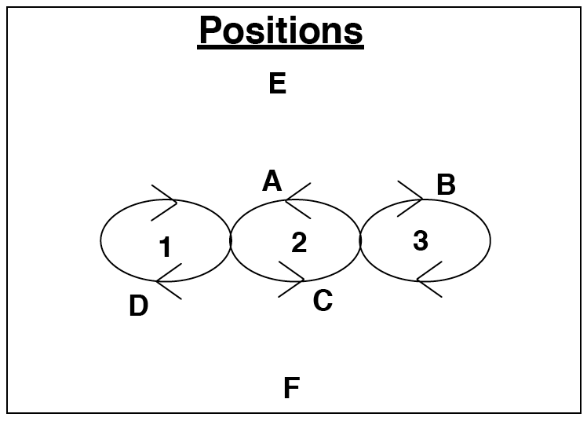{width=50%} | 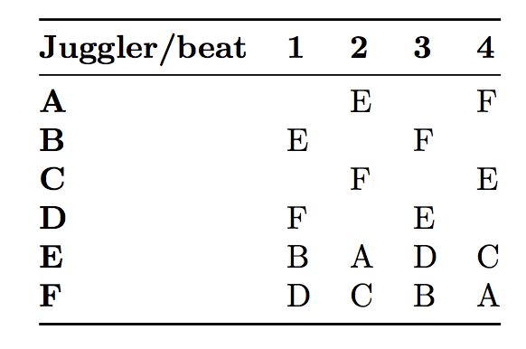{width=35%} |
| positions                                       |     |

> * Right hand counting Fast Spiral Weave [weavers 4-count; feeders 2-count]
> * 3-Count Standard Spiral Weave [weavers 6 count; feeders 3-count]
> * double 3 Count Hyper-Spiral Weave [not sure if we ever got this to work!]

Refer to the graph above to follow A's path through the pattern. A's first pass
is to E. A then turns around and moves to the bottom of loop 1 where a pass is
made to F. A turns and moves to the top of loop 1 to pass to E. A turns and
moves to the bottom of loop 2 to pass to F. A turns and moves to to the top of
loop 3 to pass to E. A turns and moves to the bottom of loop 3 to pass to F. A
turns and moves to the top of loop 2 where the pattern started.

Jugglers A, B, C, and D all do the same thing on pass out of phase. If the
numbers show right hand counting this is the Fast Spiral and the weavers have a
4-count to move between each position. This is very fast.

To slow the pattern to 3-count, change the column numbers in the table above
from 1, 2, 3, 4 to 1, 4, 7, and 10, and change "Right hand counting" to "Both
hands counting, right hand starts". The weavers will pass in 6-count (note that
2 weavers, A and C are passing left handed 6-count).

Still too fast? Change the column numbers to 1, 3, 5, and 7 with right hand
counting (weavers in 8-count).

Like many patterns, Spirals can be stacked, where one of the feeders is replaced
another Spiral with the original feeder moved to the other side of the
additional Spiral.

To red line this pattern have the feeders throw double 3 count, but keep the
same passing order. Now the weavers are all in 3-count. The Hyper Spiral should
be enough to challenge the most jaded of weavers!

Pattern by Mike Newton and MAJ.

### Standard 5-Weave
{width=50%}

The standard weave for 1 feeder and 5 feedees has each feedee in 10-count (every
5th right) and the feeder in 2-count. Each weaver passes once on the
end, moves backwards and inside, then passes once in the middle, and moves
forwards and outside to the other end. A 10-count sound very slow, but I think
you'll find most weavers will not be bored at all trying to keep up.

Once it starts, it's pretty easy to keep going. The start is a bit different
from the standard weave for 3. The first weaver who passes in the middle goes to
the opposite side of the first outside pass.

1. A – B end (B goes back on the end)
1. A – C middle (C move slowly forward and to their right)
1. A – D end (D goes back on the end)
1. A – E middle (E moves forward and to their left)
1. A – F end (F moves slowly left before the pass, then back on the end)
1. A next passes to B in the middle (as B is moving to their right) and
    continues passing to each weaver in order, but in the next weave position.

All of the weave variations can be done in a 5 Weave too. For added fun and
excitement try a double weave of 2 standard 5 weaves, or 5 weave opposite a 3
weave, or a 5 weave opposite a Gandini Weave and so on.

Also see Twister 5 variations.

Pattern by MAJ.

### Gandini 5 Weave

|                                        |                          |
|------------|------------|
| 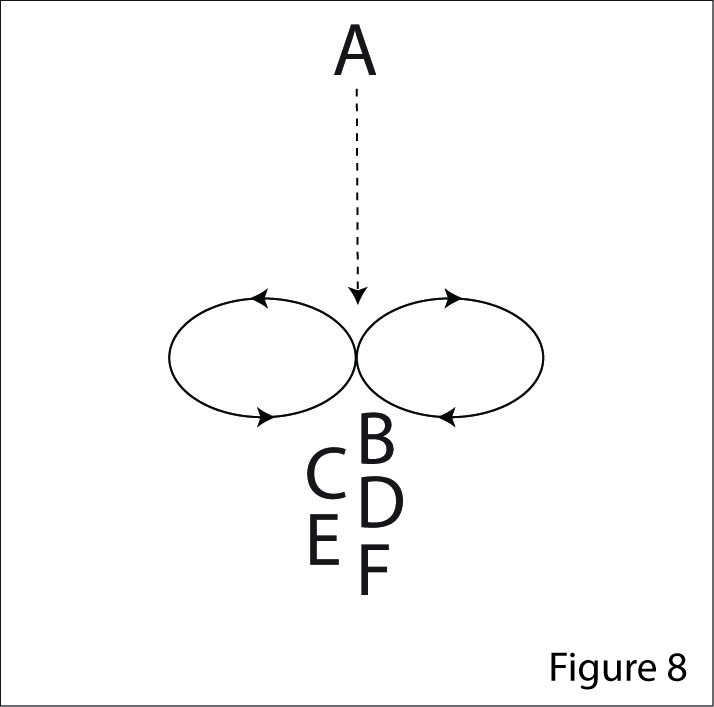{width=45%} | 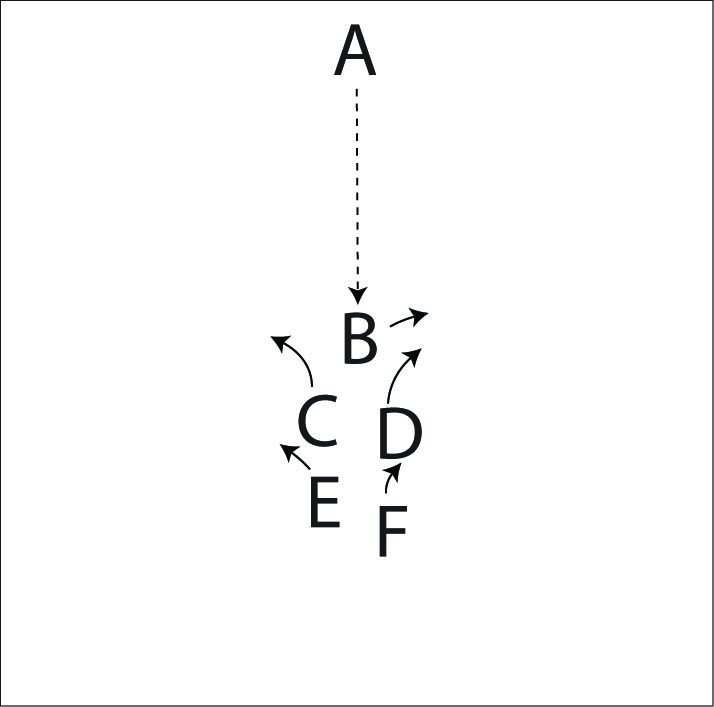{width=45%} |
| start | go     |

In this weave all the weavers move in a figure 8, but they always pass from the
middle instead of the end.

The feeder is in 2-count (every right hand pass), the feedees are in 10-count.

| **Juggler/beat** | **1**   | **2**   | **3**   | **4**   | **5**   |
|-------------|---------|---------|---------|---------|---------|
| **A**       | B       | C       | D       | E       | F       |
| **B**       | A       |         |         |         |         |
| **C**       |         | A       |         |         |         |
| **D**       |         |         | A       |         |         |
| **E**       |         |         |         | A       |         |
| **F**       |         |         |         |         | A       |

It's easiest to start with the weavers stacked in a line all facing the feeder.
Then each weaver will pass once and move in the opposite direction of the weaver
in front of them.

Try all the same variations for the Standard Weave and Gandini Weave, and
alternate counts such as 2 of 3 count. You can also invert the weave (reverse
cascade). Also see Appendix C.

We learned about this family of weave variations from juggling with Sean Gandini
and the Gandini Juggling Project in 2000.

### Twister 4 Weave

Twister Weaves can be done with any number of jugglers. Here's a twister weave
for 6.

|                                        |                          |
|------------|------------|
| 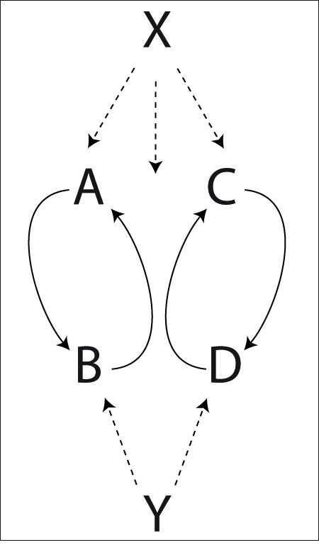{width=30%} | 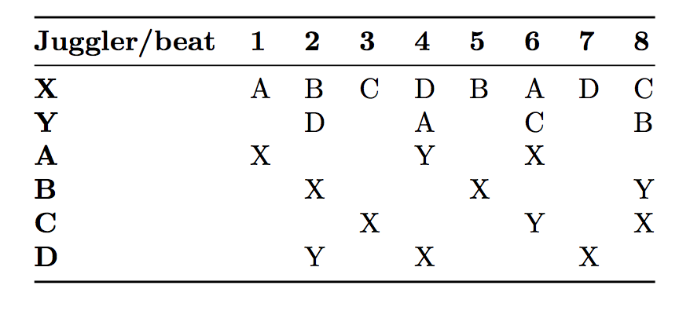{width=50%} |
| positions |  right-hand counting |

Pattern by Luke Emery.

### Foie-Graham

This is an intense off-set double-weave for six jugglers.  As you enter an *outside* loop of your weave
you do *pass-self-self* (right-hand counting) as usual for a weave. But as you enter the other loop, the *inner* loop, you make a series of 4 passes, starting and ending with the same person, and getting the other two in
between.  It takes advantage of the fact that coming out of the middle on a weave you are in front of
your other weavers, and so can get some extra passes in before going to the backside of the weave loop.
The postion graph, on the left below, shows the 12 spots of a standard weave, duplicated and offset
to configure the pattern. Blue arrows indicate moves after each beat, with the starting configuration
shown. The pass graph, on the right, shows where passes happen (green) in the 12-beat cycle.

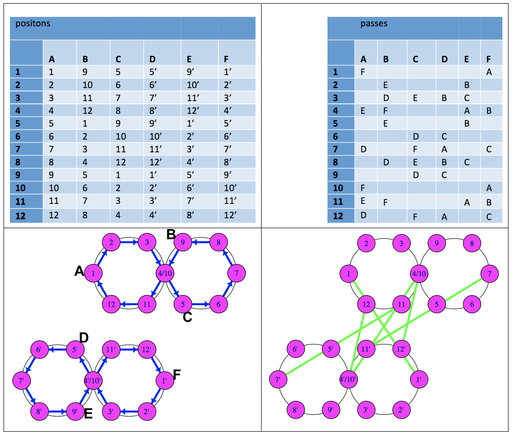

Pattern by Graham Paasch.

## 6-Person Turbo Variations
### Interlocking Turbos

The Turbo pattern for 3 jugglers lends itself to lots of variations. This is a
pattern of 2 Turbos side by side where during each transition the weaver moves
from one of the Turbos to the other.

Three of the jugglers always do an “inside turn” (turning towards their right
hand pass). Three of the jugglers do an “outside turn” (turning away from the
right hand pass). A, B and C will always go on the outside when they cross with
the other Turbo. D, E and F always go on the inside.

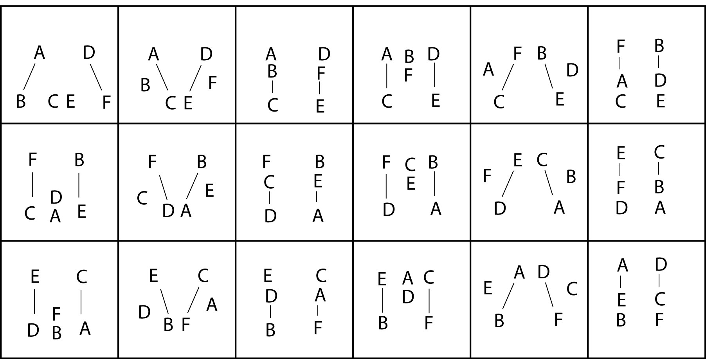{width=75%}

The standard pattern is in a 2-count Turbo. You can do it in 4-count or 3-count
to slow it down.

Try in Tom's Turbo for a good challenge. The Interlocking Extra Club Turbos is a
formidable challenge for the those with time, talent and hubris.

Pattern by Luke Emery, 1999.

### Back to Back Turbos

Two Turbos are back-to-back. There are 2 situations concerning the switching of
sides. When you are on one side of a turbo, you weave as you would in the
regular turbo. In box 2, B and E switch sides in regular turbo style. When you
are on the other side of the turbo, you move to the other turbo. In box 5, A and
F switch turbos.

The movement arrows in the graph below are an approximation. In other words, you
should move as soon as you can.

Lines indicate passes, and arrows indicate movement.

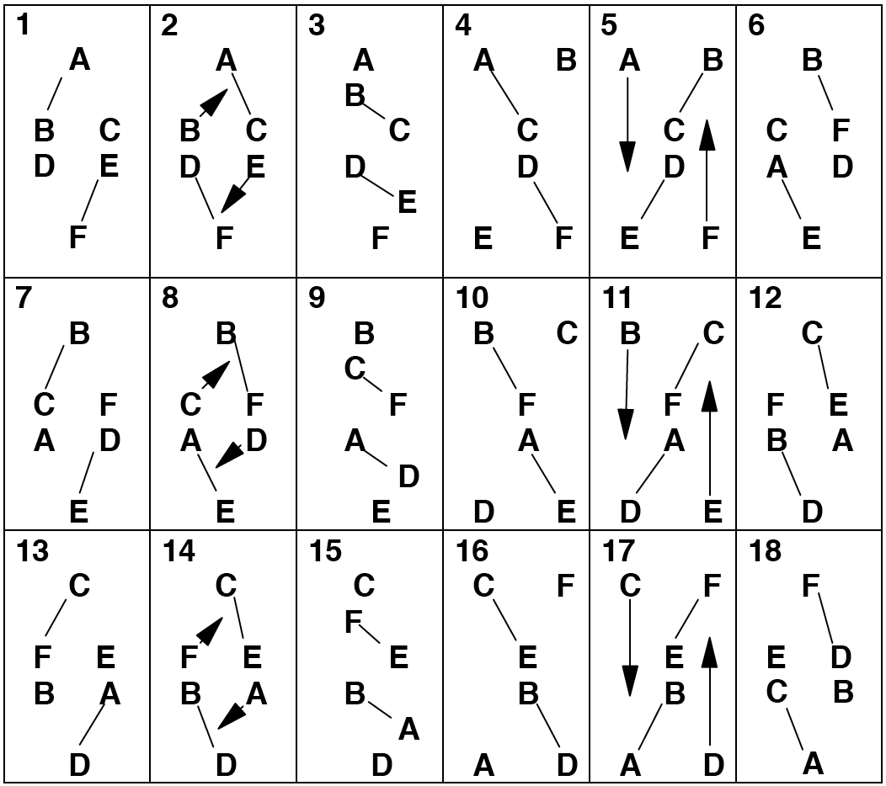{width=50%}

Pattern by Luke Emery, September 1999.

### Ball Bearing

Here's a nifty extension of the 4-person Feast.

|                                        |                          |
|------------|------------|
| 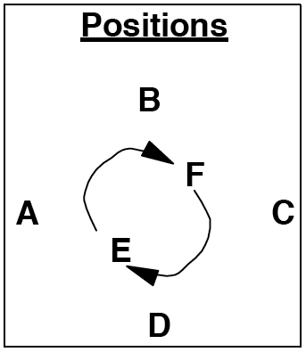{width=30%} | 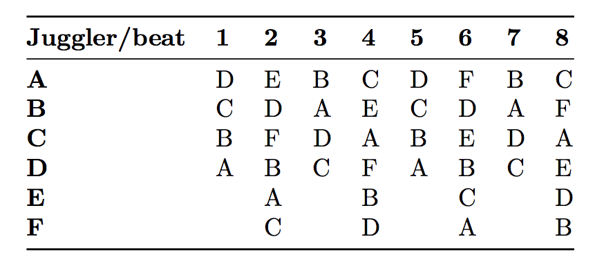{width=50%} |
| positions                                       |    right-hand 4-count |

A, B, C, and D are doing a Feast (in 4-count), but the self throw is replaced
with a pass to one of the movers in the middle. A, B, C, and D are passing
4-count. E and F are passing 8-count.

{width=75%}

**Variation**: A,B,C, and D pass 3-count, and E and F pass 6-count. Start the
variation with the left hand (or start on 2nd beat).

Pattern by Mike Newton.

## Benzene Ring (6 person)
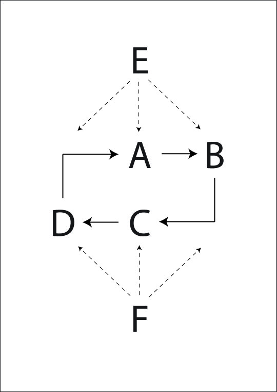{width=50%}

Here's another MAJ standard. E and F are carriage return feeders, feeding to 3
positions: left, middle, right, left, middle, right, etc. The rest of the
jugglers move around in a ring, passing to the feeders. They pass 3 times to
each feeder and then turn around to pass 3 times to the next feeder.

| **Juggler/beat** | **1** | **2** | **3** | **4** | **5** | **6** | **7** | **8** | **9** | **10** | **11** | **12** |
|-------------|-------|-------|-------|-------|-------|-------|-------|-------|-------|--------|--------|--------|
| **A**       |       | E     |       | E     |       | F     |       | F     |       | F      |        | E      |
| **B**       | E     |       | F     |       | F     |       | F     |       | E     |        | E      |        |
| **C**       |       | F     |       | F     |       | E     |       | E     |       | E      |        | F      |
| **D**       | F     |       | E     |       | E     |       | E     |       | F     |        | F      |        |
| **E**       | B     | A     | D     | A     | D     | C     | D     | C     | B     | C      | B      | A      |
| **F**       | D     | C     | B     | C     | B     | A     | B     | A     | D     | A      | D      | C      |

> * Right hand counting

Lets look to see what B does. B passes to E on the first beat and then has one
right hand self to turn around and make the first pass to F. Then B moves to the
middle (to where C is in the graph above). After B passes to F (beat 5 in the
above table), B moves to where D is in the graph above. B makes one more pass to
F before turning around to repeat the 3-pass cycle with E.

A, B, C, and D pass every other right hand. E and F pass every right hand.

### Benzene Ring Plus

A challenging variation is to add two clubs to the pattern so that E and F do a
2-count extra club typewriter feed. All passes are doubles.

Also see Benzene Ring for 8 Jugglers

Benzene Ring Pattern by Mike Newton.

## Double-Handled Egg Beater

I can't imagine why you would want an egg beater with 2 handlers, but if you
did, and it was made of weaving jugglers, it might look like this.

| **Juggler/beat** | **1** | **2** | **3** | **4** | **5** | **6** | **7** | **8** |
|-------------|-------|-------|-------|-------|-------|-------|-------|-------|
| **A**       | C     |       | D     | F     | C     |       | D     | E     |
| **B**       | D     |       | C     | E     | D     |       | C     | F     |
| **C**       | A     | E     | B     |       | A     | F     | B     |       |
| **D**       | B     | F     | A     |       | B     | E     | A     |       |
| **E**       |       | C     |       | B     |       | D     |       | A     |
| **F**       |       | D     |       | A     |       | C     |       | B     |

> * Right hand counting

E and F are handles, A and B are one beater, and C and D are the other beater.

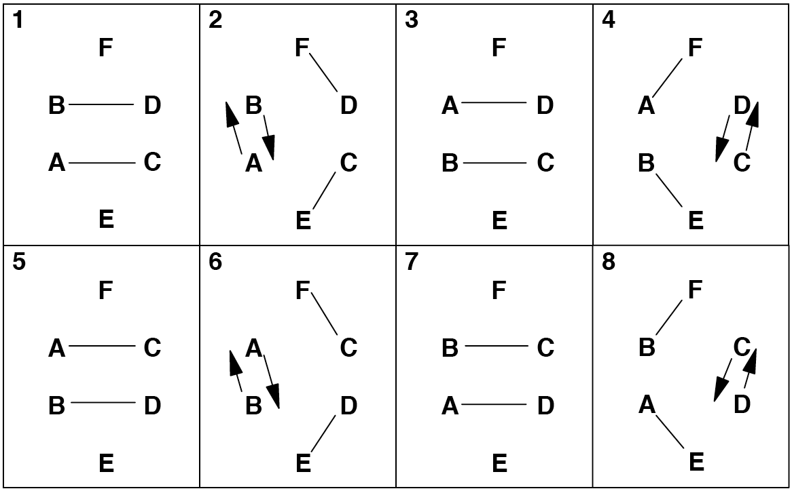{width=75%}

Pattern by Mike Newton and MAJ.

## Razor

A and B move around one circle, and C and D move around another circle. The
table below is in 3-count, and is very fast. Try 4-count, or even
6-count to start.

|            |            |
|------------|------------|
| 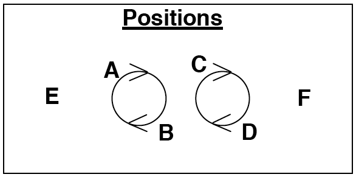{width=45%} | 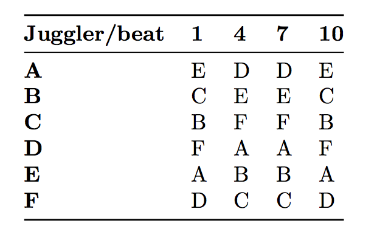{width=35%} |
| positions                                       |    both-hands counting (right start) |

The numbers in the table below count the passes.

{width=50%}

In the parlance of stacking patterns, this one is a 1-2-2-1: olive, spinning 3-count pair; spinning 3-count pair; olive.

Pattern by Peter Kaseman and the MAJ.

### Electric Razor

The Electric Razor is 3 pairs of jugglers of spinning 3 counters.

|            |            |   |
|------------|------------|---|
| 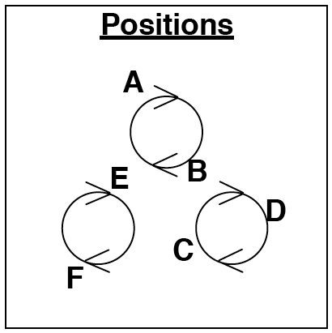{width=30%} | 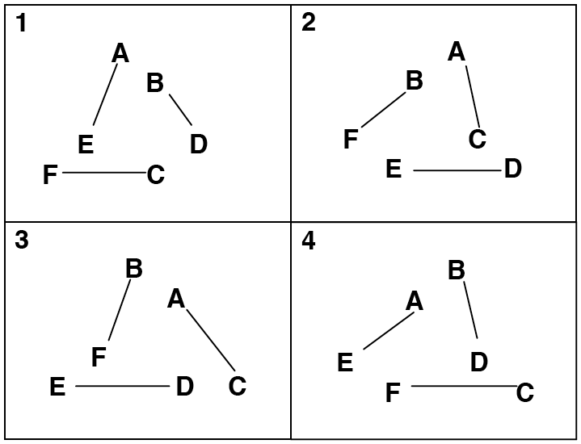{width=30%} | 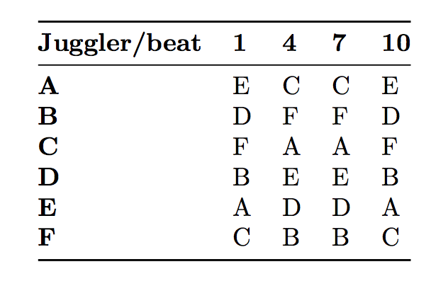{width=30%} |
| positions | passes                                    |    both-hands counting (right start) |

The numbers in the table above count passes.

The Electric Razor pattern was invented by Peter Kaseman, summer '98.

## Two-Seated Unicycle

| **Juggler/beat** | **1** | **4** | **7** | **10** |
|-------------|-------|-------|-------|--------|
| **A**       | C     | D     | D     | C      |
| **B**       | A     | A     | A     | A      |
| **C**       | B     | E     | E     | B      |
| **D**       | E     | B     | B     | E      |
| **E**       | F     | F     | F     | F      |
| **F**       | D     | C     | C     | D      |

> * Both hands counting, right hand starts
> * B does drop-back passes to A.
> * E does drop-back passes to F.

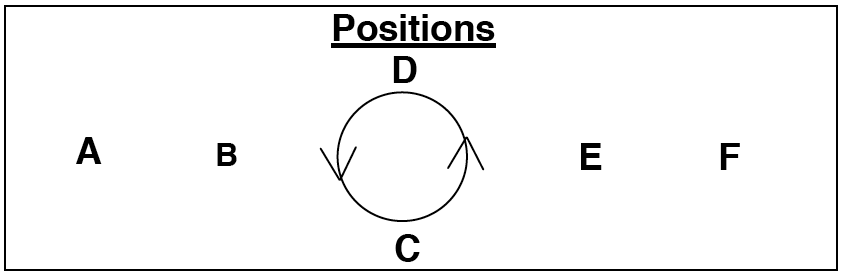

Arrows indicate the direction of pass.

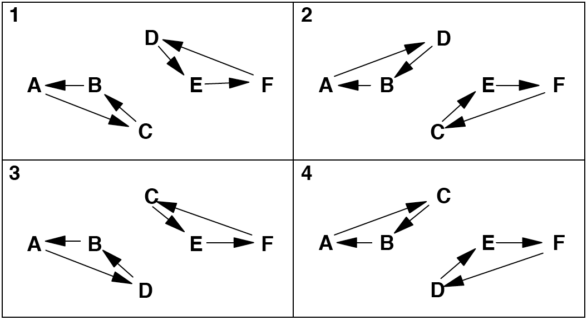

Pattern by MAJ.

## Mel's Big Woody

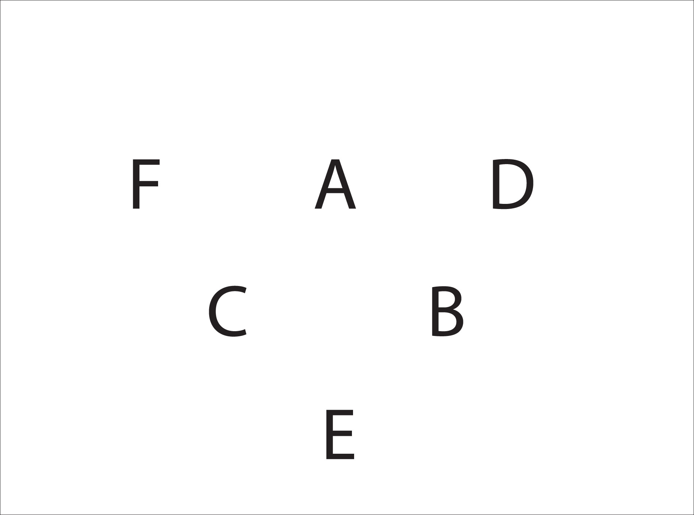{width=50%}

### Standard

| **Juggler/beat** | **1** | **2** | **3** | **4** | **5** | **6** |
|-------------|-------|-------|-------|-------|-------|-------|
| **A**       | D     | B     | C     | F     | C     | B     |
| **B**       | E     | C     | A     | D     | A     | C     |
| **C**       | F     | A     | B     | E     | B     | A     |
| **D**       | A     |       |       | B     |       |       |
| **E**       | B     |       |       | C     |       |       |
| **F**       | C     |       |       | A     |       |       |

> * Right hands counting

Now, to make it more interesting, throw early triples from the corners.

| **Juggler/beat** | **1** | **2** | **3** | **4** | **5** | **6** |
|-------------|-------|-------|-------|-------|-------|-------|
| **A**       | D     | B     | C     | F     | C     | B     |
| **B**       | E     | C     | A     | D     | A     | C     |
| **C**       | F     | A     | B     | E     | B     | A     |
| **D**       | A     | T-F   | Pause | B     | T-E   | Pause |
| **E**       | B     | T-D   | Pause | C     | T-F   | Pause |
| **F**       | C     | T-E   | Pause | A     | T-D   | Pause |

> * Right hands counting

D, E and F can pirouette in their Pause for some extra showmanship.

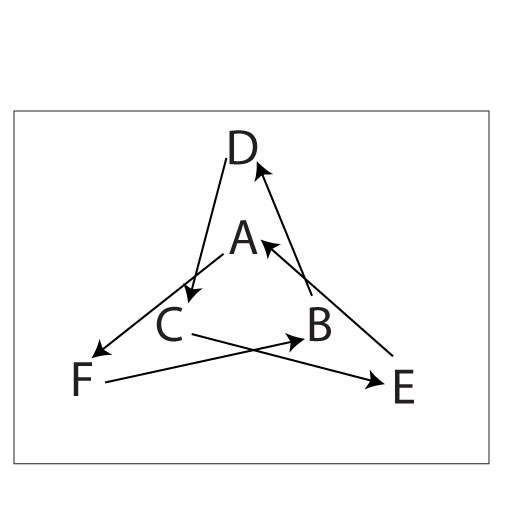

### Trompe L'oeil (Concentric Triangles)

Here's an extension of the 4-count extra club triangle to 6 jugglers. All the jugglers should be quite comfortable with 4-count extra club triangles.

* A – Double to F, self
* D – Double to C, self
* C – Double to E, self
* F – Double to B, self
* B – Double to D, self
* E – Double to A, self

> * All passes right handed. 2 extra clubs (A , and D start with 4).

This is the 4-count version.

There are also nice variations in 6 count doubles (with 1 extra club), 7 club
3-count (2 extra clubs and same pattern a 4-count, just slower), 2-count doubles
(3 extra clubs - A, B and C all start with 4), and if you're feeling crazy,
chocolate bar (PPSSSS) or 1 – count (2 extra clubs and 6 extra clubs
respectively).

This is an extension of a pattern Matt learned at a juggling convention where
the same formation juggles without extra clubs in whatever count they choose
(4-count being standard).

Pattern by That Matt (Matt Mella).

## Overlapping Y's

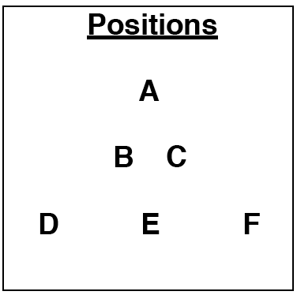{width=50%}

| **Juggler/beat** | **1** | **2** | **3** | **4** | **5** | **6** |
|-------------|-------|-------|-------|-------|-------|-------|
| **A**       | E     | E     |       | F     | D     |       |
| **B**       |       | D     |       |       | E     |       |
| **C**       | F     |       |       | E     |       |       |
| **D**       |       | A     |       |       | B     |       |
| **E**       | C     | B     |       | A     | A     |       |
| **F**       | A     |       |       | C     |       |       |

> * Both hands counting

You can do a nice 1-count variations similar to this too.

Pattern by MAJ.

## More Mating Oogles
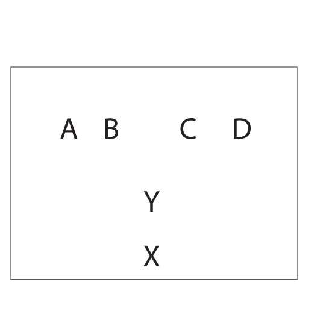

Imagine better looking oogles mating than the previous mating oogles. This is basically a 1-count Oogle variation with a 2-count left handed Y and a 2-count right handed Y superimposed.

| **Juggler/beat** | **1** | **2** |
|-------------|-------|-------|
| **X**       | D     | A     |
| **Y**       | B     | C     |
| **A**       |       | Y     |
| **B**       | X     |       |
| **C**       |       | X     |
| **D**       | Y     |       |

> * Both hands counting
> * X throws rights to D and lefts to A
> * Y throws rights to B and lefts to C
> * A throws left hands to Y and does right selves
> * B throws right hands to X and does left selves
> * C throws left hands to X and does right selves
> * D throws right hands to Y and does left selves

Pattern by MAJ.

## Fireworks

Do you have nerves of steel? Do you juggle with poise and confidence while bombs
explode all around you and other jugglers panic and dive for cover? Good, you'll
need all of that for this pattern. It is a right handed pattern with 4 extra
clubs and lots of doubles and triples. Sometimes, (maybe even often, for some
jugglers), those collide above your heads.

However, if thrown carefully, there is just enough room for all of them.

| **Juggler/beat** | **1** | **4** | **7** | **10** |
|-------------|-------|-------|-------|--------|
| **A**       | T-D   |       | D-E   |        |
| **B**       |       | D-F   |       | D-D    |
| **C**       | D-E   |       | T-F   |        |
| **D**       | D-B   |       | T-A   |        |
| **E**       |       | D-A   |       | D-C    |
| **F**       | T-C   |       | D-B   |        |

> * Both hands counting
> * A, C, D and F start with 4 clubs and right hands
> * B and E start with 3 clubs and left hands

The corners do a 2-count feed of triples to the opposite corner and doubles to the centers.

The centers do a 2-count feed of doubles to the corners.

Pattern by Luke Emery.

## Theatre Style Popcorn

This impressive pattern with 21 clubs is in the same family as the Oogle and the Apollo and is a Madison favorite.

* A does a typewriter feed to D, E and F in 8 club 2-count.
* B does a typewriter feed to D, E and F in 7 club 2-count.
* C does a typewriter feed to D, E and F in 6 club 2-count.
* D, E and F do popcorn passing: triple to A, double to B, single to C.

| **Juggler/beat** | **1** | **2** | **3** | **4** | **5** | **6** |
|-------------|-------|-------|-------|-------|-------|-------|
| **A**       | T-D   |       | T-E   |       | T-F   |       |
| **B**       |       | D-D   |       | D-E   |       | D-F   |
| **C**       | E     |       | F     |       | D     |       |
| **D**       | T-A   |       | D-B   |       | C     |       |
| **E**       | C     |       | T-A   |       | D-B   |       |
| **F**       | D-B   |       | C     |       | T-A   |       |

> * Both hands counting
> * All passes from right hand
> * A, C, D, E, F start with right hand
> * A, D and F start with 4 clubs
> * B starts with left hand

As you might expect, A is a challenging position. C, less so.

Pattern by Peter Kaseman.

## Windy Two Holer

This has quickly become a  classic six-person pattern; not sure who invented it, 
but Mel was there, and it was a windy day on the Library Mall.  Despite its full cycle being the rather lengthy 24 passing beats 
(rows of the tables), the windy-two-holer is pretty easy to remember, since each juggler's task repeats every
6 passing beats. This is fun in 4-count, 3-count, and even 2-count for those not faint of heart. All
jugglers juggle in sync but move in turn.  Six jugglers arrange around a circle inscribed with eight spots: 1,2, $\cdots$ 8, 
let's say. The spots are not in the obvious order around the perimeter, but rather they're in the order of the figure below, 
corresponding to the corners of two inscribed squares.  Now the six jugglers can cover only
six of the eight spots.  There are two *holes*, known technically (and affectionately)
  as the *A-hole* and the *number-2 hole*.  In the start indicated by the first row of the  table,  the A-hole is position 8 and the number-2 whole is *becoming* position 1. Jugglers A, B, and C move around
the yellow square, starting in positions 7, 6, and 5, respectively.  After the first beat, juggler
A moves into the A-hole, whereby position 7 becomes the new number-2 hole.  Likewise, jugglers
D, F, and E move along the magenta square, starting in positions 3, 4, and in between 1 and 2.
In fact, we always start with E in already landed in position 2, but a proper start would have E on
the move at the beginning. Each juggler only ever passes to the two others in his/her square, never
to the other square.  The local passing rule, in the steady state (and counting on the passing beat)
 is *pass one - pass other - self - pass one - pass other - move/self *.   At any passing beat one pair from each square is passing, and collisions are avoided because the two passing sets are parallel; e.g. on 
beat 1 below, jugglers A and C exchange along the diagonal of the yellow square while jugglers D and F 
exchange along the parallel line 3-4. 

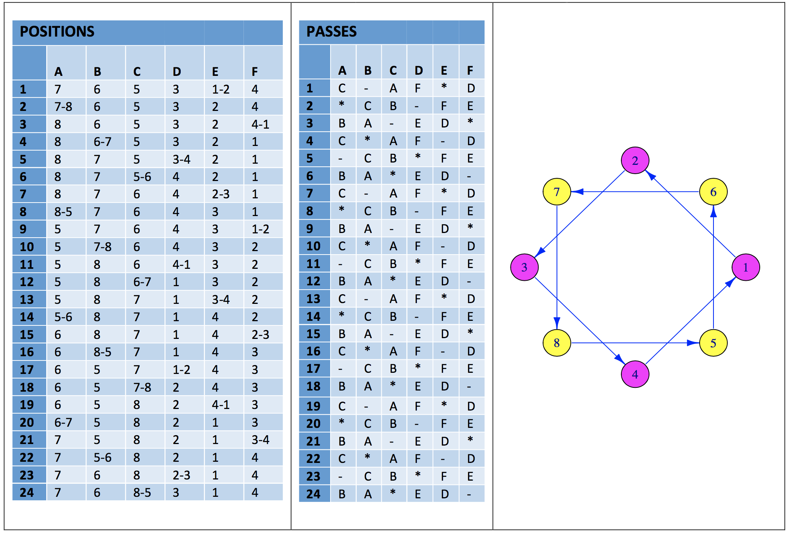
