# 7 Person Patterns

Here are some  easy stationary patterns for a group of seven.

## Feast

  Everyone feeds everyone else on count of choice.

## 1-2-4 Apollo 

|            |            |
|------------|------------|
| {width=40%} | 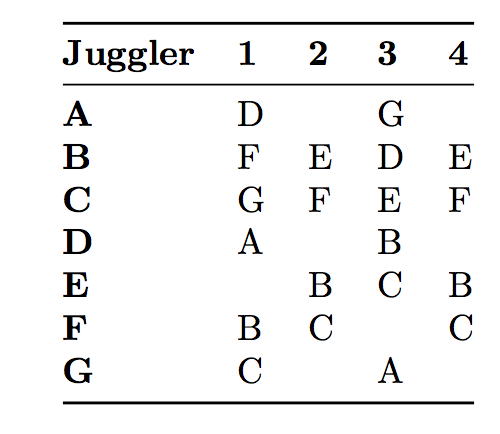{width=35%} |
| positions                                       |    Right-hand counting |
| | A throws long passes in 4-count to D and G |
| |  B and C each do sweep feeds of 3. |
| |  D and G do 4-count between A and the feeder on their side  |
| |  E and F do a sweep feed with a phantom (don't pass to the phantom) |

See the spaceship?

As with other big easy patterns, it's fun to *rotate*, i.e., to switch positions after you 
master one setting.

Pattern by MAJ.

## Hinge

|            |            |
|------------|------------|
| {width=30%} | 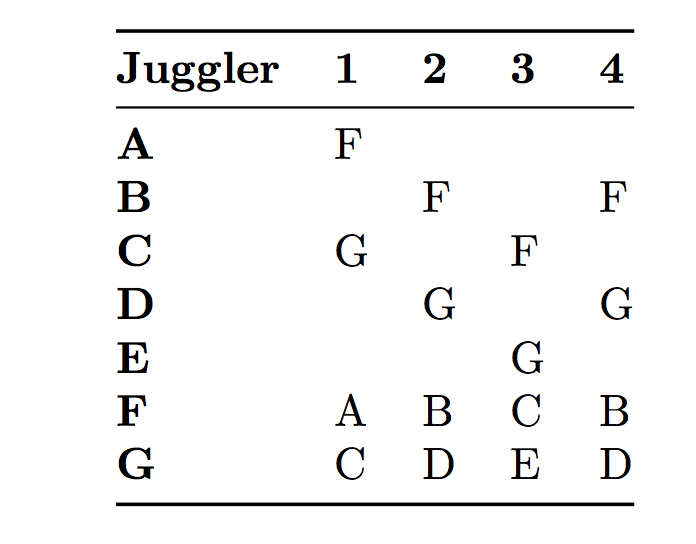{width=40%} |
| positions                                       |    Right-hand counting, or other |
| |  C is the hinge, passing to both feeders |
| |  Feeders F and G do standard feed of 3 |

**Variations:** Precious Metal Hinge.  Escalate any line with doubles and an extra club 
(see Big Patterns chapter for more details).

Hinge created by Mike Newton; precious metal variations must have been by Luke or Peter!

## Overlapping Chocolate Bar 3-count Feeds

The old-school 5-person Chocolate Bar 3-count Feed has two chocolate bar feeders and 3 3-count feedees.
This recent  extension  for seven overlaps two copies of the classic, with the 3 overlapping positions becoming very cool. In fact
Juggler B does a pretty special 1-count. A and C continue with chocolate bar; D and G do 3-count; and
E and F do 3/2-count.

|            |            |
|------------|------------|
| 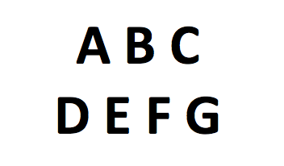{width=20%} | 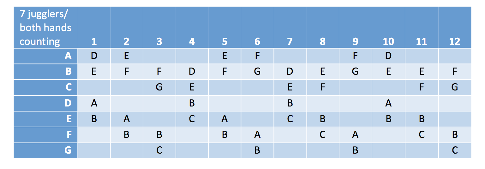{width=70%} |
| positions                                       |    passes |

**On to moving patterns.**

## Open Face Sandwich

Refer to 9-person Twister Sandwich. Replace one of the end weaves with a single 2-count feeder (an olive).
In stacking notation, a *1-3-3: olive; double-time-twister; standard weave.*

## The Blast

 This pattern became an instant Madison classic. Although the basic pattern is
straight forward, there are a vast array of extensions and variations that can
easily be tuned for the skill levels and number of available jugglers.

| **Juggler** | **1** | **2** | **3** | **4** | **5** | **6** | **7** | **8** | **9** | **10** |
|-------------|-------|-------|-------|-------|-------|-------|-------|-------|-------|--------|
| **A**       | D     | E     | C     | G     | E     | F     | G     | D     | F     | C      |
| **B**       | F     | G     | D     | F     | C     | D     | E     | C     | G     | E      |
| **C**       |       |       | A     |       | B     |       |       | B     |       | A      |
| **D**       | A     |       | B     |       |       | B     |       | A     |       |        |
| **E**       |       | A     |       |       | A     |       | B     |       |       | B      |
| **F**       | B     |       |       | B     |       | A     |       |       | A     |        |
| **G**       |       | B     |       | A     |       |       | A     |       | B     |        |

> * Right-hand 4-count base

The weavers move in 8-count in the middle and 12-count on the ends. It's not
difficult, but certainly not as boring as 8-count and 12-count might seem at
first glance.  Dotted lines are passes and solid lines are movement.

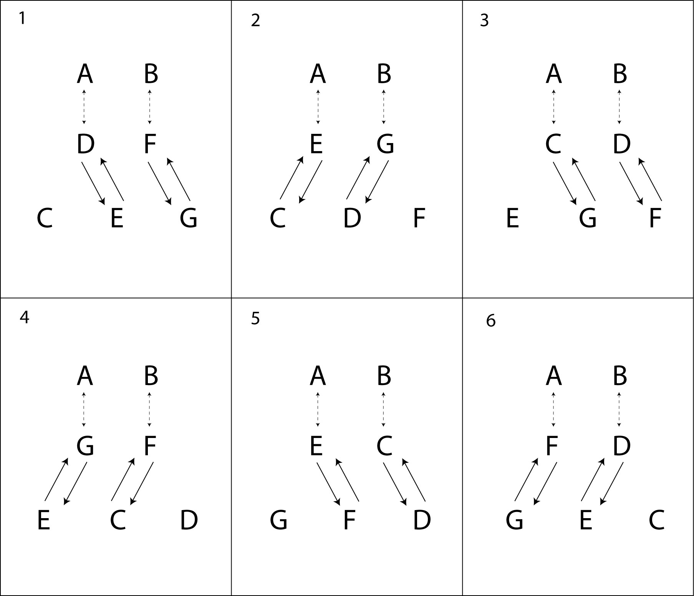{width=70%}

Try the pattern in chocolate bar, or do a pirouette underneath a self triple
while doing 12-count on the ends. See other variations in Fully Loaded Blast
underneath Big Patterns, including some very challenging and fun extensions.

This pattern was created by Peter Kaseman and was inspired by a bouncing ball
pattern.

## Broken Hearted Blast

Using the same passing table as above, change the movement. Instead of a **W**, go behind the feeder
line after you make your second *inside* pass, and thus as you go into your 12 count.  
We convinced ourselves that the long motion past the feeders and back looks like half of
a heart-shape. Taking into account the stagger needed to let another juggler pass in
front gave us the name!   

## Wonky Benzene Ring

Refer ahead to the original, 8-person, Benzene Ring.   Drop one mover, leaving 5 movers, 
and retain 2 feeders.  One feeder feeds 4 spots and the other feeder feeds 3 spots.  The feedees do 4 count on the side that has 3 spots and 6 count for the side that has 4 spots.  You start your new count as soon as you turn (only one right handed self after you finish on the side with 4 spots).

Pattern by Peter Kaseman.

## Twister-5's 

These arise from the 6-person Gandini-5 Weave by adding a second feeder (*hand*) on the oppossite side of the pattern (and thus defying gravity!).

### Original Twister-5

|            |            |
|------------|------------|
| 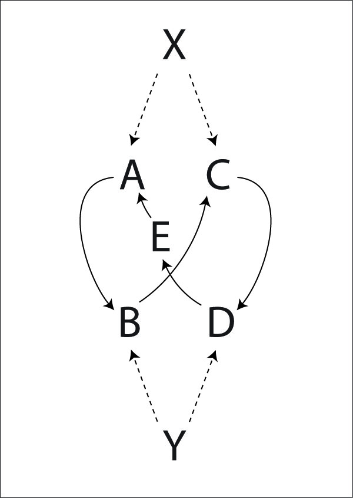{width=30%} | 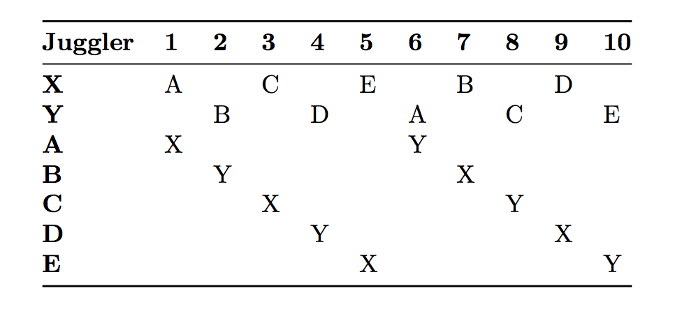{width=55%} |
| positions                                       |    Right-hand counting |

**Variations:**  Add passes, clubs, or change the count.

### Double Time Twister 5

The feeders pass twice in a row to each feeder.

### Twister-5 Plus

Add an extra club over the top with X and Y passing 7 club 4-count on their self throws.
This was a Mad-5 favorite one year; we performed it at the Cascade of Stars in the 2000 IJA Festival.

### Twister-5 7-then-8-Count

The feeders throw 3-count and the weavers pass 7 count on one leg, and 8 count on the other.

### Twister-5 5-Count

X throws 2-count right handed. Y throws 2-count left handed. The weavers do 5-count. Fun!

### Twister-5 Sandwich

Like the Twister Sandwich in 9 Person Patterns, you can replace one or both of the feeders with a 3 person weave (or any other weave, really). To make it more interesting, try a double time weave where each weaver passes twice to the other weave.

Pattern by MAJ.

## Twister Plus Plus
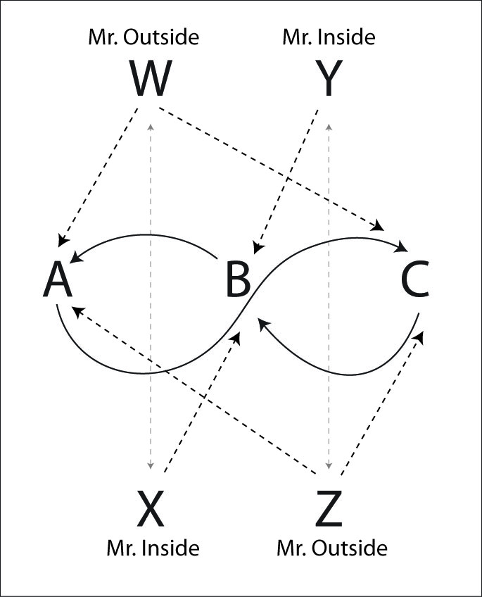{width=50%}

This amazing pattern is another crown jewel of the MAJ pattern repertoire. It's
a combination of Twister Plus and Double Time Twister.

The feeders are all doing Twister Plus, alternating triples all the way across
the pattern with singles to the weavers. The weavers are doing a Double Time
Twister Weave and pass twice on each side, once to each feeder. Messrs Outside
pass to the outsides, and Messrs Inside pass to the inside weaver position.

| **Juggler** | **1** | **2** | **3** | **4** | **5** | **6** | **7** | **8** | **9** | **10** | **11** | **12** |
|-------------|-------|-------|-------|-------|-------|-------|-------|-------|-------|--------|--------|--------|
| **W**       | A     | T-X   | C     | T-X   | B     | T-X   | A     | T-X   | C     | T-X    | B      | T-X    |
| **X**       | T-W   | B     | T-W   | A     | T-W   | C     | T-W   | B     | T-W   | A      | T-W    | C      |
| **Y**       | T-Z   | A     | T-Z   | C     | T-Z   | B     | T-Z   | A     | T-Z   | C      | T-Z    | B      |
| **Z**       | C     | T-Y   | B     | T-Y   | A     | T-Y   | C     | T-Y   | B     | T-Y    | A      | T-Y    |
| **A**       | W     | Y     |       | X     | Z     |       | W     | Y     |       | X      | Z      |        |
| **B**       |       | X     | Z     |       | W     | Y     |       | X     | Z     |        | W      | Y      |
| **C**       | Z     |       | W     | Y     |       | X     | Z     |       | W     | Y      |        | X      |

> * Right hand counting
> * X and Y start with 4 clubs

Pattern by MAJ.

## Iron Cross Weave

|            |            |
|------------|------------|
| 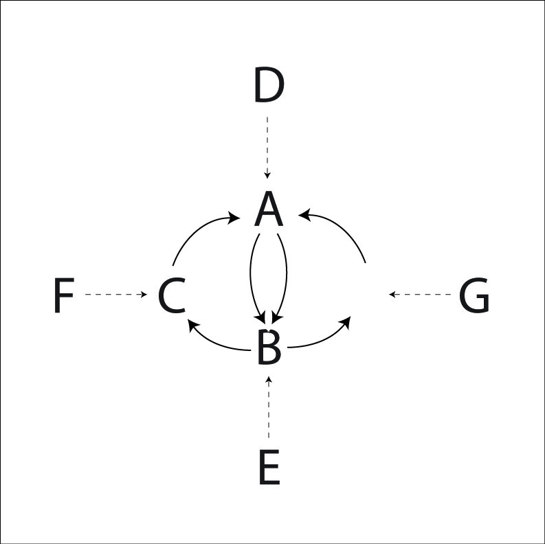{width=35%} | 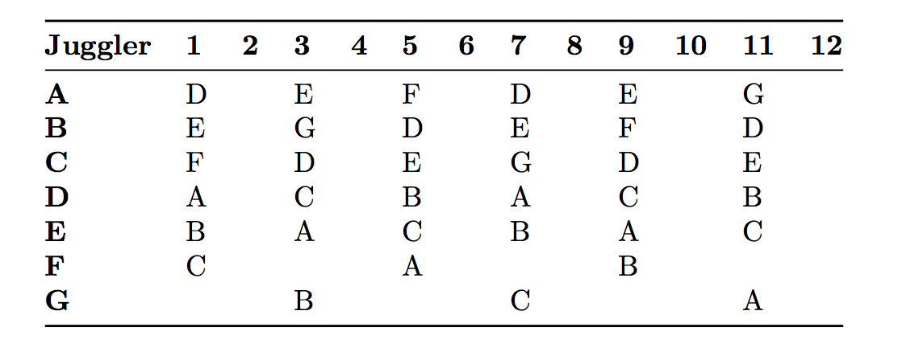{width=55%} |
| positions                                       |    Right-hand counting |

See all those selves? Once you're comfortable with this pattern, make life more
interesting by adding extra passes in the selves. One variation is for F and G
to pick up the passes before and after their normal passes (so they throw pass,
pass, pass, self). Another variation is for each E, F and G to all pass twice in
a row to the weavers. D can't pass twice in a row without making the turn from D
to E rather difficult.

Pattern by Luke Emery.

## Intersecting Weave
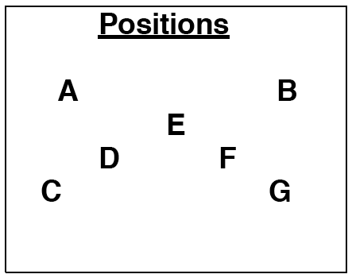{width=40%}

A and B are feeding a standard weave with one position common to both. The
weavers do a standard weave until they get between A and B. The weaver then
leaves one weave to enter the other. During this transition, the weaver makes 2
passes in a row.

| **Juggler** | **1** | **2** | **3** | **4** | **5** | **6** | **7** | **8** | **9** | **10** | **11** | **12** | **13** | **14** | **15** | **16** | **17** | **18** | **19** | **20** |
|-------------|-------|-------|-------|-------|-------|-------|-------|-------|-------|--------|--------|--------|--------|--------|--------|--------|--------|--------|--------|--------|
| **A**       | C     | D     | F     | C     | D     | F     | G     | D     | F     | G      | E      | F      | G      | E      | C      | G      | E      | C      | D      | E      |
| **B**       | E     | F     | G     | E     | C     | G     | E     | C     | D     | E      | C      | D      | F      | C      | D      | F      | G      | D      | F      | G      |
| **C**       | A     |       |       | A     | B     |       |       | B     |       |        | B      |        |        | B      | A      |        |        | A      |        |        |
| **D**       |       | A     |       |       | A     |       |       | A     | B     |        |        | B      |        |        | B      |        |        | B      | A      |        |
| **E**       | B     |       |       | B     |       |       | B     |       |       | B      | A      |        |        | A      |        |        | A      |        |        | A      |
| **F**       |       | B     | A     |       |       | A     |       |       | A     |        |        | A      | B      |        |        | B      |        |        | B      |        |
| **G**       |       |       | B     |       |       | B     | A     |       |       | A      |        |        | A      |        |        | A      | B      |        |        | B      |

> * Right hand counting

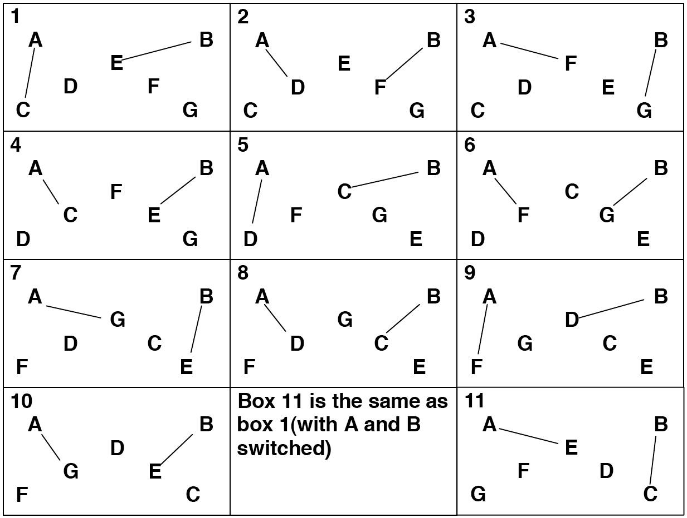{width=50%}

A and B are feeding a standard weave with one position common to both. The
weavers do a standard weave until they get between A and B. The weaver then
leaves one weave to enter the other. During this transition, the weaver makes 2
passes in a row.

Pattern by Steve Otteson.

## Eye of the Needle

A Twister Weave has lots of time and space in the middle.

If your weavers are quite comfortable with outside turns in a Twister Weave,
then here is a fun and good looking pattern. This is just a Twister Weave with
another passing duo embedded in the center.

|            |            |
|------------|------------|
| 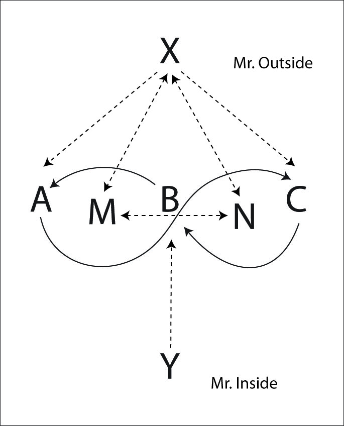{width=35%} | 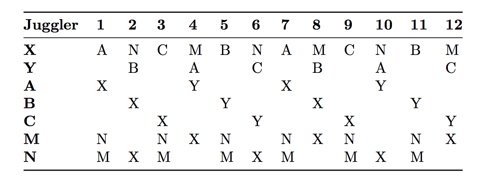{width=55%} |
| positions                                       |    Right-hand counting |

If this pattern is too challenging as written, then start by skipping the passes
from M and N to X. Then M and N just do a 4-count in the middle and X does a
standard Mr. Outside 4-count.

There are a number of patterns that have enough room to embed other patterns in
the middle.

Pattern by MAJ.

## 2-5 or 1-5-1 Foie Graham
  
 Refer to the 8-person 3-5 Foie Graham and the variations that drop one juggler.

## Big Mangled Squirrel

  A high-end pattern with extra clubs and change sides:
 refer to 5-person Mangled Squirrel, which is 2 on 3.  Expand it to 3 on 4.   Now the
 passing rule is *Triple-2-1-2-1-2*.

