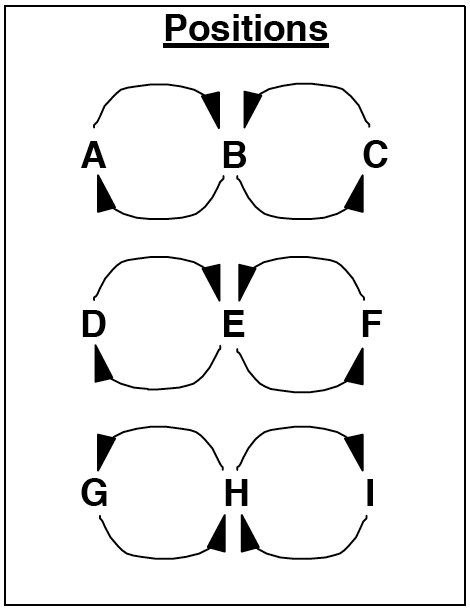
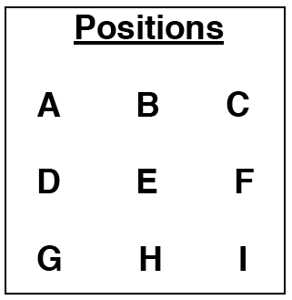
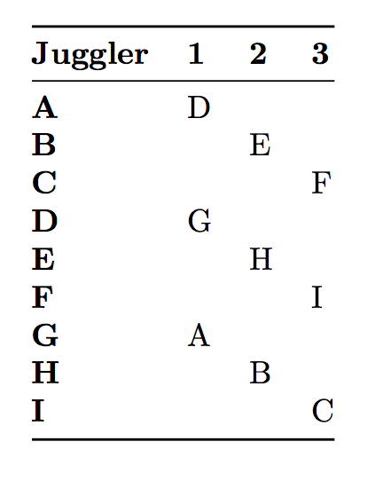
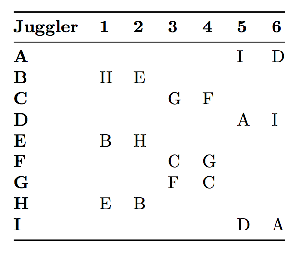

# 9 Person Patterns

## Feast
   
  Everyone feeds everyone else, on count of your choice.

## 4 on 5 line
  

## Big Hinge minus 3

   Drop 3 of the 4 baby positions from this 12-person pattern.

## Twister Sandwiches

### Original Twister Sandwich

At first this is a difficult pattern, but it's awesome. You need 6 good weavers and 3
double-time twister weavers.

|                                        |                          |
|------------|------------|
| {width=40%} | {width=40%} |
| positions                                       |    Right-hand counting, or other |

D, E, and F are doing the Double-time Twister Weave. The single feeders on the
opposite sides of D, E, and F have been replaced with 3 weavers on one side and
3 weavers on the other side.

A, B, and C (and G,H, and I) are doing a standard weave; passing to D,E, and F.

To help you remember to whom you are supposed to pass, just pass straight across
from whatever position that you are in. For example, C is in the right side, so
when C passes, he or she will pass to who ever is in the right position at that
time (in this case, C's first pass is to F). C will then move to the middle and
pass to who ever is in the middle.

### Twister Sandwich Variations
1. Replace either standard weave with one standard feeder or two every-other
  feeders. If there is one feeder, they are known as the Olive and the sandwich
  is an Open Faced Sandwich.
2. After one cycle, rotate the weaves by 90 degrees. For example, after one
  cycle the positions will be as indicated in the graph above. Run the next
  cycle with C, F, and I as one standard weave, B, E, and H as the double-time
  twister weave, and A,D, and G as a standard weave. This version is insane to
  implement, but it does provide intellectual stimulation.
3. Add another "slice" to the sandwich: add jugglers J, K, and L below G, H,
  and I. G, H, and I are also doing the Double-time Twister. This is the Double-
  Decker Sandwich.
4. If the outside weavers are having trouble keeping up, then you can change
  any of the weaves to fixed positions where the ends pass in 8-count and the
  insides pass in 4-count. This is known as Stale Bread.

In the parlance of stacked patterns, the (original) Twister Sandwich is a  3-3-3:  weave; double-time-twister; weave.

Pattern by Peter Kaseman and MAJ.

## Weaving Canoes

This pattern is a cross between the Asynchronous Double Weave and the Canoe. The
Canoe for 3 jugglers is commonly referred to as a drop-back line. We recommend
that you can do these before trying the Weaving Canoes.

|                                        |                          |
|------------|------------|
| {width=35%} | {width=32%} |
| positions                                       |     |

> * Right hand counting
> * A, B, and C face downward. The rest face upward.
> * Weavers are in rows. Canoes are in columns.
> * D, E, and F pass drop-backs.

A, D, and G start the pattern with the first pass as indicated in the passing
graph above. After they pass, they move to the right of their respective weaves.
Meanwhile, B, E, and H make their first pass on the second passing beat, and
then weave to the left, replacing A, D, and G. C, F, and I pass on the 3rd
passing beat and weave to the left.

**Variation:** Have one of the weaving teams remain stationary.

Pattern dates to September, 1999 by Peter Kaseman.

## Weaving Triangles

Here passes happen in the middle positions of the weave, in a Gandini-style.

|                                        |                          |
|------------|------------|
| {width=40%} | {width=32%} |
| positions                                       |  Right-hand counting   |

Try it with inside outside triangle first then inside triangle.

Pattern by Luke Emery.

## Triangle of Weaves

  Place three in-sync weaves on edges of an equilateral triangle, a bit like the Weaving Triangles pattern above,
 but each is an ordinary 6-count weave.  On the inside throws the middle jugglers exchange on a triangle (pick inside
 or outside).  Do the same for the outside throws. Cool!

  This is different from the big weave variations in Chapter 11.

## Stacks

###  1-2-3-2-1
 
 This is a beautiful pattern on a 3-count base:

  3-count olive; spinning 3-count pair; 4-5 twister; spinning 3-count pair; 3-count olive

 It's nice and easy if you shift it to 4-count base. Then it's an ordinary twister in the middle, spinning
 4-count pairs, and 4-count olives.

### 1-3-4-1

   3-count olive; 4-5 twister; spiral weave; 3-count olive

