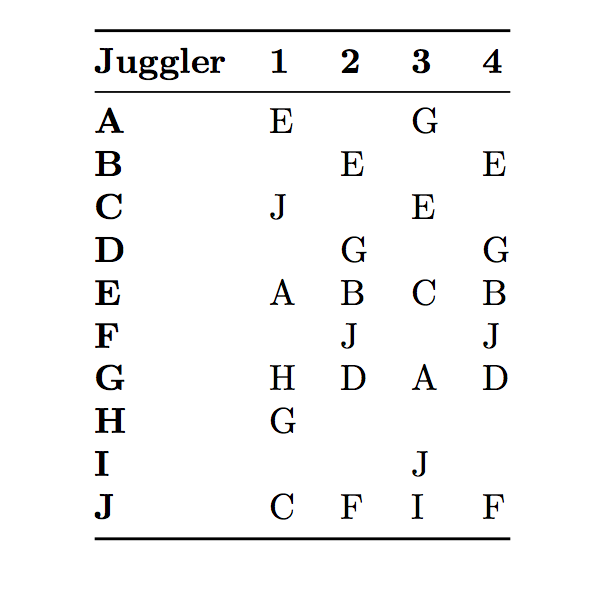
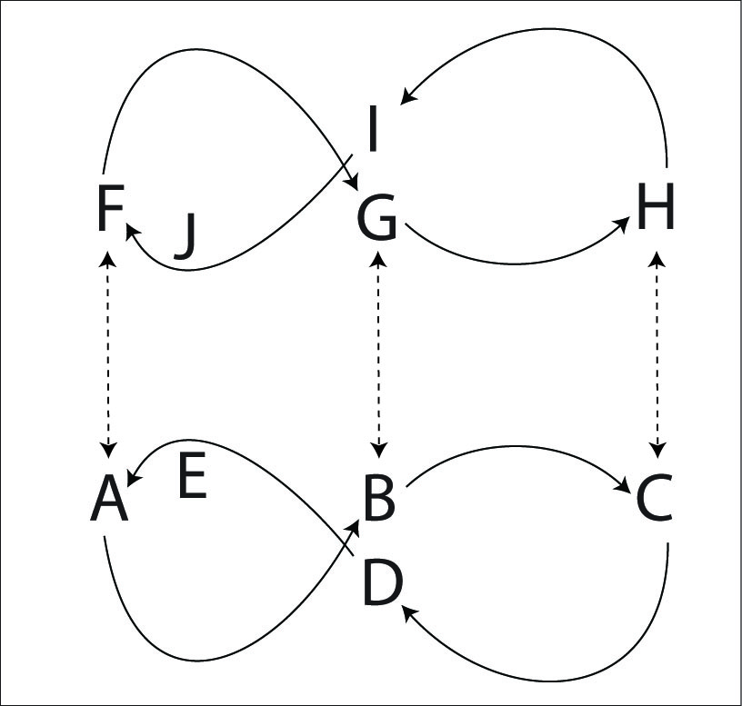
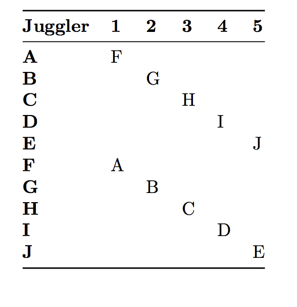
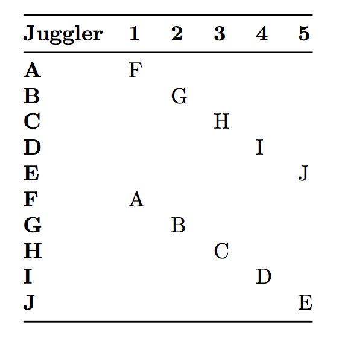
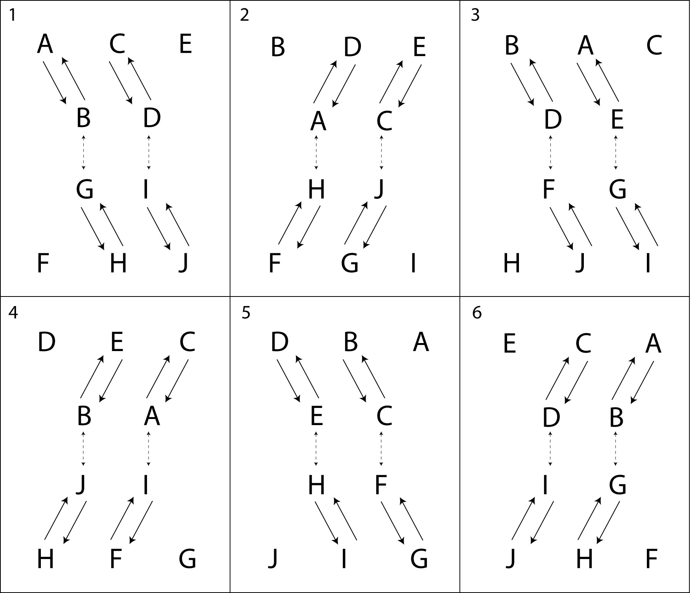

# 10 Person Patterns

## Feast

   With this many jugglers the feast naturally oscillates (to keep the passing distances about the same)
 and looks something like an Amoeba.   Fun to make the group move across the floor while juggling!

## 5 on 5 lines

Pass to two opposites, say on 4 count, with two end jugglers on slower (e.g 8) count.   Start one special (e.g. differently colored) club on one end and see if you can make it move to the other end!

## Double-vision 5's

 Take any 5-person pattern (well maybe not any one) and turn each juggler into two jugglers.
 E.g. try double-vision star! 

## Big Hinge minus 2

  Take the 12-person big hinge and drop two of the baby positions, either line centers
 on two lines, or one line center and the matching feeder, as described here:

|                                        |                          |
|------------|------------|
| {width=35%} | {width=40%} |
|   |    Right-hand counting |
|        | **Hinges:** A, C |
|        | **Feeders:** E, G, J |

## Double Weave (with 10 jugglers)

This one is fun and pretty easy.  Each juggler has just one counterpart in the other weave, and only
passes the that juggler, on a fixed (usually 10) count.

|                                        |                          |
|------------|------------|
| {width=45%} | {width=40%} |
| positions                                       |    Right-hand counting, or other |

Pattern by MAJ.

## Double Gandini 5 Weave

Two mirrored Gandini 5 Weaves face each other and pass in 2-count (or any other
count).

On either side weavers alternate directions as they leave the middle. It is easiest if weaver counterparts go the same
direction (for example A and F start to the pattern's right and B and G start to
the pattern's left).

|                                        |                          |
|------------|------------|
| {width=45%} | {width=40%} |
| positions                                       |    Right-hand counting, or other |

If this is too fast, then pass twice in the middle (either to the same weaver or
to two different feeders).

Pattern by MAJ and Gandini Juggling Project.

## Double Blast

The Double Blast is two mirrored Blast patterns. It is easy.

| **Juggler** | **1** | **2** | **3** | **4** | **5** |
|-------------|-------|-------|-------|-------|-------|
| **A**       |       | H     |       | I     |       |
| **B**       | G     |       |       | J     |       |
| **C**       |       | J     |       |       | F     |
| **D**       | I     |       | F     |       |       |
| **E**       |       |       | G     |       | H     |
| **F**       |       |       | D     |       | C     |
| **G**       | B     |       | E     | B     |       |
| **H**       |       | A     |       |       | E     |
| **I**       | D     |       |       | A     |       |
| **J**       |       | C     |       |       |       |

{width=80%}

Pattern by Peter Kaseman and MAJ.

## Two Mating Four Leaf Clovers

By Melonhead. *describe*
