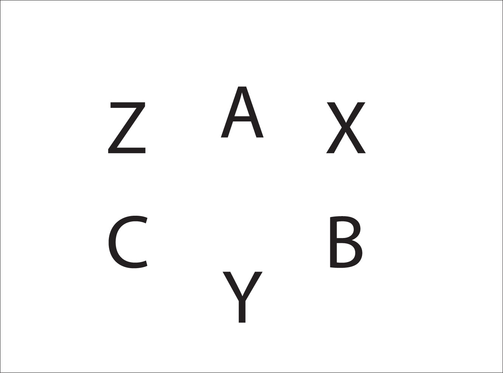
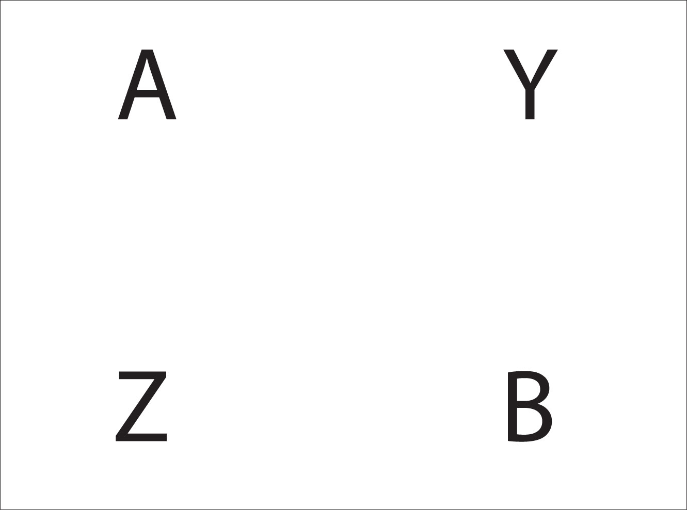

Appendix B – Dual Passing Patterns
==================================

Steve and Mike were playing with the idea of considering the hands of a juggling passing pattern independently of the jugglers, and then moving around which jugglers are attached to which hands. Between every two real jugglers is a phantom or shadow juggler whose left hand is a real person's right hand and their right hand is a different real person's left hand. Every pattern has a corresponding out of phase dual passing pattern.

We discovered a number of new 6 and 7 club patterns and multi person patterns we hadn't tried before. I sent out a bunch of 7 club siteswap passing patterns that come from known 7 club patterns. An interesting corollary is that for every asynchronous passing pattern (left, right, left, right) there is a corresponding synchronous passing pattern (where lefts and rights throw together). This is true for all passing patterns, but especially fun for 7 clubs where collisions aren't as problematic as with 6 club patterns. Some of these patterns are quite difficult, which explains why I don't think I've ever seen any 7 club synchronous patterns in practice except for the basic left double, right single pass.

Yesterday Peter and I worked out some of the "Pod" patterns for 7 club fast/slow variations. Instead of one juggler juggling 2 count against another juggler juggling 3 count, try right hands juggling 2 count against left hands juggling 3 count, etc.

El Nino with phantom jugglers is doable but difficult. The asynchronous 4 person box turns into a very nice and easy synchronous passing pattern (pass 2 to the left, then 2 to the right).  Most of the 5 person star patterns turn into either themselves (like the self-less star) or another known 5 person pattern. There's no end in sight!

If 3 jugglers A, B, and C are standing in a triangle formation, define 3 virtual jugglers X, Y, and Z so that X is between A and B, Y is between B and C, and Z is between C and A.

A's left hand is X's right hand, and A's right hand is Z's left hand. Similarly, B's left hand is Y's right, B's right hand is X's left, C's left hand is Z's right, and C's right hand is Y's left.

Any pattern performed by A, B, and C has a dual pattern performed by X, Y, and Z. To generate a new pattern, pick any pattern for X, Y, and Z, and then find out what A, B, and C are doing. In the table below we have X feeding 2-count to Y and Z with the dual pattern for A, B, and C.

|             |          |          |          |          |
|-------------|----------|----------|----------|----------|
| **Juggler** | **1**    | **2**    | **3**    | **4**    |
| **X**       | R pass Y | L self   | R pass Z | L self   |
| **Y**       | R pass X | L self   | R self   | L self   |
| **Z**       | R self   | L self.  | R pass X | L self   |
|             |          |          |          |          |
| **A**       | L pass C | R pass C | L self   | R pass C |
| **B**       | L self   | R pass A | L pass C | R pass A |
| **C**       | L pass A | R pass B | L pass B | R pass B |

Both hands counting

The idea of dual passing patterns was conceived by Mike Newton and Steve Otteson in 2001 and applied to many passing patterns by the MAJ.

### Dual Passing Pattern for 4

Four jugglers A, B, C, and D stand in a box formation and the virtual jugglers W, X, Y, and Z do a pass-pass-self-self (chocolate bar) box pattern. The dual pattern for A, B, C, and D is shown below. A and C start with 4 clubs each. B and D start with 2 clubs each.

|             |             |             |             |             |
|-------------|-------------|-------------|-------------|-------------|
| **Juggler** | **1**       | **2**       | **3**       | **4**       |
| **W**       | R pass Y    | L self      | R self      | L pass Y    |
| **X**       | L self      | R pass Z    | L pass Z    | R self      |
| **Y**       | R pass W    | L self      | R self      | L pass W    |
| **Z**       | L self      | R pass X    | L pass X    | R self      |
|             |             |             |             |             |
| **A**       | R,L pass D  |             | R, L pass B |             |
| **B**       |             | R, L pass A |             | R, L pass C |
| **C**       | R, L pass B |             | R, L pass D |             |
| **D**       |             | R, L pass C |             | R, L pass A |

The A, B, C and D square is now doing a synchronous pattern, where the right and left hands throw at the same time.

Dual passing is a good tool for discovering synchronous patterns.

Notice that if beats 1 and 2 are repeated, then W, X, Y, and Z will be doing a 2-count box with right hand passes. If beats 3 and 4 are repeated, then W, X, Y, and Z will be doing a 2-count box with left hand passes.

This pattern was generated by the Madison Area Jugglers March 3, 2001, and was the first dual pattern created.

### Dual Passing Pattern for 2

This pattern is for 2 jugglers A and B. The virtual jugglers Y and Z do a 7-club 3-count pattern.

|             |             |          |        |             |          |        |
|-------------|-------------|----------|--------|-------------|----------|--------|
| **Juggler** | **1**       | **2**    | **3**  | **4**       | **5**    | **6**  |
| **Y**       | L self      | R D-Z    | L self | R self      | L D-Z    | R self |
| **Z**       | L D-Y cross | R self   | L self | R D-Y cross | L self   | R self |
|             |             |          |        |             |          |        |
| **A**       | R D-B cross | L T-self | R B    | L S-B       | R B      | L B    |
| **B**       | R S-A       | L S-A    | R A    | L D-A cross | R T-self | L A    |

Notice the triple self throw for A and B. We found that the triple spin gave us the time needed to make the pattern work for us.

The pattern for A reads: Right double pass to B crossing (right to right), Left to Right triple self, right single straight pass to B, left single straight pass to B, right single straight pass to B, left single straight pass to B.

In (one form of) pass siteswap notation, you could right that as 4px53p3p3p3p.

The dual pattern for 7-club 3-count was created by the Madison Area Jugglers March 3, 2001.
