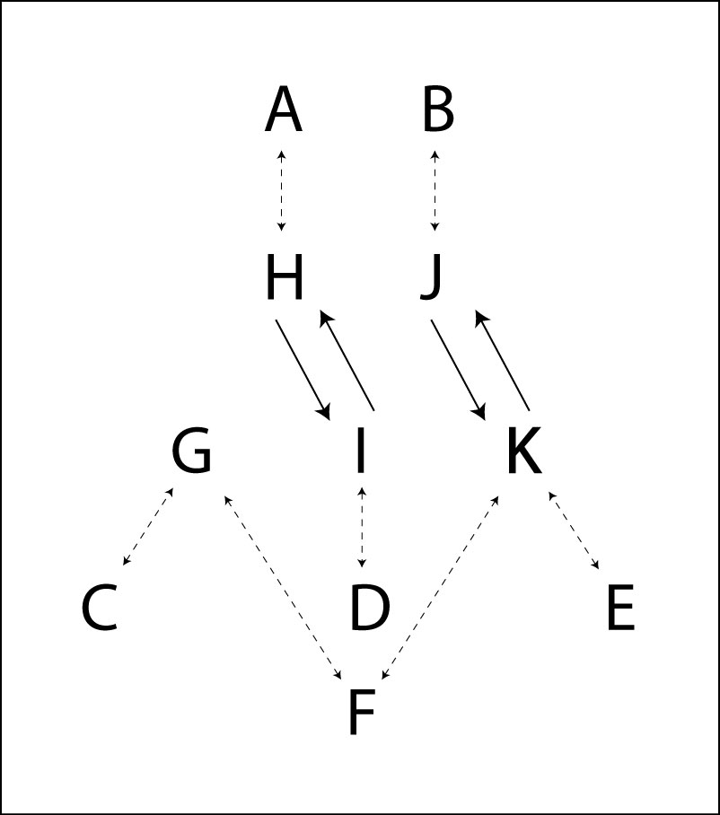
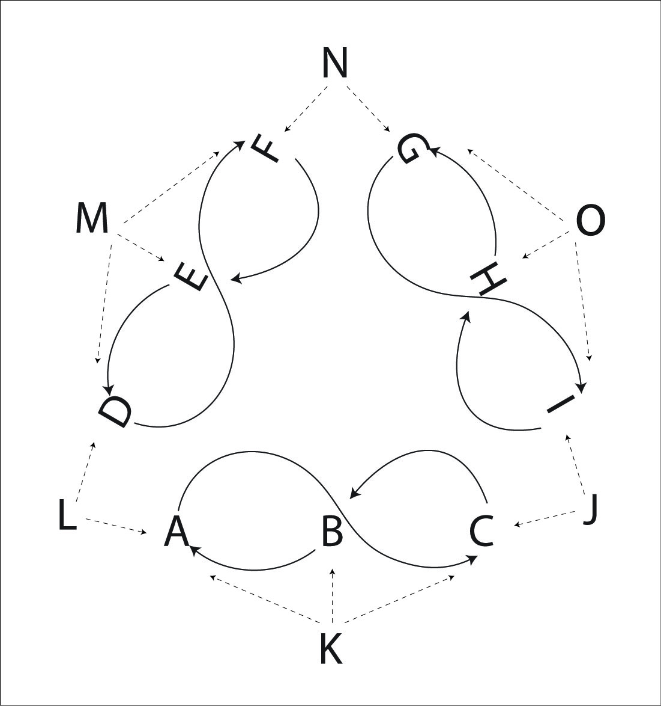
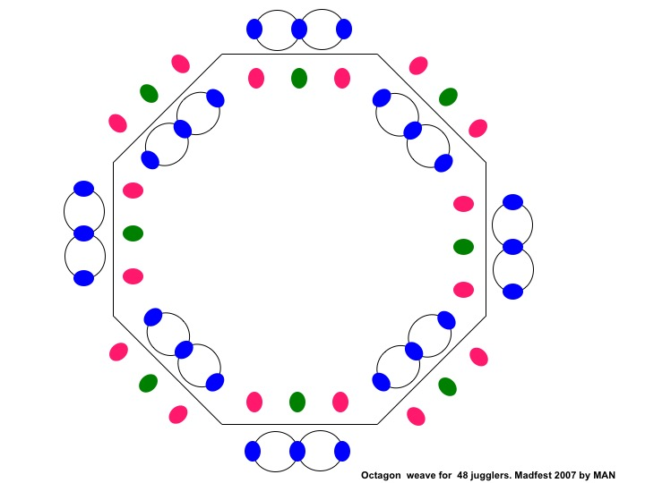
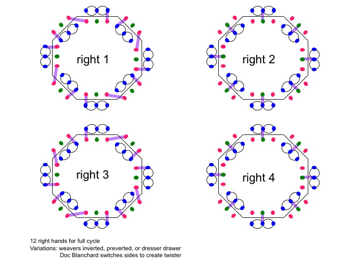

# Big Patterns

## Fully Loaded Blast

 The Blast has a lot of fun and challenging variations. Here's a Blast loaded
up with extra passes and twister weaving for 11 people, but the basic concept
works for 7 through 12 people.

The movers (G, H, I, J, and K) move in a typical Blast fashion, except they turn
around after every pass to A and B to pass to feeders behind the weave.

The table shows ½ of a full cycle, so the table ends in the mirror image of the
start.

| **Juggler** | **1** | **2** | **3** | **4** | **5** | **6** | **7** | **8** | **9** | **10** |
|-------------|-------|-------|-------|-------|-------|-------|-------|-------|-------|--------|
| **A**       | H     |       | I     |       | G     |       | K     |       | I     |        |
| **B**       | J     |       | K     |       | H     |       | J     |       | G     |        |
| **C**       | G     |       | G     |       | I     |       | I     |       | K     |        |
| **D**       | I     |       | H     |       | K     |       | G     |       | J     |        |
| **E**       | K     |       | J     |       | J     |       | H     |       | H     |        |
| **F**       |       | G     |       | J     |       | I     |       | H     |       | K      |
| **G**       | C     | F     | C     |       | A     |       | D     |       | B     |        |
| **H**       | A     |       | D     |       | B     |       | E     | F     | E     |        |
| **I**       | D     |       | A     |       | C     | F     | C     |       | A     |        |
| **J**       | B     |       | E     | F     | E     |       | B     |       | D     |        |
| **K**       | E     |       | B     |       | D     |       | A     |       | C     | F      |

> * Right handed counting.

For more variations, replace D and F with a weave or with a single feeder. You
can also remove either of the outside feeders C and E for fewer people (and an
easier pattern).

Replacing D and F with a weave is called the Blast Toupee (because there is a
weave on top).

Pattern by Peter Kaseman and MAJ.

## Double-Decker Sandwich

A sandwich with two middle layers.

Pattern by MAJ.

## Triangle Weave

The Triangle Weave for 15 jugglers consists of 3 standard weaves (9 jugglers)
and 6 feeders in 4-count. There is a Mr. Inside feeder for each weave, and then
a Mr. Outside feeder in between the weaves who passes in turn to each adjacent
weave.

| **Juggler** | **1** | **2** | **3** | **4** | **5** | **6** | **7** | **8** | **9** | **10** | **11** | **12** |
|-------------|-------|-------|-------|-------|-------|-------|-------|-------|-------|--------|--------|--------|
| **A**       | L     |       |       | K     |       |       | J     |       |       | K      |        |        |
| **B**       |       | K     |       |       | L     |       |       | K     |       |        | J      |        |
| **C**       |       |       | J     |       |       | K     |       |       | L     |        |        | K      |
| **D**       |       |       | L     |       |       | M     |       |       | N     |        |        | M      |
| **E**       |       | M     |       |       | N     |       |       | M     |       |        | L      |        |
| **F**       | N     |       |       | M     |       |       | L     |       |       | M      |        |        |
| **G**       |       |       | N     |       |       | O     |       |       | J     |        |        | O      |
| **H**       |       | O     |       |       | J     |       |       | O     |       |        | N      |        |
| **I**       | J     |       |       | O     |       |       | N     |       |       | O      |        |        |
| **J**       | I     |       | C     |       | H     |       | A     |       | G     |        | B      |        |
| **K**       |       | B     |       | A     |       | C     |       | B     |       | A      |        | C      |
| **L**       | A     |       | D     |       | B     |       | F     |       | C     |        | L      |        |
| **M**       |       | E     |       | F     |       | D     |       | E     |       | F      |        | D      |
| **N**       | F     |       | G     |       | E     |       | I     |       | D     |        | H      |        |
| **O**       |       | H     |       | I     |       | G     |       | H     |       | I      |        | G      |

> * Right handed counting.

To start, all the Mr. Outside feeders pass to their right, and then feed
alternately left and right in 4-count. The Mr. Inside feeders start on beat 2
and pass 4-count to their weave. The weavers pass to alternate Mr. Outside
feeders on either end and the Mr. Inside feeder in the middle.

There are all the usual variations of different weave counts, chocolate bars,
left handed etc. The pattern design can be any polygon where the side is a weave
with a Mr. Inside feeder and the vertices of the polygon are a Mr. Outside
feeder who alternates passing between weaves (also known as Doc Blanchard and Glenn Davis). 
See also the Octagon Weave. The
number of jugglers is 5N were N is the number of sides of the polygon (three for
each weave plus 2 feeders).

Pattern by Mike Newton and Luke Emery.

## Octagon Weave

Similar to the Triangle Weave, except with 8 sides and 48 jugglers. This was
the big pattern at 2007 Madfest.

Pattern by Mike Newton.

## Mandala Weave

<!-- TODO GET GRPAHICS FROM KAT!-->

Pattern by Kat Girdaukas.
