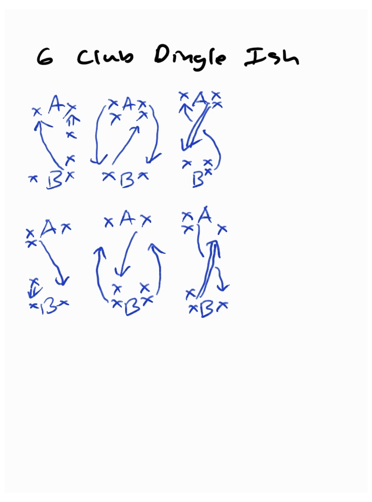
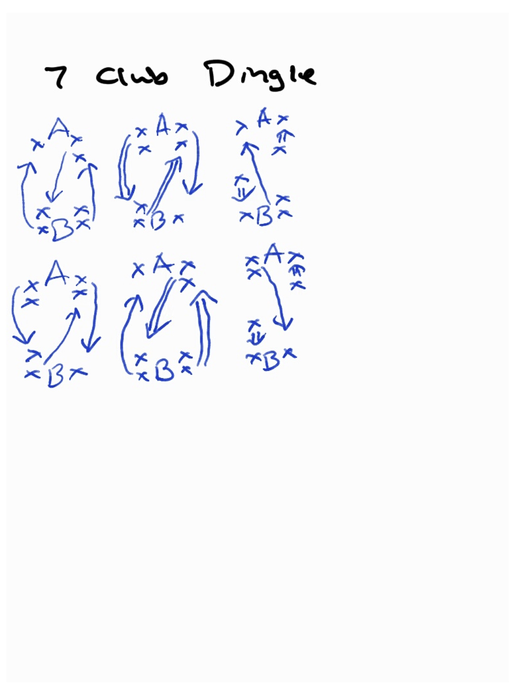
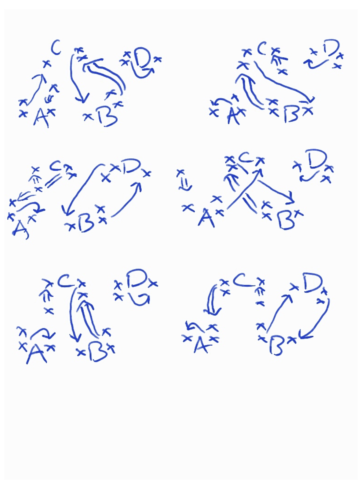

##  Passing 43

Here is a further analysis of all the possible 2 person 7 club patterns in the siteswap 43. There appear to be 58 valid patterns.

Within each group of related patterns, you can switch between patterns of the same group at any time. You can switch between the 2 synchronous patterns or between the 2 asynchronous patterns with no effort, but to switch from async to sync requires one of the usual site swap sequences. For example, in standard 7 club 2-count doubles you can switch from 4p 3 to 3px 4 (start with the 4) or switch between (4px 4) and (4x 4p) synced.

Of course there are also site swaps to go between groups. To get from the RL group to the LR group, just change a straight pass to a crossing pass (or vice versa), and both jugglers exchange groups with each other.

To go from right handed patterns to left handed patterns (such as RR to LL) is a little trickier; you need a siteswap like 4p 4p 2 | 3 4p 4p.

To go from RR to RL requires one juggler to switch left and right timing completely, with a throw like (4x, 2) and a siteswap from their partner that give them enough time to do that (such as an early triple or an extra 4).

Each pattern belongs to a group and requires a partner match from a group. For example, there are 4 patterns in the RR group and each of those patterns requires a partner also in the RR group. That means there are 10 possible combinations of 2 jugglers juggling RR on both sides. (From combination theory, combinations with repetitions (n+k-1)!/k!(n-1)! where n = 4 and k = 2).

No Passing Groups: - N3 (with 3), N4 (with 4) The N4 can be synchronous or asynchronous.

Passing Groups: R or L passing to, and then R or L receiving from (followed by number of objects if applicable)

Trivial patterns

**N3 requires N4**

3 3

N4 requires N3

(4 4) (note: can be in sync with either the left or right hand of the juggler with 3)

4 4

**1-count patterns**

3p 3p | 4px 4px

3px 3px | 4p 4p

**RR requires RR**

3 4p

3px 4

(4x 3p)

(3px 4)

LL requires LL

4p 3

4 3px

(3p 4x)

(4 3px)

LR requires RL

3p 4

3 4px

(3p 4)

(4x 3px)

RL requires LR

4 3p

4px 3

(4 3p)

(3px 4x)

***Skewed patterns (4 clubs on one side and 3 clubs on the other)***

RR3 requires RR4

3 3p

**RR4 requires RR3**

4px 4

(4px 4)

(4x 4p)

**LL3 requires LL4**

3p 3

**LL4 requires LL3**

4 4px

(4 4px)

(4p 4x)

**RL3 requires LR4**

3px 3

**LR4**

4p 4

(4p 4)

(4x 4px)

**LR3 requires RL4**

3 3px

**RL4 requires LR3**

4 4p

(4 4p)

(4px 4x)

58 total pattern combinations

## Graham's Stuff

More patterns by Graham Paasch 

### 6 Club Dingle

 {width=85%}

### 7 Club Dingle

 {width=85%}

### 7 Club Martins

 {width=85%}

### Hard 4 Person With Easy Positions

 {width=85%}

