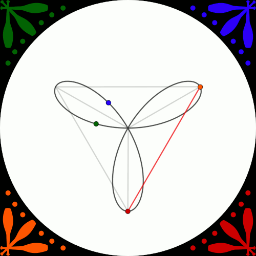

Madison Area Jugglers pattern book
==================================

This is the working home of the MAJ's pattern book; you can access the
latest *official* version in PDF format from [our web
site](http://madjugglers.com/Madison%20Pattern%20Book).

Dependencies
------------
* make
* R
* Pandoc
* TexLive

How to Build Locally
--------------------

To build locally, do:

1. Clone/download this repository.
2. Open a terminal and navigate to the repository parent directory.
3. Run `make`.

If there were any changes since the last build, a new pdf will
reside in the `build` directory.

